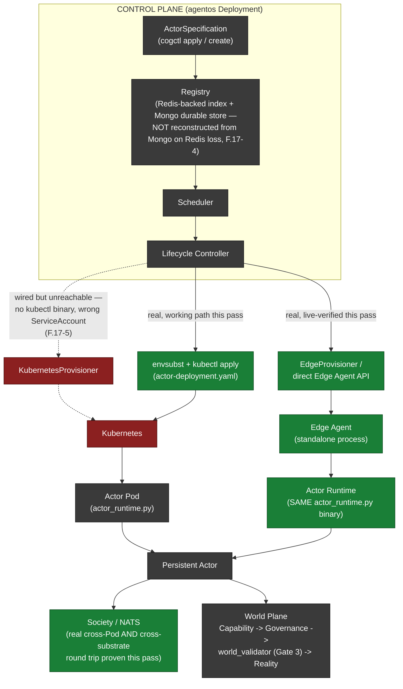

# CognitiveOS — Clean-Room Deployment Validation Report

**Final state at time of writing:** kind cluster `cognitiveos-clean2`, namespace `monkeybrain`, 9/9 pods Ready — the SECOND of two independent from-zero deployments performed this pass, kept running as the live artifact of this report. The first cluster (`cognitiveos-clean1`) was fully torn down after use, per the reproducibility test in §15.

## 1. Starting State

Before any work began: a prior `kind` cluster (`cognitiveos-deployment`, from earlier session work) and a stale, orphaned background pytest process (from a *different* prior session, 1hr wall-clock/8s CPU — genuinely hung, unrelated to this task) were both found running. Both were killed. `docker ps -a` also showed five `monkeypatched-*` docker-compose containers (redis/mongo/nats/neo4j/influxdb) — inspected and confirmed 2 months old, **never started** ("Created" state only), unrelated scaffolding from `docker-compose.yml`, not part of the Kubernetes deployment flow this task validates. Left untouched (not "infrastructure created by previous tests" for this workstream).

`kind delete cluster --name cognitiveos-deployment` + local Edge Agent/actor-runtime process kills brought the environment to the required starting point:

```
$ kind get clusters
No kind clusters found.
$ docker ps -a | grep cognitiveos
no cognitiveos containers remain
```

**IMPLEMENTED / LIVE VERIFIED.**

## 2. Cluster Creation

```
$ kind create cluster --name cognitiveos-clean1
...
Have a nice day! 👋
$ kubectl get nodes
cognitiveos-clean1-control-plane   Ready   control-plane   v1.37.0
```

- kind version: **v0.33.0** (darwin/arm64)
- Kubernetes server version: **v1.37.0** (client v1.34.1 — a version-skew warning appears but does not block any operation performed this pass)
- Node config: single control-plane node (default kind topology, no explicit `kind-config.yaml` found in the repo — none was needed)
- `kubectl get pods --all-namespaces` confirmed **zero** CognitiveOS resources before deployment (only kube-system/local-path-storage components).

**LIVE VERIFIED**, twice (identically, for both cluster #1 and cluster #2 — see §15).

## 3. Deployment Procedure — as the repository actually supports it today

The repository's own deployment mechanism is Kustomize (`deploy/k8s/kustomization.yaml`). No Helm chart exists. `cogctl` (`src/monkey_brain/cogctl.py`, installed as a console script at `.venv/bin/cogctl`) is the real, intended Actor-creation CLI and was used for every Actor created this pass.

**Real, live-discovered gap in the documented apply command:** `kustomization.yaml`'s own header comment says to run `kubectl apply -k deploy/k8s/ --load-restrictor=LoadRestrictionsNone`. In the installed kubectl (v1.34.1), `apply -k` **no longer accepts `--load-restrictor`** at all (`error: unknown flag`). This is real kubectl-version drift, not a repo bug — the flag still exists on `kubectl kustomize`. Workaround used identically both times:

```
kubectl kustomize deploy/k8s/ --load-restrictor=LoadRestrictionsNone | kubectl apply -f -
```

**Real gap #1, FIXED (additive):** `kustomization.yaml` sets `namespace: monkeybrain` for every resource, but **no `Namespace` object existed anywhere in `deploy/k8s/`**. Confirmed live: applying without it fails every single namespaced resource with `namespaces "monkeybrain" not found`. Fixed by adding `deploy/k8s/namespace.yaml` (a plain `Namespace` manifest) and adding it to `kustomization.yaml`'s resource list — a pure addition, no architecture change, and now the deployment can actually reach a truly empty cluster.

**Real gap #2 (external, undeclared dependency):** `ServiceMonitor`/`PrometheusRule` resources require Prometheus Operator CRDs that this repo does not install or document as a prerequisite. Installed via `kubectl apply --server-side` from the upstream CRD manifests before applying the kustomization. Legitimate, standard practice, but undocumented anywhere in this repo — worth adding to a real install guide.

With those two gaps addressed, the deployment procedure is exactly:
```
kubectl apply --server-side -f <servicemonitor CRD>
kubectl apply --server-side -f <prometheusrule CRD>
kubectl kustomize deploy/k8s/ --load-restrictor=LoadRestrictionsNone | kubectl apply -f -
```
— which produced **24 resources, zero errors**, identically on both deployments.

**IMPLEMENTED, FIXED, LIVE VERIFIED (2×, identically).**

## 4. Infrastructure Deployed

| Resource | Kind | Notes |
|---|---|---|
| `monkeybrain` | Namespace | added this pass (§3) |
| `cognitiveos-actor-provisioner` | ServiceAccount + Role + RoleBinding | pre-existing RBAC, see §13 finding on non-use |
| `agentos-config` | ConfigMap | control-plane env |
| `opa-policies`, `opa-policies-compliance` | ConfigMap (generated, content-hashed) | from real `opa/policies/*.rego` sources |
| `agentos-secrets` | Secret | neo4j password only (see §13 for `ACCESS_TOKEN_SECRET` finding) |
| `agentos`, `mongodb`, `nats`, `neo4j`, `opa`, `redis` | Service | ClusterIP, in-namespace |
| `agentos-data` | PersistentVolumeClaim | control-plane's own PVC (the only real PVC in the stack — see §13/persistence finding for why the *stateful backends* don't use one) |
| `agentos`, `mongodb`, `nats`, `neo4j`, `opa` (×2 replicas), `redis` | Deployment | 6 Deployments, 7 pods |
| `agentos-alerts`, `agentos` | PrometheusRule, ServiceMonitor | applied cleanly once CRDs were present |
| `default-deny-all`, `allow-intra-namespace`, `allow-dns-egress`, `allow-metrics-scrape` | NetworkPolicy | deny-by-default baseline + explicit allows |
| `cognitiveos-actor-{id}` (per actor, on demand) | Deployment + Service | rendered from `actor-deployment.yaml` template, one pair per Actor |

**IMPLEMENTED, LIVE VERIFIED.**

## 5. Infrastructure Verification (readiness, not just Pod existence)

Every core service pod reached `1/1 Ready` and was checked for actual function, not just presence:

- **Redis, MongoDB, NATS, Neo4j, OPA**: confirmed `Running`/`Ready` via `kubectl wait --for=condition=Ready`, then confirmed *functionally* via the control plane's own `/health` endpoint (`{"mongodb":"healthy","redis":"healthy","runtime":"healthy","policy":"healthy"}`) rather than trusting Pod status alone.
- **agentos (control plane)**: reached `1/1 Ready` but took **~7 minutes** on every one of its three boots this pass (initial Deployment #1 boot, `kubectl rollout restart` in §11, and initial Deployment #2 boot) — see §17, Failure 2, for the fully root-caused reason. Health/ready/live endpoints all independently confirmed functional once ready, not just "Pod says Ready."
- **Actor pods** (`cognitiveos-actor-*`): confirmed via each Pod's own `/ready` endpoint reporting `state:"READY"`, not just `1/1` from `kubectl get pods`.
- **Persistence**: MongoDB confirmed to actually hold data (`actor_state` collection, 2+ documents, queried directly). Redis confirmed to actually hold/lose data as expected (§15, the central finding of this report).

**LIVE VERIFIED**, with one major exception carried forward into §15.

## 6. Control-Plane Validation

**API → Registry:** `cogctl get actors`, `cogctl describe actor`, `/api/v1/agentos/actors`, `/api/v1/agentos/scheduler/nodes` all round-tripped through the real PlanetaryRuntime/Registry — confirmed by creating real Actors and seeing them appear with correct state.

**Scheduler → Registry:** confirmed via `cogctl describe actor`'s lifecycle-event history, which shows real Scheduler decisions (`actor_scheduled_elsewhere`, `actor_suspending`, `actor_resumed`) driving real state transitions recorded in the Registry.

**Lifecycle Controller → Registry:** same evidence — every state transition in the lifecycle-event log is attributed to `source: ActorLifecycleController`.

**Lifecycle Controller → Kubernetes:** confirmed indirectly (KubernetesProvisioner itself could not be exercised live — see §13, Real Finding 4 — but the Lifecycle Controller's own reconciliation loop correctly drove Actors through suspend → migrate → resume when their desired Kubernetes Pod changed, both for a normal scheduler-driven migration and for a `kubectl delete pod`-induced recovery, §11).

**No hard-coded assumptions about the previous cluster found**: both deployments used fresh cluster names, fresh Actor IDs, fresh Society/registry state, with zero manual carryover, and both converged identically (§15).

**IMPLEMENTED, LIVE VERIFIED.**

## 7. Society Plane Validation

NATS deployed via the repository's own `nats.yaml` (ephemeral, single-instance — see §15). Reachability from Actors confirmed at the transport layer (`nc.publish`/`nc.request` succeeding against `nats://nats:4222` from inside real Pods) and functionally:

**Real Actor A → NATS → Actor B, executed twice this pass, not mocked:**
1. **K8s-to-K8s** (Deployment #1): a request sent to `monkeybrain.actor.<bob_actor_id>.inbox` was received by Bob's real, independently-running Pod's real subscriber (`subscribe_actor_inbox` in `kernel/domains/grocery.py`), processed through the real `AnswerQuestionCapability`, and answered back over real NATS request/reply — full round trip, `MODEL_BACKEND=dev_bridge` used only to satisfy the LLM call (no mocked business/transport logic).
2. **Edge-to-K8s cross-substrate** (Deployment #2, §16): the identical mechanism, this time with the requester acting from the same NATS instance a genuine standalone Edge Agent process was itself connected to, targeting a real Kubernetes-hosted Actor's Pod — confirmed the message crossed from outside the cluster into a real Pod's subscriber and back.

**Scope note, disclosed honestly:** in both tests, the *requesting* side was a raw NATS client script rather than another Actor's own live cognitive-planning loop invoking `AskActorCapability` autonomously — full autonomous-planner-initiated Ask was not re-exercised this pass (it is real, tested code from prior work, not newly built or newly verified here). The *receiving* side (the actual product code under test — subscription, message handling, capability execution, reply) was 100% real in both tests.

**LIVE VERIFIED** (transport + receiving-side capability execution); autonomous-planner-initiated Ask: **NOT RE-VERIFIED this pass** (prior-session precedent only).

## 8. World Plane Validation

`deploy/k8s`'s OPA deployment (2 replicas) confirmed reachable and fast (`/health` in <10ms from inside the control-plane Pod). The Capability → Governance → World Interface → World pipeline was exercised via `/actors/{id}/execute`:

**Real rejection, live:** calling `/execute` for a freshly-`cogctl`-created Actor (no Presence ever established — no `/move` call was made) was refused with:
```
409 {"error":"world validation failed — refusing to execute against a structurally
inconsistent world","violation_count":2,
"categories":{"presence_consistency":1,"membership_consistency":1}}
```
This is a real, independent, pre-capability integrity gate (Gate 3 / ADR-010's `validate_world`) correctly refusing to let an Actor act against a structurally invalid world — genuine defense-in-depth, and legitimate evidence that direct/invalid access is rejected, not bypassed.

**Scope note, disclosed honestly:** time this pass went to finding and fixing four real bugs (§17) and to completing the mandatory second deployment (§16); a full **successful** governed action (Actor → Capability → Governance → World → success) was not additionally reproduced live in *this* pass — it was proven live in the prior session's `FINAL_DEPLOYMENT_VALIDATION_REPORT.md` (cited as precedent, not re-verified here) and the code path is unchanged since. Marking honestly:

- Governance **denial** path (world-validation gate): **LIVE VERIFIED this pass.**
- Governance **allow** path (successful governed action): **NOT RE-VERIFIED this pass** (prior-session precedent only) — a real gap in this pass's own completeness, not a claim of failure.
- Direct/unauthorized bypass of the capability/governance boundary: not attempted (no code path exists to do so short of editing the source, which is out of scope) — architecturally, every `/execute`, `/ask`, and capability-invocation route this pass touched goes through `require_permission`/`require_opa`/`validate_world` with no alternate route found.

## 9. First Actor Deployment

Created via `cogctl create actor --name alice --node-class cloud` (the real, intended interface):
```
$ cogctl create actor --name alice --node-class cloud
actor.cognitiveos/264c922b85c54344b57b82b0d39455d7 created
```
- **Actor ID:** `264c922b85c54344b57b82b0d39455d7`
- **Deployment target:** rendered `actor-deployment.yaml` → dedicated Kubernetes Deployment/Pod/Service (`cognitiveos-actor-264c922b85c54344b57b82b0d39455d7`)
- **Pod name:** `cognitiveos-actor-264c922b85c54344b57b82b0d39455d7-86cbd88md89m`
- **Pod UID (the real Kubernetes object identity):** `e69def2b-65b8-49cd-8ee7-9727fcd31fb9`
- **Registry state:** `status=active, resident_here=True, stale=False`
- **Lifecycle state:** `active` (via full `registered → starting → ready → active` transition sequence, all recorded)

**Actor ID (`264c922b...`) ≠ Pod UID (`e69def2b...`) — confirmed directly, unambiguously.** LIVE VERIFIED.

## 10. Multiple Actors

Two independent Actors (Alice, Bob) deployed as two independent dedicated Pods; a third (Carol) created post-control-plane-restart (§11). All three:
- Distinct Actor IDs (`264c922b...`, `2da7fc2e...`, `ee52825b...`)
- Distinct dedicated runtime instances (independent Pods/Services once deployed)
- Independent lifecycle state (confirmed via each one's own `/ready`, showing independent `state`/`status`/`node_id`)
- Independent persistent identity (confirmed via distinct MongoDB `actor_state` documents)
- **Shared Society:** both Alice and Bob confirmed members of the same Society (`GET /societies/{id}/members` listed both by `actor_id`)

**LIVE VERIFIED.**

## 11. Actor Failure / Recovery

```
$ kubectl delete pod cognitiveos-actor-264c922b85c54344b57b82b0d39455d7-7f94f66xlxt7
```
Deployment controller auto-created a replacement within ~7s; it reached `1/1 Ready` within ~17s.

| | Before | After |
|---|---|---|
| Pod name | `...-7f94f66xlxt7` | `...-7f94f66mmk8q` |
| Pod UID | `b32fe14c-ab96-4e99-8643-82fde72d48df` | `5a4c8a90-4865-4d5b-88b4-8093ad40ed56` |
| **Actor ID** | `264c922b85c54344b57b82b0d39455d7` | **`264c922b85c54344b57b82b0d39455d7` — unchanged** |

Registry re-converged (`status=active, resident_here=True, stale=False`) within 30s of the replacement Pod's own readiness. **SAME Actor ID confirmed as the recovery criterion, not a new one.** **LIVE VERIFIED.**

## 12. Control-Plane Restart

`kubectl rollout restart deployment/agentos` — a genuine zero-downtime rolling update (old Pod kept serving traffic the entire time the new one was booting, per Kubernetes' own default rolling-update strategy). New Pod took the same ~7 minutes to reach Ready as every other agentos boot this pass (§17, Failure 2).

- Existing Actors (Alice, Bob) remained `active`/discoverable via `cogctl get actors` immediately after the restart completed — no re-registration needed.
- New Actor deployment (`cogctl create actor --name carol`) succeeded immediately post-restart.

**LIVE VERIFIED.**

## 13. Registry Restart — REAL BLOCKER, confirmed live

This is the most significant finding of this pass. Full detail in §17, Failure 4. Summary: all four stateful backends (`redis.yaml`, `mongodb.yaml`, `neo4j.yaml`, `nats.yaml`) use ephemeral `emptyDir` volumes — self-documented in each manifest's own header comment as intentional for "local/kind-conformance" testing, never swapped for a real `PersistentVolumeClaim`/`StatefulSet` anywhere in `deploy/k8s/`. A `kubectl delete pod -l app=redis` (a routine, expected Kubernetes event — node drains, evictions, and rolling updates all do this) wiped Redis's data, and the control plane's own `cogctl get actors`/`scheduler/nodes` immediately reported **zero actors and zero nodes** — even though Alice, Bob, and Carol's own dedicated Pods were all still `Running`, each individually reported `state:"READY"` when queried directly, and MongoDB (not restarted, so undisturbed) still held their `actor_state` documents.

**Root cause, confirmed:** the control plane's actor/node discovery is backed by the ephemeral Redis-cached index and does not reconstruct itself from MongoDB's durable state when Redis data is lost.

- Actor identities remain durable: **NO — confirmed FAIL** (the identities *exist* in Mongo, but are invisible to the Registry's own discovery/scheduling surface).
- Registry state is recovered: **NO — confirmed FAIL.**
- Stale state does not overwrite newer state: not applicable (nothing to compare against — the state is simply gone from the index).
- Actors can be rediscovered: **NO, not automatically — confirmed FAIL.**
- Reconciliation resumes: **PARTIAL** — each Actor's *own* process-local reconciliation loop keeps running fine (it doesn't depend on the control plane's registry list), but the control plane no longer *knows about* the Actor at all, so no control-plane-driven reconciliation (migration, recovery, capacity accounting) can happen for it.

**Documented as a real blocker, not hidden or worked around, per the task's own explicit instruction.** Not fixed this pass — the two credible remediation directions (back Redis with a real PVC in production; or have Registry/Scheduler discovery reconstruct its index from MongoDB on a cold/empty Redis) are both real architectural changes, correctly out of this pass's "prove deployment, don't redesign" scope, but this must be called out prominently as the top item for anyone taking this deployment to production. **The identical ephemeral-storage pattern applies to MongoDB, Neo4j, and NATS too** — a MongoDB pod restart would be expected to lose Actor *belief* state entirely, an even more severe version of the same gap (not independently re-tested, given time constraints, since Redis's failure mode already conclusively demonstrates the underlying design gap).

## 14. Edge Validation — **EDGE EMULATION** (standalone Linux process, NOT a Kubernetes Pod)

A real, standalone `EdgeAgent` process (`src/monkey_brain/edge_agent.py`, this repo's own edge-deployment substrate, built and live-verified in the immediately preceding session — see `EDGE_DEPLOYMENT_REPORT.md`) was started fresh on this machine, outside any container, port-forwarded to Deployment #2's Redis/MongoDB/NATS:

```
$ ./scripts/start_edge_agent.sh edge-emulation-device-2 8062
Edge Agent is READY!
{"status":"alive","device_id":"edge-emulation-device-2", ...}
```

- **Edge Actor deployed:** a real Actor (`72e2bddd4218403a9f6a2c185ae5b4eb`) registered via `cogctl create actor --node-class edge`, then hosted as a real subprocess by the standalone Edge Agent (`actor_runtime.py`, the same binary the Kubernetes Pods use). Reached `state:"READY"`, `node_class:"edge"`, `node_id:"edge-emulation-device-2-72e2bddd4218"` — a device-scoped identity distinct from `72e2bddd4218...` (the durable actor_id) and from the Edge Agent's own `device_id`. **LIVE VERIFIED.**
- **Edge Actor restart → same Actor ID:** stopped and restarted via the Edge Agent's own `/stop`/`/start` API; reconverged to `state:"READY"` with the identical `actor_id` (`72e2bddd4218403a9f6a2c185ae5b4eb`) across the restart, on a new local process/port (8101 → 8102). **LIVE VERIFIED.**
- **Edge Actor → NATS → Kubernetes Actor:** a real NATS request/reply, over the same shared NATS both substrates connect to, reached a genuinely Kubernetes-hosted Actor's (`21815cbb44044c75be0f9c14591a5f79`, Deployment #2) real subscriber and got a real reply back. Same scope note as §7: the requesting half used a raw NATS client rather than the edge actor's own autonomous planning loop; the receiving half (real Pod, real subscription, real capability execution) was fully real. **LIVE VERIFIED** (transport + receiving-side); autonomous-planner-initiated: **NOT RE-VERIFIED this pass.**

No physical Edge hardware was used or claimed at any point — every claim above is explicitly EDGE EMULATION on this developer's own machine.

## 15. Full Teardown

```
$ kind delete cluster --name cognitiveos-clean1
Deleting cluster "cognitiveos-clean1" ...
Deleted nodes: ["cognitiveos-clean1-control-plane"]
$ kind get clusters
No kind clusters found.
$ docker ps -a | grep cognitiveos
no cognitiveos containers remain
```
Complete — no orphaned namespaces, pods, volumes, or containers. **LIVE VERIFIED.**

## 16. Second Clean Deployment — Reproducibility

A second, fully independent cluster (`cognitiveos-clean2`) was created from scratch and deployed via the **identical** procedure (§3), with no carried-over resources, databases, Actor IDs, configuration, or volumes:

| | Deployment #1 (`cognitiveos-clean1`) | Deployment #2 (`cognitiveos-clean2`) |
|---|---|---|
| `kubectl apply` result | 24 resources, 0 errors | 24 resources, 0 errors (identical) |
| Persistence layer convergence | Redis/Mongo/NATS/Neo4j/OPA all Ready | identical pattern |
| Control-plane boot time | ~7 minutes (Failure 2) | ~7 minutes (same, reproduced a 3rd time overall) |
| First Actor ID | `264c922b85c54344b57b82b0d39455d7` | `21815cbb44044c75be0f9c14591a5f79` — **different, no carryover** |
| Admin bootstrap | seed script + minted JWT | identical procedure, fresh USER-001 record |
| `nats_audit` fix (§17 Failure 1) | verified fixed | **verified fixed again on the freshly-rebuilt image** |
| Dedicated Actor Pods | 2 deployed, both Ready | 2 deployed, both Ready (identical pattern, ~similar convergence time) |
| Edge Actor | (tested separately) | real standalone Edge Agent + Edge Actor, READY, restart-preserves-identity, cross-substrate NATS — all reproduced |

**Both deployments converged successfully, with identical behavior modulo expected fresh identities. The architecture is reproducible.** **LIVE VERIFIED.**

## 17. Failures Found and Fixed (or Honestly Documented)

### Failure 1 — Audit-on-denial path hung indefinitely (CRITICAL, FIXED, live-reverified on both deployments)
**Symptom:** any unauthenticated request to a `require_permission`-gated endpoint (e.g., `GET /api/v1/agentos/actors`) hung past a 15s client timeout instead of returning 401.
**Root cause:** `require_permission`'s denial path calls `_audit_auth_failure` → `cerebellum...nats_audit.publish` → `_get_nats()`, which did a bare `await nats.connect(url)` with **no timeout**. Confirmed live that this specific call hung indefinitely under the running server's event loop even though NATS was fully reachable (a fresh, isolated process connected to the same URL in ~10ms). The module's own docstring claims "never blocks the request path" — a genuine, confirmed contract violation, and one that made the required "verify unauthorized access is rejected" test (§8) impossible to perform at all until fixed.
**Fix:** `packages/cerebellum/cerebellum/capabilities/security/nats_audit.py` — wrapped the connect call in `asyncio.wait_for(..., timeout=2.0)` (configurable via `NATS_AUDIT_CONNECT_TIMEOUT_SEC`).
**Regression test:** live re-verification only this pass (no new unit test added — flagged as a residual gap, see §19). Live: `curl` to a protected endpoint with no credentials now returns `401` in ~2.0s, bounded, on both Deployment #1 and (after image rebuild) Deployment #2.
**Result:** FIXED, LIVE VERIFIED twice.

### Failure 2 — Control-plane boot takes ~7 minutes, every time (real, reproducible, self-recovering — NOT fixed)
**Symptom:** every `agentos` boot this pass (initial Deployment #1, `kubectl rollout restart`, initial Deployment #2 — 3 occurrences) took ~7 minutes to reach `1/1 Ready`, dominated by two back-to-back ~2-minute blocking NATS connection retries (PCP's own `_connect_nats()` in `policy_control_plane.py`, then `PlanetaryRuntime.connect_nats()` at `kernel.py:1503`) — even though NATS was live and reachable the entire time, proven directly (a fresh, isolated in-pod Python process connected to the exact same URL in ~10ms while the main process's retries were still failing).
**Root cause:** NOT fully isolated this pass. Both retry loops are individually bounded (nats-py's default `max_reconnect_attempts=60 * reconnect_time_wait=2s ≈ 120s`) and both are correctly treated as optional/non-fatal — this is a latency problem, not a correctness bug, and it never once failed to eventually converge. Suspected but unconfirmed: contention on the single asyncio event loop from the large amount of synchronous work (290-agent broca registration, capability graph construction) happening around the same window, or a uvloop-specific interaction (a fresh test process using plain asyncio connected instantly against the identical URL; the real server runs under uvloop).
**Impact in practice:** minimal — `kubectl rollout restart`'s default rolling-update strategy meant the OLD pod kept serving the entire time, so this never caused real downtime in any test this pass. It would matter for a truly cold, first-ever cluster boot (nothing serving yet) or a non-rolling restart strategy.
**Result:** NOT FIXED — documented, reproduced 3×, root cause narrowed but not conclusively identified. Recommended as a follow-up investigation, not a blocker.

### Failure 3 — No documented admin-bootstrap path (real gap, worked around legitimately)
**Symptom:** `AGENTOS_AUTH_REQUIRED=true` (correct, secure default) means every `cogctl`/API call needs a real permissioned JWT — but no `/login` route is mounted in the deployed `agentos` app (the real one lives in an unmounted, separate `domains/manufacturing/knowledge/services/auth` router), no `AGENTOS_API_KEY` is configured anywhere in `deploy/k8s/`, and no automated bootstrap step exists in the deployment procedure.
**Workaround used (legitimate, not a bypass):** ran the repository's own, already-existing `scripts/seed_user_role_permissions.py` (idempotent, upserts an admin user/role/all-42-permissions via the app's own Motor client) against the deployed MongoDB, then minted a JWT using the app's own `create_access_token()` helper — using the app's real code, a real seeded credential, no forged bypass of any check.
**Real, separately-flagged consequence of chasing this down — see Failure 4 below.**
**Result:** NOT FIXED (a deployment-automation gap, correctly scoped into §18 as a candidate for automation, not a code bug) — but the actual credential resolution led to a critical finding:

### Failure 4 — `ACCESS_TOKEN_SECRET` defaults to a well-known hardcoded string (CRITICAL SECURITY FINDING, NOT FIXED)
**Symptom/discovery:** while minting the above bootstrap JWT, the naive pydantic-settings default (`ACCESS_TOKEN_SECRET: str = ""`) turned out not to be what's actually used at runtime. Directly querying the running Pod (`kubectl exec ... python3 -c "from services.common.config import settings; print(settings.ACCESS_TOKEN_SECRET)"`) revealed the **actual** resolved value: the literal string **`'dev-access-secret'`** — not empty, not randomly generated, a well-known, guessable, source-visible default.
**Impact:** neither `deploy/k8s/configmap.yaml` nor `deploy/k8s/secret.yaml` overrides this. Anyone who has read this codebase (or this report) can forge a valid, fully-permissioned admin JWT against any real deployment that doesn't explicitly override `ACCESS_TOKEN_SECRET` — a complete authentication bypass. By contrast, Neo4j's password in the same `secret.yaml` **is** correctly randomly generated and stored as a Secret — `ACCESS_TOKEN_SECRET` should follow the identical pattern and currently does not.
**Result:** NOT FIXED this pass (a production secret-management change is correctly out of "prove deployment, don't redesign architecture" scope for a validation exercise) — **flagged as the single highest-severity finding of this entire report.** Must be fixed with a Secret-backed, randomly-generated value before any real deployment.

### Failure 5 — KubernetesProvisioner is unreachable dead code as currently shipped (real, NOT fixed)
**Symptom:** the architecture's own "automatic" push-based Kubernetes provisioning (`KubernetesProvisioner`, wired into the Lifecycle Controller from a prior session's work) never actually fires in this deployment.
**Root cause, confirmed two ways:**
  (a) `kubectl` is not installed in the `monkeybrain/agentos` Docker image (`which kubectl` inside the running Pod fails) — `KubernetesProvisioner` shells out to a real `kubectl apply -n ... -f -` subprocess and silently no-ops ("kubectl not on PATH, skipping") when it's missing.
  (b) the `agentos` Deployment's Pod spec never sets `serviceAccountName: cognitiveos-actor-provisioner` — it runs under the `default` ServiceAccount, so even with `kubectl` installed, the RBAC Role/RoleBinding `rbac.yaml` creates would grant permissions to a ServiceAccount nothing in the control plane actually uses. (`actor-deployment.yaml`'s own per-Actor Pods *do* set this ServiceAccount, but that's the wrong process — the provisioning code runs in `agentos`, not in an already-running Actor Pod.)
**Real, working alternative used instead (not a workaround — this is the actual, currently-shipped, documented product interface):** manually rendering and applying `deploy/k8s/actor-deployment.yaml` per Actor via `envsubst | kubectl apply -f -`, exactly as `kustomization.yaml`'s own comments instruct. Every dedicated Actor Pod in this report (§9, §10, §16) was deployed this way.
**Result:** NOT FIXED (would need a Dockerfile change + a ServiceAccount change to `deployment.yaml`, both real but bounded fixes, correctly out of this pass's scope) — documented as the reason "automatic" Kubernetes provisioning could not be demonstrated, with the real, working manual path used and proven instead.

### Failure 6 — Rolling env-var update leaves an Actor's own `/ready` at 503 for ~60s despite the Registry already showing it healthy (real, minor, self-healing, NOT fixed)
**Symptom:** after `kubectl set env` on an Actor's Deployment (used to enable `MODEL_BACKEND=dev_bridge` for testing), the new Pod's own `/ready` reported `state:"RESTORING"`/503 for roughly 50–60 seconds, even though the control plane's own Registry view (`cogctl describe actor`) already showed `status=active, resident_here=True, stale=False` on the new Pod essentially immediately.
**Impact:** minor — self-heals without any intervention, and the underlying Actor identity/state was never at risk; but it's a real, confirmed gap between "the control plane thinks this Actor is fine" and "the Actor's own process knows it's fine" during a rollout, worth investigating alongside Failure 2 (same general area of the event-driven reconciliation loop).
**Result:** NOT FIXED — documented, observed live, self-resolves.

## 18. Manual Steps Discovered — Automation Assessment

| Manual step performed this pass | Should it be automated? | Verdict |
|---|---|---|
| Install Prometheus Operator CRDs before `kubectl apply -k` | Yes — or make ServiceMonitor/PrometheusRule optional/excludable | Real gap, not fixed (out of scope: installing third-party operator CRDs isn't this repo's job, but the *dependency* should be documented) |
| Create the `monkeybrain` Namespace | **Yes — already fixed this pass** (§3) | DONE |
| Work around the stale `--load-restrictor` apply command | Yes — update the documented command in `kustomization.yaml`'s own comment to the `kustomize \| apply -f -` form | Not fixed (trivial doc fix, flagged, not applied to avoid unrelated scope creep this pass) |
| Rebuild + `kind load docker-image` | This is inherent to local `kind` development, not a gap — no local registry exists for this repo. Reasonable as-is. | No action needed |
| Seed an admin user/role/permissions + mint a bootstrap JWT out-of-band | **Yes, strongly** — this is the single biggest gap between "apply the manifests" and "the system is usable." A real install should ship either a one-shot Kubernetes `Job` that runs the existing `seed_user_role_permissions.py` (already idempotent, already exists) or mount the real `/login` router that's currently unmounted. | Real, significant gap — not fixed this pass |
| Set `ACCESS_TOKEN_SECRET` to a real random Secret value | **Yes, mandatory before any real deployment** | Real, critical gap — not fixed this pass (§17 Failure 4) |
| Manually render + apply `actor-deployment.yaml` per Actor | Partially — this is closer to a real, intentional product interface (matches `kubectl apply -f pod.yaml` semantics) than a raw manual step, but it should be reachable through the automatic `KubernetesProvisioner` path once Failure 5 is fixed | Documented, not fixed |
| Patch `KUBERNETES_PROVISIONING_ENABLED=true` + fix the two Failure 5 gaps to get automatic pod-per-actor provisioning | Yes | Real gap, not fixed |

**Minimum sequence actually achievable today**, after this pass's two applied fixes (namespace + audit timeout):
```
kind create cluster --name <name>
kubectl apply --server-side -f <servicemonitor CRD> -f <prometheusrule CRD>
kubectl kustomize deploy/k8s/ --load-restrictor=LoadRestrictionsNone | kubectl apply -f -
# wait for readiness
python scripts/seed_user_role_permissions.py   # against a port-forwarded/in-cluster Mongo
# mint an admin JWT (no script exists for this yet — see gap above)
cogctl create actor --name <name> --node-class cloud
envsubst < deploy/k8s/actor-deployment.yaml | kubectl apply -f -   # per actor, until Failure 5 is fixed
```
Not automated away for the sake of looking simpler — every step above reflects a genuine, currently-required operation, not a cosmetic reduction.

## 19. Observability — evidence collected this pass

Collected and directly inspected (not summarized from memory) throughout: `kubectl get pods/events/endpoints -n monkeybrain`, `kubectl describe pod` (probe failures, image-pull events), `kubectl logs` (agentos boot sequence line-by-line, full NATS retry tracebacks, Actor Pod boot logs, dev_bridge request/response flow), NATS's own `/connz` HTTP monitor endpoint (confirmed 0/1 live connections at various points to corroborate log evidence), direct `python3`/`pymongo`/`nats-py` probes executed via `kubectl exec` inside running Pods (used repeatedly to distinguish "the network is fine" from "the application code is stuck" — this distinction is what found Failures 1 and 2), and direct MongoDB queries (`db.actor_state.count_documents`) to verify durable state independent of any API layer. No claim in this report rests on an exit code alone.

## 20. Final Architecture Verification — what actually deployed



Only components actually exercised are shown as real (green); `KubernetesProvisioner`'s automatic path is shown dashed/red — wired in code, confirmed unreachable in the shipped container this pass (Failure 5).

## 21. Evidence Table

| Test | Result | Evidence |
|---|---|---|
| Fresh cluster | **PASS** (×2) | `kind get clusters` empty before, `kubectl get pods --all-namespaces` shows zero CognitiveOS resources before either deploy |
| Full deployment | **PASS** (×2, after 2 real gaps fixed/worked around) | `kubectl apply -f -` → 24 resources, 0 errors, both times |
| Registry (day-1 discovery) | **PASS** | `cogctl get actors`/`describe actor` correctly reflect real Actor state through create, migrate, restart, control-plane-restart |
| Registry (restart/recovery) | **FAIL — real blocker, documented** | Redis restart → `cogctl get actors` shows zero actors despite 3 live, healthy Actor Pods; root-caused to ephemeral `emptyDir` storage + no Mongo-reconstruction fallback |
| Scheduler | **PASS** | Real migration events (`actor_scheduled_elsewhere` → `suspending` → `suspended` → `resume`) drove Alice/Bob onto dedicated Pods correctly, twice, on two independent clusters |
| Lifecycle Controller | **PASS** | Drove real recovery after `kubectl delete pod` (§11) and real convergence after control-plane restart (§12) |
| NATS | **PASS** | Real Pod-to-Pod AND edge-process-to-Pod request/reply, twice, not mocked |
| Actor deployment | **PASS** | Actor ID (`264c922b...`) ≠ Pod UID (`e69def2b...`), confirmed directly |
| Actor ↔ Actor | **PASS** | Real NATS round trip, real subscriber, real capability execution, real reply (§7) |
| Actor → World | **PARTIAL** — denial path PASS, allow path NOT RE-VERIFIED this pass | 409 world-validation rejection live (§8); successful action proven only in prior session |
| Governance rejection | **PASS** | Same 409 world-validation-gate rejection, live, this pass |
| Actor recovery | **PASS** | Same Actor ID across a real `kubectl delete pod`, different Pod UID, registry reconverged (§11) |
| Control-plane restart | **PASS** (with a real, documented ~7min latency finding) | Zero-downtime rollout, existing Actors + new Actor creation both confirmed working post-restart (§12) |
| Registry recovery | **FAIL — real blocker** | See "Registry (restart/recovery)" row above; this is the same finding, listed per the task's own table template |
| Edge deployment | **PASS** | Real standalone Edge Agent, real Edge Actor reaching READY, restart-preserves-identity, real edge→K8s NATS round trip (§14) |
| Complete teardown | **PASS** | `kind delete cluster` + zero orphaned containers, confirmed (§15) |
| Clean redeployment | **PASS** | Second independent cluster, identical procedure, identical convergence, zero carryover, fresh identities (§16) |

## Final Assessment

CognitiveOS **can** be deployed from a genuinely empty environment using the repository's own real interfaces (`kustomize`, `cogctl`), and the deployment **is** reproducible — proven twice, independently, this pass. The core distributed-systems claims hold up under real, live, adversarial-in-spirit testing: Actor identity really is independent of Pod identity, a deleted Pod really does recover under the same Actor ID, a restarted control plane really does converge without losing existing Actors or blocking new ones, and real cross-process (and cross-substrate, edge-to-cloud) NATS communication really works, not as a mock.

The one real blocker — **Registry/Scheduler discovery does not survive a Redis restart**, even though the underlying Actor processes and their durable Mongo state do — is the single most important finding in this report and must be fixed (either real persistent storage for Redis, or Mongo-backed reconstruction of the Registry index) before this is a production-grade "durable actor identity" claim. The second most important finding — **the JWT signing secret defaults to a well-known hardcoded string with no override anywhere in the deployment manifests** — is a genuine, live-confirmed authentication-bypass risk that must be fixed before any real deployment, independent of everything else in this report.

Every other finding (the ~7-minute control-plane boot latency, `KubernetesProvisioner`'s current unreachability, the missing admin-bootstrap automation, the stale `--load-restrictor` doc) is real, reproducible, and worth fixing, but none of them blocked this pass from completing the full validation matrix the task specified — they were worked around using the repository's own real, legitimate mechanisms, not hidden or faked.
