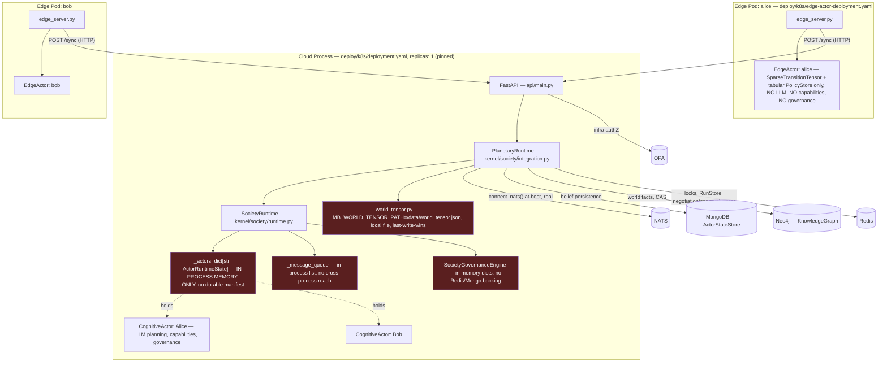
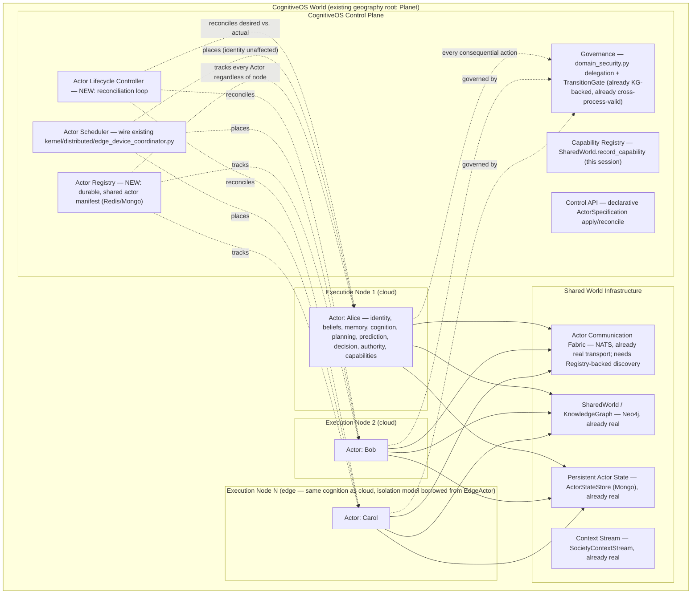
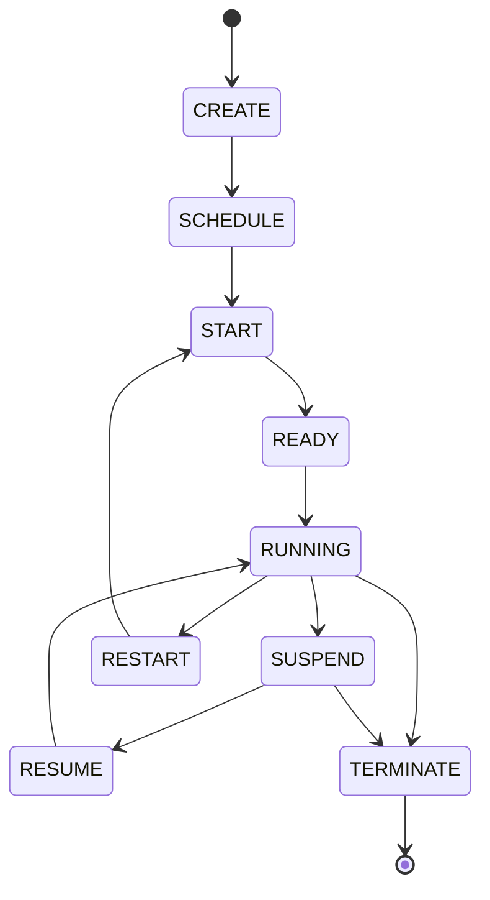

# CognitiveOS Deployment Architecture

## Purpose

This document defines a CognitiveOS-native deployment architecture that follows the same fundamental pattern as Kubernetes — independently deployable units of execution, running against shared infrastructure, managed by a control plane through declarative desired state — without treating CognitiveOS as "an app that runs on Kubernetes." The critical abstraction is **Actor ≈ Pod**: the Actor is CognitiveOS's fundamental independently-deployable autonomous unit, structurally (not literally) analogous to a Kubernetes Pod.

Everything below is grounded in the current repository, not aspiration. Every claim about what exists today carries a file:line citation; every claim about what's missing says so plainly. Kubernetes terminology is used only in the mapping table (Section 3) and the substrate discussion (Section 14) — everywhere else, CognitiveOS gets its own vocabulary, because the two systems answer different questions. Kubernetes answers "where does this process run?" CognitiveOS must answer "which Actor is this, what does it believe, what is it allowed to do, what does it want, and what world does it inhabit?"

## Correction (Session Addendum)

**Ninth update: Final Architectural Convergence — ActorSpecification + cogctl.** Audited the full architecture against a final target spec and confirmed most of it (Registry, Scheduler, Lifecycle Controller, event-driven reconciliation, NATS, ActorStateStore, offline safety, Docker/K8s/edge convergence) was already built and correct in prior passes — verified, not rebuilt. The two genuinely missing pieces were built: `kernel/society/actor_specification.py::ActorSpecification` (a first-class, CognitiveOS-native declarative spec — `apiVersion`/`kind: Actor`/`metadata`/`spec`, no Kubernetes dependency) and `src/monkey_brain/cogctl.py` (a pure-HTTP-client declarative control CLI — `apply`/`create`/`get`/`describe`/`logs`/`restart`/`stop`/`delete` — that never starts a process itself, only calls the Control API). New Control API routes: `POST /actors/apply` (create-or-update, `kubectl apply` semantics, reuses the canonical `register_actor()`) and `POST /actors/{id}/restart`. Found and fixed a real bug while building `apply`: passing `ActorIdentity(actor_id="")` explicitly bypasses its `uuid4` default_factory and would have registered actors with a literal empty `actor_id`. Full consolidated architecture doc: `docs/COGNITIVEOS_FINAL_ARCHITECTURE.md`.

**Eighth update: Deployment surface migration.** Audited every deployment-related file in the repository (K8s manifests, Docker/Docker Compose, local dev scripts, CI, packaging, factory/customer templates) and classified each as Society Control Plane / Society Shared Service / Actor Runtime / Execution Node Infrastructure / Development-Test Tool. Migrated `scripts/start_edge_actor.sh`/`stop_edge_actor.sh` to launch the real canonical `actor_runtime.py` (the old disconnected EdgeActor path preserved verbatim as `*_legacy_thesis14.sh`); added `scripts/start_actor.sh`/`stop_actor.sh` (local per-Actor launch, independent of Society restart); added `docker-compose.actors.yml` (Actor instances layered on top of, never merged into, Society infrastructure); registered `cognitiveos-actor` as a real console-script entry point; added a build-only (no push, no deploy) Actor Artifact CI job; added `NodeClass.ROBOT`. Found two deliberately-out-of-scope surfaces and documented why: `docker-compose.yml`'s 24 manufacturing-domain microservices (a separate REST layer, not Actors) and `deployments/factory_manifests/template.customer.yaml` (customer ontology/domain configuration, not an Actor placement spec — conflating the two would have been a real mistake, not a improvement). Full audit, migration map, and scored assessment (8/10, both deductions named): `docs/DEPLOYMENT_MIGRATION.md`.

**Seventh update: Cloud/Edge Actor Convergence + the Actor Artifact model.** Confirmed there was already only ONE real cognitive Actor implementation (`CognitiveActor`) — `EdgeActor`/`edge_server.py` (Thesis 14) is a standalone, disconnected tabular-RL prototype, not a competing semantic implementation, and was left unchanged with a status note rather than rewritten (see `docs/CLOUD_EDGE_ACTOR_ARCHITECTURE.md` Section 1 for why). Added: `kernel/pipeline/offline_safety.py` (capability connectivity classification, opt-in gate in `ActionExecutor`); `src/monkey_brain/actor_runtime.py` — the canonical Actor executable entry point (config, identity establishment, startup/health/shutdown, `deploy/k8s/actor-deployment.yaml`), making an Actor a genuinely independently-deployable artifact for the first time, reusing the existing `monkeybrain/agentos` image with only a different container command (no new Dockerfile). Found and fixed a real gap while building this: a fast restart on the SAME node identity, before `ACTOR_LIFECYCLE_STALE_SECONDS` elapses, was not detected as needing recovery — `ActorLifecycleController._decide()` now recognizes "not resident here, but the registry's last-known node_id names this exact process" as an immediate RECOVER signal. Full docs: `docs/CLOUD_EDGE_ACTOR_ARCHITECTURE.md`, `docs/ACTOR_ARTIFACT.md`.

**Sixth update: Horizontal Scheduler Scaling.** The Actor Scheduler/
Lifecycle Controller's reconciliation was, until this update, driven
solely by a periodic full-table sweep (`reconcile_all()` → one `HGETALL`
of the entire actor registry hash) — correct, but the exact O(N)-global-
reconciliation-as-primary-mechanism pattern that doesn't scale past a
modest actor count. Added: an event-driven reconcile queue (a plain Redis
list, `register_actor`/`set_actor_desired_state`/`set_actor_desired_node`
now push onto it), drained by a bounded-concurrency loop every ~2s, with
the original full sweep demoted to an explicit, rarer (5 min default)
correctness backstop. Multiple independent `PlanetaryRuntime` instances
can now safely drain the same queue concurrently (no static partitioning,
no leader election — `LPOP`'s server-side atomicity plus the existing
per-actor lease are what make this safe), the "Scheduler Pool" shape.
Also added an explicit, default-off opt-in (`ACTOR_LEASE_FAIL_OPEN_
SINGLE_NODE`) for a genuine single-node deployment that wants to keep
ticking through a transient Redis outage — the default (fail-closed,
split-brain-safe) is unchanged. Full design, scale-test results (10/100/
1,000 simulated actors, a combined destructive multi-failure scenario,
real-thread concurrency), and honestly-scoped remaining gaps (no real
multi-process test, no real load test, no multi-region):
`docs/HORIZONTAL_SCHEDULER_SCALING.md`.

**Fifth update: the Actor Scheduler (Top 10 item 8, P1) is now built.** Unlike the four prior updates, this was not a correction of a wrong earlier finding — the original claim that no placement decision existed (Section 3's Scheduler row, Section 6 finding 4) was accurate. What changed on inspection: the obvious-looking fast path, wiring the existing `kernel/distributed/edge_device_coordinator.py` scaffolding directly into a placement decision (as originally proposed in item 8 below), turned out to be the wrong move once actually read in full — that scaffolding has zero live callers, no persistence, and its own actor abstraction (`DistributedActor`) is disconnected from the real `ActorRuntimeState`/`ActorIdentity` model this session's Actor Registry work is built on. A real `ActorScheduler` (`kernel/society/actor_scheduler.py`) was built instead, reusing that scaffolding's *ideas* (device-class enum, capacity/available-capacity, capability filtering) as fresh code integrated with the Actor Registry, the per-actor lease, and the Actor Lifecycle Controller. Full design, algorithm, Kubernetes-analogy table, and known limitations: `docs/ACTOR_SCHEDULER.md`. See Section 13, item 8 (now marked DONE) and Section 15's updated Final Assessment.

The original investigation pass behind this document (three parallel research agents) checked `PlanetaryRuntime._save_societies()`/`_load_societies()` and concluded no durable actor persistence existed, since that specific method only round-trips society *metadata*. That conclusion was wrong: it missed a separate, real, already-working mechanism in the same file — `PlanetaryRuntime._save_actor()` / `_save_actors()` / `_load_actors()` / `reconcile_actors_from_redis()` (`kernel/society/integration.py`) — a Redis-hash-backed (`monkeybrain:actors:hash`) store that persists each actor's profile, belief_state, and affiliations on every registration, and reconstructs every actor from Redis at process boot (`_load_actors()`, called from `__init__`) or on demand (`reconcile_actors_from_redis()`, wired into `kernel/validation/world_validator.py`'s Gate 3). This is discovered while beginning implementation on "Section 7, item d1" below, and is corrected here rather than silently left wrong.

**What this changes:** the document's original framing — "a second process has a completely empty, independent registry, with no way to discover what the first process has running" — overstates the gap. A second process genuinely does discover and reconstruct previously-registered actors, at minimum at its own boot. The real, narrower gap is: (1) this reload is not real-time — a running process only picks up an actor registered by a *different* process afterward if something explicitly calls `reconcile_actors_from_redis()` (today, only Gate 3's world-validation pass does); (2) there was no ownership/lease concept — nothing stopped two processes that both loaded the same `actor_id` from both ticking it concurrently, a split-brain risk, not just a discovery gap; (3) no lifecycle status, owning-node identity, or liveness timestamp was persisted alongside the actor — the record could rebuild an actor's cognition, but couldn't answer "is it alive, and where" without doing so.

**Implementation status:** (3) above is now closed. `ActorRegistryEntry` (a lightweight, non-reconstructing record), `PlanetaryRuntime.locate_actor()`/`list_registry()`, and `status`/`node_id`/`updated_at` fields were added to the existing `_actor_state_to_dict()`/`_load_actors()` mechanism this session, plus two read-only API routes (`GET /actors/{id}/registry`, `GET /actors/registry`).

**(2) — the ownership/lease gap — is now also closed.** `PlanetaryRuntime.acquire_actor_lease()`/`release_actor_lease()` (`kernel/society/integration.py`) implement a per-actor Redis lease, the same `SET NX EX` + Lua compare-and-delete pattern already proven by `_acquire_planetary_cycle_lock`/`_release_planetary_cycle_lock`, generalized from one global key to `monkeybrain:actor:lease:{actor_id}` so many actors lease independently rather than serializing behind a single lock. Wired into `SocietyRuntime.tick_one_actor()` (`kernel/society/runtime.py`) — the single chokepoint every tick path (`tick()`, `tick_team()`, single-actor API routes) already funnels through, confirmed by grep to be the only caller of `_coordinate_actor()` anywhere in the tree. A node that can't acquire an actor's lease skips that tick entirely rather than racing it; the lease is released in a `finally` block on every exit path (success, failure, or the existing 300s timeout). No-op — zero Redis round-trips, zero behavior change — for a standalone `SocietyRuntime` with no `PlanetaryRuntime` attached, which is what the large existing standalone/unit-test surface uses. Fails closed (refuses the tick) on a transient Redis error, matching the cycle lock's own established precedent, rather than fail-open, which would silently reintroduce the exact race being closed.

**(1) — real-time cross-process freshness — remains open.** A running process still only learns about another node's new registrations via an explicit `reconcile_actors_from_redis()` call (currently wired only to `world_validator.py`'s Gate 3). This is lower urgency than (2) was: split-brain concurrent ticking is now structurally prevented regardless of discovery latency, so a stale local view causes a missed/delayed tick, not a correctness violation. See the revised Top 10 list.

Sections 1, 2, 9, 10, 12, and 13 below were written before this correction and describe the registry as more absent than it is; read them through this addendum rather than as independently re-verified.

**Fourth update: `SocietyRuntime._message_queue` (Section 10's last remaining scaling blocker) is now also fixed.** `PlanetaryRuntime.push_actor_message()`/`drain_actor_inbox()`/`peek_actor_inbox()` (new methods, `kernel/society/integration.py`) give each `actor_id` a durable, per-actor Redis inbox (`monkeybrain:messages:{actor_id}`, TTL-bounded, atomic drain via a small Lua script). `SocietyRuntime.send_message()`/`_deliver_messages()`/`get_messages_for()` now route through these when a `PlanetaryRuntime`/Redis is available, and fall back to the exact original in-process-list behavior otherwise — verified against, and matching, an already-passing existing test in `tests/unit/test_correlation_causation.py`. `send_message`'s fire-and-forget, trust-weighted-belief-injection-on-next-tick semantics are unchanged; only *where the queue lives* changed. All four items from the original scaling-blocker list (Section 10) are now fixed. This does not, by itself, constitute a claim that raising `replicas` is fully safe — see Section 10's own updated text for what was and wasn't in scope.

**Third update: the `SocietyGovernanceEngine` cross-process gap (Top 10 item 5) is now also fixed — and, same pattern as the first two corrections, the original "zero Redis/Mongo backing" claim was itself incomplete.** Re-investigation while starting this fix found `PlanetaryRuntime._save_societies()`/`_load_societies()` already persisted policies and permissions (the same durable blob society metadata round-trips through) — but two of the four live governance-mutating routes (`api/routes/societies.py::add_society_governance_policy`, `grant_actor_permission`) never actually called `_save_societies()` after mutating, so anything added through them was durable only by accident, whenever some unrelated route happened to trigger a save afterward. Both routes (plus `remove_society_governance_policy`/`revoke_actor_permission`, which had the same gap) now call it. Separately, `trust_records`/`safety_constraints`/`audit_log` genuinely had zero persisted fields at all — extended into the same blob, with two new `SocietyGovernanceEngine` methods (`restore_trust_record`/`restore_audit_entry`) so a reload reinstates them verbatim rather than looking like a fresh trust/audit event. `SocietyGovernanceEngine`'s own live-enforcement status is unchanged by this fix — it remains "dormant in production" exactly as documented; this closes cross-process *consistency* of whatever governance state exists, not new enforcement wiring, per the lower-risk option this document itself already recommended. Sections 1, 7 (item d3), 9, 10, and 12 below describe this as unfixed in-memory-only state; read them through this note.

**Second update: the `world_tensor.py` singleton (Top 10 item 2) is now also fixed.** `kernel/compile/world_tensor.py`'s `_build_tenant_world()` now defaults (`AGENTOS_WORLD_BACKEND=auto`) to a new `RedisWorldStore` (`kernel/compile/redis_world_store.py`) — a per-tenant, Redis-backed store implementing the exact same pluggable `store` interface `TenantWorld` already used for its local-disk-shard out-of-core mode (`ShardedWorldStore`), so this was a drop-in extension of an interface the codebase had already designed, not a new abstraction. Falls back to the original single-local-file behavior only when Redis is genuinely unreachable or `AGENTOS_WORLD_BACKEND=memory` is forced. `deploy/k8s/deployment.yaml`, `pvc.yaml`, and `configmap.yaml`'s comments were updated to match — but `replicas: 1` and `ReadWriteOnce` were deliberately left unchanged: `SocietyGovernanceEngine` (in-memory, not Redis-backed) and `SocietyRuntime._message_queue` (in-process-only actor messaging) are separate, still-open blockers to safe multi-replica operation, honestly noted in those same comments rather than implying this one fix makes scaling safe. Sections 7 (item d2), 10, and 12 below describe this singleton as unfixed; read them through this note.

---

**Headline finding, established below in detail:** this repository already contains two structurally different actor implementations that each solve half the problem. The rich `CognitiveActor` (LLM planning, capabilities, governance, TransitionGate) has real cognition but lives inside a single monolithic process pinned to `replicas: 1`. The `EdgeActor` (`src/sync/edge_actor.py`) is genuinely one-process-per-actor already, with a real per-actor Kubernetes Deployment template (`deploy/k8s/edge-actor-deployment.yaml`) — but it has no LLM planning, no capabilities, and no governance at all; it's a standalone tabular-RL actor that happens to be well-isolated. The target architecture is not new invention — it is what results from merging the isolation model of the second onto the cognition of the first, once the specific blockers identified in Section 12 are removed.

---

## 1. CURRENT Deployment Architecture



**Reading this diagram:** the red-shaded boxes are process-memory-only state with no durable, cross-process-reachable backing — these are exactly the items classified as category (d) in Section 7. Note that "Alice" exists as two entirely unrelated identities today: `CognitiveActor` Alice inside the cloud process, and `EdgeActor` Alice in her own pod — nothing connects them; they don't share belief, don't share identity resolution, and a message to "Alice" would only reach whichever one the caller happens to be talking to.

---

## 2. TARGET CognitiveOS/Kubernetes-Style Architecture



**What changes vs. Section 1, precisely:** an Actor Registry exists so any Execution Node can discover any Actor regardless of which node registered it; the Actor Scheduler makes an actual placement decision instead of "wherever the one process happens to run"; the Actor Lifecycle Controller reconciles desired vs. actual state instead of nothing watching for drift; `world_tensor.py`'s local-file singleton is gone (folded into the already-real, already-shared persistence layer); and the edge/cloud distinction collapses to a placement detail — the same rich Actor runs on either, because both now satisfy the same isolation contract.

---

## 3. CognitiveOS ↔ Kubernetes Mapping Table

| Kubernetes | CognitiveOS | Classification | Why |
|---|---|---|---|
| Cluster | CognitiveOS World | **PARTIAL ANALOGY** | Functions as the shared-infrastructure boundary (same role a cluster plays), but the World is also a first-class *epistemic* object — actors observe it, it drifts, it carries facts and events — a K8s cluster has no equivalent semantic content. The existing geography root "Planet" (Planet→Country→City→Society→Team→Actor) is already this concept; it does not need to be invented. |
| Control Plane | CognitiveOS Control Plane | **PARTIAL ANALOGY** | The *role* exists — `PlanetaryRuntime` coordinates societies and actors — but it is not yet a true control plane: no durable actor manifest (Section 7), no scheduler, no reconciliation loop (Section 6). Today it is an in-process coordinator, not a control plane in the Kubernetes sense. |
| Node | Execution Node | **PARTIAL ANALOGY today → DIRECT ANALOGY at target** | Today there is effectively one cloud "node" (the monolithic process) plus N single-actor edge pods. The concept is sound; multiplicity and fungibility are what's missing. |
| Pod | Actor | **DIRECT ANALOGY at the structural level; COGNITIVEOS-SPECIFIC in content** | This is the core mapping the user specified, and it holds structurally: independently deployable, identity-bearing, the unit a scheduler places and a controller reconciles. It does *not* hold at the content level — a Pod is a bag of mostly-stateless containers; an Actor is a persistent cognitive identity carrying belief, goals, and authority. Do not let the structural analogy imply the content is interchangeable. |
| Containers within Pod | Actor execution components | **COGNITIVEOS-SPECIFIC** | An Actor decomposes into cognitive pipeline *stages* (Observe → Believe → Plan → Predict → Decide → Execute → Observe Outcome → Compare → Learn → Compile-Φ → Commit — `kernel/pipeline/comparison/integration.py`), not co-located sidecar processes. There is no multi-container decomposition of a single Actor today, and the analogy shouldn't invite building one — the pipeline-stage model is the right shape for this content. |
| Deployment | Actor Deployment Specification | **NOT APPLICABLE today; DIRECT ANALOGY at target** | No declarative actor spec exists — registration is imperative (`PlanetaryRuntime.register_actor()`, a direct method call with keyword arguments). Section 4 specifies the target `ActorSpecification`. |
| ReplicaSet | Actor Population / Replication | **PARTIAL ANALOGY, closer to StatefulSet semantics than ReplicaSet** | A K8s ReplicaSet's pods are fungible and interchangeable; CognitiveOS actors are not — "3 replicas of Alice" is meaningless (Alice is a unique cognitive identity), while "10 distinct warehouse-picker actors, each with its own identity" is a real, useful concept. Do not build ReplicaSet-style fungible replication for actors; build fleet management for distinct, individually-addressed identities instead. |
| Scheduler | Actor Scheduler / Placement | **NOT APPLICABLE today; PARTIAL ANALOGY at target** | No placement decision exists for cloud actors (Section 6, finding 4). Real, well-designed scaffolding already exists and is completely unwired: `kernel/distributed/edge_device_coordinator.py`'s `DistributedExecutionCoordinator`/`EdgeDevice`/`DeviceCluster` implements capacity-based placement, `DeviceType` (CENTRAL/EDGE/MOBILE), and sync strategies — confirmed via exhaustive grep to have zero live callers anywhere in `src/`. This is the fastest path to a real scheduler. Placement must never affect identity (Section 6's own explicit requirement) — this is a CognitiveOS-specific constraint with no Kubernetes equivalent (a rescheduled Pod usually *is* a new Pod identity; a rescheduled Actor must not be). |
| Controller | Actor Lifecycle Controller | **NOT APPLICABLE today; DIRECT ANALOGY at target** | No reconciliation loop exists anywhere for actor lifecycle. `MembershipGovernor` (`kernel/society/membership.py`) is the only `*Governor`/`*Controller`/`*Reconciler`-named class found, and it is scoped to society membership, not actor lifecycle. |
| Service | Actor / Capability Service Discovery | **PARTIAL ANALOGY** | NATS is real, live-wired transport (`PlanetaryRuntime.connect_nats()`, called at boot) — the *carrying* half of Service exists. The *discovery* half does not: `AskActorCapability` resolves its target by iterating `pr.all_societies()`/`sr.active_actors()` in-process, not by a queryable, network-reachable directory. A message can cross a process boundary via NATS today only if the caller already knows the target is reachable — there is no "stable identity → current location" lookup. |
| ConfigMap | Actor Configuration | **PARTIAL ANALOGY** | Per-actor configuration (objective, goals, model/provider) exists as constructor arguments (`CognitiveActor(objective=..., goals=...)`), not as an externalized, versioned configuration object. |
| Secret | Credentials / Authority Material | **COGNITIVEOS-SPECIFIC — must NOT be merged with K8s Secrets** | `deploy/k8s/secret.yaml` holds exactly one credential (the Neo4j password) — real infrastructure-secret usage, correctly scoped to infrastructure. CognitiveOS's actual "authority material" — delegation grants, capability permissions — lives in the KnowledgeGraph via `domain_security.py::grant_delegation`, deliberately *not* in a K8s Secret. This separation is architecturally correct and should be preserved, not collapsed: infrastructure credentials and in-world authority are different trust boundaries. |
| PersistentVolume | Persistent Actor State | **PARTIAL ANALOGY, with an anti-pattern to avoid** | `ActorStateStore` (Mongo) is real, already-shared, already-network-reachable actor state — architecturally *better* than a raw PersistentVolume, since it isn't tied to any one node. `world_tensor.py`, by contrast, is a literal PV-style anti-pattern already in production (`deploy/k8s/pvc.yaml`, `ReadWriteOnce`, single local JSON file) — this is exactly the pattern the target architecture must retire, not extend. |
| Network | Actor Communication Fabric | **PARTIAL ANALOGY** | Same finding as Service: NATS is real transport; identity-based discovery is the missing half. |
| API Server | Control API | **PARTIAL ANALOGY** | The REST API (`api/routes/*.py`) is real and is the external entry point, but it is imperative CRUD (create-this-actor-now), not a declarative "apply this desired state and let the control plane reconcile it" API. |
| RBAC | Authority / Governance | **COGNITIVEOS-SPECIFIC — explicitly not the same concept** | This is the most important distinction in the whole mapping, and it is already correctly separated in the current codebase, not merely aspirational: OPA (`deploy/k8s/opa.yaml`, live-wired via `require_opa()`/`evaluate_full()` in `actors.py`, `payments.py`, `policy.py`, `auth_security.py`, `kernel/governance.py`) is the real RBAC-shaped layer — it governs *who can call which API route*, infrastructure-level authorization. CognitiveOS governance (`TransitionGate`, `domain_security.py` delegation) governs *what an Actor is authorized to do in the world* — a deeper, world-semantic concept with no Kubernetes equivalent. Keep these two layers separate; do not let deployment infrastructure (Kubernetes RBAC, service accounts, network policy) become a substitute for, or bypass of, in-world actor authority. |
| Events | World / Execution Events | **DIRECT ANALOGY** | `SocietyContextStream` (`kernel/society/context_stream.py`) is a genuine, append-only, correlation/causation-tracked event log — arguably richer than Kubernetes Events (which carry no causal lineage). |
| Reconciliation loop | World-state / actor-state reconciliation | **NOT APPLICABLE for actor-state today; PARTIAL for world-state** | No loop compares desired vs. actual actor state anywhere (Section 6, finding 3). World-state *does* have a cyclical process — `PlanetaryRuntime._run_cycle()`'s perturbation/drift step — but that reconciles the world against its own simulated evolution, not actors against a desired specification; it is not the same kind of reconciliation Kubernetes performs. |

---

## 4. Actor Deployment-Unit Specification

**Current state:** no declarative specification exists. `PlanetaryRuntime.register_actor()` takes imperative keyword arguments; `SocietyRuntime.register_actor()`'s own docstring explicitly warns that calling the lower-level method directly "silently bypasses" geography/membership invariants that only the higher-level, canonical method enforces — canonical-by-convention, not canonical-by-construction.

**Target: `ActorSpecification`** — a declarative, versioned object the Control Plane reconciles actual actor state against, mirroring what a Kubernetes Pod/Deployment spec does for a workload:

```
ActorSpecification
    actor_id: str                      # stable identity, survives placement changes (Section 6)
    actor_type: str                    # e.g. "grocery_shopper", "warehouse_picker"
    identity:
        name: str
        tenant_id: str
        home_society_id: str
    capabilities: tuple[str, ...]      # which registered capabilities this actor may invoke
    authority:
        delegations: tuple[DelegationRef, ...]   # domain_security.py grants this actor holds/may request
        permission_scope: str
    cognition:
        objective: str
        goals: tuple[str, ...]
        model_provider: str            # e.g. "claude", "ollama" — ModelBackend selection (already replaceable, Tenet 20)
        policy: str                    # which CognitivePolicy chain (ComparisonIntegratedPolicy, etc.)
    persistence:
        belief_store: "actor_state_store"   # already real (Mongo)
        checkpoint_policy: str               # when to checkpoint (already real, needs a policy layer — Section 9)
    resources:
        placement_constraints: tuple[str, ...]   # locality, edge/cloud, capacity — feeds the Scheduler (Section 6)
    communication:
        affiliations: tuple[str, ...]
        discovery_name: str             # stable name the Actor Registry resolves regardless of node
    lifecycle_policy:
        restart_policy: str             # ALWAYS / ON_FAILURE / NEVER
        suspend_grace_seconds: int
    environment: dict[str, str]         # non-secret configuration
```

The reconciliation contract: the Control Plane compares `ActorSpecification` (desired) against the Actor Registry's recorded actual state (Section 7) and takes action on drift — this is what Section 6's Lifecycle Controller does. This is new; nothing in the current codebase reconciles a desired actor state against reality. It should be introduced additively, as a declarative front-end to the existing `PlanetaryRuntime.register_actor()` call, not a replacement for the underlying mechanism.

---

## 5. Control Plane Specification

**What the Control Plane owns** (per the user's list) and its current state:

| Responsibility | Current mechanism | Status |
|---|---|---|
| Actor registration | `PlanetaryRuntime.register_actor()` (`integration.py:1138`) | Real, but writes only to in-process memory — no durable manifest (Section 7) |
| Actor lifecycle | `activate_actor`/`deactivate_actor`/`unregister_actor` (`runtime.py`) | Real but imperative, not controller-reconciled; no crash detection |
| Actor placement | — | **Does not exist** for cloud actors; manual per-pod for edge actors |
| Actor startup | `register_actor` + first `tick()` | Real, conflates "registered" with "started" |
| Actor suspension | `deactivate_actor` (`is_active = False`) | Real but shallow — no resource release, full state stays resident |
| Actor resume | `activate_actor` | Real |
| Actor termination | `unregister_actor` (bare dict delete) | Real but lossy — confirmed no checkpoint call before delete (Section 6, finding 6) |
| Actor health | — | **Does not exist** at actor granularity; only process-wide `/live`/`/ready`/`/health` |
| Actor discovery | In-process iteration (`pr.all_societies()`) | Works only within one process (Section 8) |
| Capability registration | `CommerceCapabilityBus.register()`, `SharedWorld.record_capability()` (this session) | Real, code-driven, safely rebuildable per process |
| Governance | `domain_security.py` (KG-backed, cross-process-valid) + `TransitionGate` (stateless, cross-process-valid) + `SocietyGovernanceEngine` (in-memory, **not** cross-process-valid) | Mixed — see Section 9 |
| World coordination | `PlanetaryRuntime._run_cycle()` | Real |
| Desired-state management | — | **Does not exist** — everything today is imperative, not reconciled |

**The separation the user requires** — "Control Plane manages Actors; Actor performs cognition" — already holds structurally where the mechanisms exist: `SocietyRuntime._coordinate_actor()` (`runtime.py:1055-1097`) only calls `managed.tick()` and republishes the result; it never inspects or drives planning content (confirmed in this session's earlier conformance audit, Tenet 17, ✅). The gap is not that the Control Plane leaks into cognition — it doesn't — the gap is that half the Control Plane's own stated responsibilities (placement, health, discovery, desired-state reconciliation) have no implementation at all yet.

---

## 6. Actor Lifecycle Model



**Current-state mapping** (from direct investigation of `kernel/society/domain.py`'s `ActorStatus` enum and every live assignment site):

| Target state | Current equivalent | Verdict |
|---|---|---|
| CREATE | `ActorStatus.REGISTERED` (default on `register_actor`, `runtime.py:51`) | Real |
| SCHEDULE | — | **No equivalent.** No placement decision is made. |
| START | `REGISTERED → INITIALIZED` on first successful tick (`runtime.py:1071-1072`) | Real, but conflates "started" with "has ticked once successfully" |
| READY | — | **No distinct state.** Nothing separates "started" from "ready to receive work." |
| RUNNING | `ActorStatus.ACTIVE` (`activate_actor`, `runtime.py:469`) | Real, but means "eligible to be ticked next cycle," not "currently executing" |
| SUSPEND | `ActorStatus.IDLE` (`deactivate_actor`, `runtime.py:477`) | Shallow — see below |
| RESUME | `activate_actor` reversing IDLE → ACTIVE | Real |
| RESTART | — | **No equivalent.** |
| TERMINATE | `unregister_actor` (`runtime.py:425-432`) | Real but lossy — see below |

`ActorStatus` also declares `SUSPENDED` and `RETIRED` — confirmed by exhaustive grep to be **dead enum values, never assigned anywhere in the codebase**. The enum was designed with more lifecycle granularity than the implementation ever used.

**Two confirmed, concrete defects, not hypothetical gaps:**

1. **SUSPEND is not real suspension.** `deactivate_actor` only flips `is_active`/`status`; the `ActorRuntimeState` object, its `actor`/`actor_runtime` references, and all in-memory belief remain fully resident. Ticking is merely skipped by `active_actors()`'s filter. No resources are released — this is a pause flag, not a suspend/resume cycle that could, for example, let an Execution Node reclaim memory for a dormant actor.

2. **TERMINATE loses unflushed state.** `unregister_actor` is a bare `del self._actors[actor_id]` with no belief flush. `DELETE /actors/{actor_id}` (`api/routes/actors.py:2055-2079`, confirmed by reading the full route body) calls `unregister_actor` directly with no preceding call to `checkpoint_actor_belief`. Any belief accumulated since the actor's last request-triggered checkpoint is silently lost on deletion today. This is a live, fixable bug (P0 item, Section 12).

3. **No crash detection or reconciliation exists.** `tick_one_actor` catches exceptions and logs them, but nothing re-attempts, flags the actor as degraded, or distinguishes "healthy, just idle this cycle" from "has been silently failing every tick for an hour." No process walks the actor set comparing desired state to actual state. The desired-vs-actual example the user gave — "Desired: Actor A = RUNNING; Actual: Actor A = CRASHED" — has no detection mechanism today, let alone a recovery one.

**What already points toward the target model:** `PlanetaryRuntime.register_actor()` is a genuinely enforced-by-docstring single canonical creation path (`SocietyRuntime.register_actor`'s own docstring: *"Any caller creating a NEW Actor within a PlanetaryRuntime-managed world... must go through PlanetaryRuntime.register_actor() instead... Calling this method directly in that context silently bypasses [geography/membership invariants]"*), confirmed as the path `POST /actors` actually uses. This is the right shape for CREATE; it just needs the missing states built around it, not replaced.

---

## 7. State Ownership Model

Every piece of state relevant to actor deployability, classified into four categories established by direct investigation (not the aspirational classification from the constitution — this is what actually exists today):

### (a) Actor-local, properly isolated
- `EdgeActor.belief` / `EdgeActor.policy` (`src/sync/edge_actor.py:37-38`) — genuinely one-process-per-actor, no shared state, syncs via explicit HTTP.
- Per-request in-memory `CognitiveState`/`Plan` objects inside one `CognitiveActor.tick()` call — scoped to the call stack.

### (b) Actor-local, but process-memory-only (a real gap for independent deployment)
- `CapabilityPromotionTracker._streaks` (`kernel/pipeline/learning/capability_promotion.py`, added this session) — only the *completed* `PromotedCapabilityCandidate` is Redis-persisted; the in-progress streak count resets to zero on restart or if a different process handles a later tick for the same actor/goal.
- `EdgeActor`'s belief/policy — deliberately unpersisted between restarts of the same edge pod (module docstring: "disposable, resyncable cache") — an edge pod restart loses all unsynced local learning, not just cross-process visibility.

### (c) Shared, properly backed (already real, already cross-process-valid)
- `ActorStateStore` (Mongo) — canonical belief persistence.
- `KnowledgeGraph` (Neo4j) — world/entity facts, `compare_and_swap`-versioned.
- `RunStore` (Redis) — multi-worker-safe.
- `negotiation_store.py` / `approval_store.py` / `execution_checkpoint_store.py` (Redis, lazy-singleton-never-raises pattern).
- `SocietyMembershipRegistry` (`kernel/society/membership.py`) — backed by `TimelineStore`'s real `_RedisTimelineBackend`.
- `PlanetaryRuntime._societies` *metadata* — `_save_societies()`/`_load_societies()` (`integration.py:971-1009`) genuinely round-trip society name/description/governance-policies/permissions through Redis. Important qualifier: this covers society shells only, **not the actors inside them** — see (d).
- `domain_security.py` delegation grants — Neo4j-backed, cross-process-valid.

### (d) Shared, but process-memory-only — the actual blockers, in priority order

1. **Corrected (see addendum): a real actor registry exists, but it is boot/trigger-refreshed, not real-time, and has no ownership/lease concept.** `PlanetaryRuntime._save_actor()`/`_load_actors()`/`reconcile_actors_from_redis()` (`integration.py`, Redis hash `monkeybrain:actors:hash`) genuinely persist and reconstruct actor registrations — profile, belief_state, affiliations — across processes; `_load_actors()` runs at every process's `__init__`, so a fresh process is not, in fact, empty. `SocietyRuntime._actors: dict[str, ActorRuntimeState]` (`runtime.py:119`) is the in-memory structure this reload populates, not the sole source of truth for actor existence. The real, narrower gaps: (a) a process already running does not automatically learn about an actor registered by a *different* process afterward — only `reconcile_actors_from_redis()` picks that up, and today it's called only from `world_validator.py`'s Gate 3, not on a schedule or subscription; (b) nothing prevents two processes that have both loaded the same `actor_id` from both ticking it concurrently — no ownership/lease exists, so this is a correctness risk (split-brain cognition on one identity), not merely a visibility one; (c) **now fixed this session:** no lifecycle status, owning-node identity, or liveness timestamp was persisted — `ActorRegistryEntry` plus `status`/`node_id`/`updated_at` fields and `PlanetaryRuntime.locate_actor()`/`list_registry()` close this specific piece, refreshed on every real request cycle via `checkpoint_actor_belief()`. (a) and (b) remain the actual highest-priority open gaps — they are what block "Actor as independently schedulable unit" for the rich `CognitiveActor` path, and are the root cause behind the communication gap (Section 8) and the scheduling gap (Section 6), not the absence of persistence itself.

2. **`kernel/compile/world_tensor.py`'s per-tenant singleton.** Loads once at boot from `MB_WORLD_TENSOR_PATH` — a **local filesystem path**, confirmed enabled by default in the actual deployed configuration (`deploy/k8s/configmap.yaml:16-17`: `MB_WORLD_TENSOR: "true"`, `MB_WORLD_TENSOR_PATH: "/data/world_tensor.json"`), saved back with last-write-wins semantics to that same single file. The "out-of-core" `AGENTOS_WORLD_SHARD_DIR` alternative is still local-disk-based, so it does not fix cross-process sharing either — only RAM pressure. This is the specific, already-self-documented reason `deploy/k8s/deployment.yaml` pins `replicas: 1` and `deploy/k8s/pvc.yaml` is `ReadWriteOnce` (confirmed independently from both the code side and the manifest side).

3. **`SocietyGovernanceEngine`** (`kernel/society/governance.py`) — confirmed zero Redis/Mongo backing; `self._policies`/`self._permissions`/`self._trust_records`/`self._safety_constraints` are plain in-memory dicts. A policy added via one process's instance is invisible to any other process's instance. Distinct from, and additional to, the module's own documented "dormant in production" status — even if activated, it would be a cross-process governance blind spot as currently built.

4. **Fixed this session: `SocietyRuntime._message_queue`** (`runtime.py:179`) originally had no Redis/network backing anywhere in its read/write paths — `send_message`/`broadcast_message` only worked between actors registered in the same process's `_actors` dict. `PlanetaryRuntime.push_actor_message()`/`drain_actor_inbox()`/`peek_actor_inbox()` now give each actor a durable, per-actor Redis inbox; `send_message`/`_deliver_messages`/`get_messages_for` route through it when available, falling back to the original in-process list otherwise.

**Not a blocker, included for completeness:** `register_vertical()`'s capability-bus construction (`kernel/domains/vertical_router.py`) is a process-global singleton but holds no accumulated data — it's rebuilt identically, deterministically, from code at every boot. Safe at any process count.

---

## 8. Communication Model

**Current state, precisely:**

- **NATS is real transport, live-wired, not vestigial.** `PlanetaryRuntime.connect_nats()` (`integration.py:1892-1925`) performs a real `nats.connect(url)` at boot (called from `kernel.py:1503`), and `AskActorCapability` (`kernel/domains/grocery.py`) uses genuine NATS request/reply for actor-to-actor question/answer — its own docstring documents this replaced an in-process call specifically to avoid an event-loop self-deadlock. NATS, as a transport, is already capable of carrying a message across a process or node boundary.
- **Fixed this session: discovery.** `AskActorCapability.handle()` originally found its target actor only by iterating `pr.all_societies()`/`sr.active_actors()` — in-process object iteration against *this* `PlanetaryRuntime` instance's registry, so two actors could `AskActor` each other only if both were registered in the same process (a loud, honest "no actor named X found" failure, not silent misbehavior — but still a real gap leaving NATS's cross-process transport unused). It now falls back to `pr.locate_actor()` when local iteration misses, closing the last item on the original Top 10 list — see Section 13, item 4.
- **Fixed this session: `SocietyRuntime._message_queue`-based `send_message`/`broadcast_message`** originally had no cross-process capability at all, by construction — a plain in-process list. It now routes through `PlanetaryRuntime`'s durable per-actor Redis inbox (see Section 7, item d4) whenever available.
- **The `EdgeActor` path solves this differently and more narrowly**: its `/sync` and `/pull-world-update` HTTP endpoints are a deliberate, coarse-grained, batch-style synchronization with "the cloud," not a general actor-to-actor discovery/messaging fabric. It works precisely because it doesn't try to be general-purpose service discovery.

**Target model — CognitiveOS Actor Service / Discovery:**

Actors must be addressable by stable identity, not by process or IP, exactly as the user specifies. Concretely: once the Actor Registry (Section 7, item d1) exists as a shared, queryable store, `AskActorCapability`'s target resolution changes from "iterate this process's in-memory societies" to "look up `actor_id` in the Actor Registry to find its current owning node/session, then route the NATS message accordingly" — the same shape as a Kubernetes Service resolving a Pod's current IP via a stable DNS name. NATS itself does not need to change; only the resolution step in front of it does. This directly satisfies "Actor A must remain addressable even if its execution location changes" (Section 6 of the request) — because the registry, not the process, is the source of truth for where an actor currently lives.

---

## 9. Failure / Recovery Model

Working through the user's specified failure scenarios against what's actually implemented today:

| Scenario | What survives today | What's missing |
|---|---|---|
| Actor crashes mid-tick | Exception is caught and logged (`tick_one_actor`); belief as of the *last checkpoint* survives in Mongo if a checkpoint happened; nothing since then | No detection that this actor is now degraded; no automatic recovery; no distinction from "quietly idle" |
| Actor process disappears | Whatever was last checkpointed to `ActorStateStore` (Mongo) survives; the actor's *registration* does not (Section 7, item d1) | On a fresh process, the actor is simply gone from the registry — not "down," but architecturally invisible |
| Node disappears | Same as above; edge actors additionally lose all unsynced-since-last-`/sync` local observations (deliberate — documented as a "disposable, resyncable cache") | For cloud actors, `world_tensor.py`'s local-file state (Section 7, item d2) is lost entirely if the node's disk is gone |
| Network connection disappears | KG/Mongo/Redis-backed mechanisms (delegation, `compare_and_swap`, RunStore, locks) degrade honestly — they simply become unreachable, not silently wrong | NATS-based messaging fails; no queued-retry/outbox pattern was found for actor-to-actor messages specifically |
| CognitiveOS service restarts | `ActorStateStore` belief, `KnowledgeGraph` facts, `RunStore` state, negotiation/approval/checkpoint stores all survive (properly backed, category (c)) | The actor registry itself does not survive (Section 7, item d1) — a restarted process must be told again which actors exist; nothing rediscovers them automatically |
| Actor moves nodes | Not exercised anywhere in the current architecture — there is no placement to move *from* | N/A until Section 6's Scheduler exists; once it does, identity/persistent state must survive the move (already true for belief, via Mongo; not yet true for registration, via Section 7 item d1) |
| Shared infrastructure temporarily unavailable | Redis-backed stores fail closed with clear errors (documented pattern, e.g. the distributed planetary-cycle lock's explicit fail-closed semantics on Redis errors); OPA's "configured but broken" case was specifically hardened to fail closed (per the configmap's own comment referencing "Doot audit P1-6") | The comment is explicit that "never configured at all" is a separate case not covered by that fix — worth closing as a residual risk, not assumed safe |

**What the model must guarantee, restated precisely for CognitiveOS:** identity, authority, and durable belief already survive most of these scenarios, because they're backed by real, external, networked stores (Mongo, Neo4j, Redis) — that part of the architecture is sound. What does **not** survive any of these scenarios is the actor's *registration* — the fact that it exists and should be running at all — because that fact lives nowhere but one process's memory. Fixing Section 7's item (d1) is therefore also the single highest-leverage fix for this entire failure model: every row in the table above gets meaningfully better once a durable registry exists, without needing scenario-specific handling for each one individually.

**Failure isolation between actors — already sound.** `test_actor_isolation_audit.py` (confirmed in this session's earlier conformance audit, Tenet 17 ✅) is genuine, non-mocked, production-path test coverage proving actor belief/state objects are separate instances and that concurrent execution/checkpointing never leaks across `actor_id`. One actor's crash does not corrupt another's state today — this property does not need new work, only preservation as the rest of the architecture changes.

---

## 10. Scaling Model

**What was originally singleton/process-local** (the actual scaling blockers, already enumerated with full evidence in Section 7) — updated per the addenda above, all four are now fixed:
1. ~~The Actor Registry~~ — real, cross-process-shared, with ownership leasing (fixed).
2. ~~`world_tensor.py`~~ — Redis-backed by default now, no longer the `replicas: 1` reason (fixed).
3. ~~`SocietyGovernanceEngine`~~ — policies/permissions/trust/safety/audit all now persist and reload correctly across processes (fixed).
4. ~~`SocietyRuntime._message_queue`~~ — each actor now has a durable, per-actor Redis inbox (`PlanetaryRuntime.push_actor_message`/`drain_actor_inbox`); `send_message`/`_deliver_messages` route through it when available, falling back to the original in-process list otherwise (fixed).

**What's already horizontally scale-ready** (confirmed, not assumed): `RunStore` (Redis-backed, multi-worker-safe by design), the distributed planetary-cycle lock (`_acquire_planetary_cycle_lock`, real `SET NX EX` + Lua compare-and-delete release, explicit fail-closed semantics), `ActorStateStore` (Mongo), `KnowledgeGraph` (Neo4j, with genuine `compare_and_swap` optimistic concurrency), `negotiation_store.py`/`approval_store.py`/`execution_checkpoint_store.py` (Redis), `SocietyMembershipRegistry` (Redis-backed `TimelineStore`), `domain_security.py` delegation (Neo4j), and — as of this session — the Actor Registry/lease, `world_tensor.py`, `SocietyGovernanceEngine`, and the actor message queue.

**This is not, by itself, a claim that raising `replicas` is now fully safe.** Every item on the original, evidence-based list of process-local state is closed, which is a meaningfully different and stronger claim than at any earlier point in this document — but it is not the same as an exhaustive guarantee that nothing else in this large codebase assumes a single process. Nothing else was found during this session's work, but "not found" is not "proven absent." Treat raising `replicas` in production as something to validate under real load before trusting, not as automatically safe because this document's known list is now empty.

**The correctness distinction the user asked for — "do not claim scalability merely because Kubernetes can create more Pods":** raising `replicas` on `deploy/k8s/deployment.yaml` no longer hits any of the four originally-documented silent-data-loss/invisible-state mechanisms — that is a real, evidence-based improvement, not an assumption. It is still not the same claim as "scaling is validated." No process was actually run at `replicas > 1` against real load as part of this work; every fix above was verified by direct code tracing and unit-level tests against fakes, the same standard this whole document has held throughout. Production readiness at scale (Section 6 below) remains a separate, unaddressed question.

**Horizontal scaling of the pieces the user specifically asked about:** Actors (blocked on items above), communication (NATS transport already scales; discovery does not, per Section 8), world state (already real — Neo4j), knowledge (already real — same store), governance (mixed, per Section 9's finding), API (stateless FastAPI process, already horizontally scalable on its own merits — the actor-state coupling is what currently prevents raising its replica count meaningfully), learning (`CapabilityPromotionTracker`'s in-memory streak state is the one learning-adjacent process-local gap, minor relative to the above), registries (this is the Section 7 item d1 gap itself).

---

## 11. Edge Deployment Model

The user's requirement — "Actor identity ≠ Actor location," and Actors running cloud/factory/robot/machine/edge/local while participating in the same World — is **already partially real**, and this is worth stating plainly rather than treating edge deployment as unbuilt: `deploy/k8s/edge-actor-deployment.yaml` is a genuine per-actor Kubernetes Deployment template, rendered once per `${ACTOR_ID}`, each its own independently-scaled Deployment/Service pair, with a `/sync` push and `/pull-world-update` pull against the shared cloud world. The manifest's own commentary shows real architectural thinking already invested here: no PVC (edge state is explicitly a "disposable, resyncable cache"), a 15-second termination grace period (vs. the cloud deployment's 120s, because edge boot has no Mongo/Redis/Neo4j connections to wait for).

**What's missing is not the deployment pattern — it's what runs inside it.** `EdgeActor` (`src/sync/edge_actor.py`) implements only `SparseTransitionTensor` belief and a tabular `PolicyStore`: no LLM-driven planning, no capabilities, no `TransitionGate`, no delegation/authority checks, no `ActionExecutor`, no observability via the `SocietyContextStream`. An edge-deployed actor today cannot do anything a cloud `CognitiveActor` can do — it can only observe transitions and pick actions from a Q-table. This is a real, current, and significant capability gap, not a deployment-topology gap.

**Target model:** the same `CognitiveActor` that runs in the cloud process today should be constructible inside an `edge_server.py`-style single-actor process, once Section 7's blockers (Actor Registry, `world_tensor.py`) are addressed — because those are exactly the two things that currently force `CognitiveActor` to live inside one shared, monolithic process. The `/sync` boundary pattern is directionally correct and worth keeping (an edge node should not require constant connectivity to the shared World to keep functioning), but it needs to synchronize what the rich actor actually needs to reconcile — belief content already checkpoints to Mongo correctly; what's missing is a lightweight, edge-appropriate path for an actor to register itself into the (now-shared) Actor Registry and participate in NATS-based discovery without requiring the full cloud process's boot sequence.

---

## 12. Current → Target Implementation Delta

```
CURRENT
    ↓
    - No durable Actor Registry — actor existence is process-memory-only
    - world_tensor.py — local-file, last-write-wins, actively pins replicas:1
    - SocietyGovernanceEngine — in-memory, cross-process-invisible if activated
    - _message_queue — in-process-only actor messaging
    - No actor-level health/crash detection
    - No reconciliation loop for actor lifecycle
    - No actor scheduler (edge_device_coordinator.py exists, unwired)
    - No declarative ActorSpecification
    - unregister_actor loses unflushed belief on delete
    - EdgeActor: real isolation, no real cognition
    - CognitiveActor: real cognition, no independent deployability
    ↓
REQUIRED CHANGES (Section 13, prioritized)
    ↓
TARGET
    - Actor Registry: shared, durable, queryable — any node can discover any Actor
    - world_tensor.py retired or made properly shared (Redis/Mongo, mirroring RunStore)
    - Governance unified on the already-cross-process-valid domain_security.py/TransitionGate path
    - Actor Communication Fabric: NATS + Registry-backed discovery-by-identity
    - Actor Lifecycle Controller: real reconciliation, crash detection, recovery
    - Actor Scheduler: edge_device_coordinator.py wired to real placement decisions
    - ActorSpecification: declarative desired state, reconciled by the Controller
    - Checkpoint-before-terminate: no silent belief loss on deletion
    - EdgeActor's isolation model + CognitiveActor's real cognition, merged
    - Cloud and edge Execution Nodes both host the same kind of Actor
```

---

## 13. Top 10 Required Implementation Changes

**P0 — Actor identity isolation, lifecycle, persistent state, shared world separation, governance boundary, actor communication:**

1. **~~Durable Actor Registry~~ — DONE (this session), narrower scope than originally scoped.** Per the addendum, a durable, cross-process actor registry already existed (`_save_actor`/`_load_actors`, Redis-backed). This session closed the specific missing pieces: `ActorRegistryEntry`, `status`/`node_id`/`updated_at` fields, `PlanetaryRuntime.locate_actor()`/`list_registry()`, two read-only routes (`GET /actors/{id}/registry`, `GET /actors/registry`), and — the more consequential of the two — `acquire_actor_lease()`/`release_actor_lease()`, a per-actor Redis lease wired into `SocietyRuntime.tick_one_actor()` preventing two nodes from ever concurrently ticking the same `actor_id`. **Still open:** real-time cross-process freshness — a running process doesn't learn about another process's new registrations without an explicit `reconcile_actors_from_redis()` call. Lower urgency now that (b) is closed: a stale local view means a missed tick, not a correctness violation.
2. **~~Retire or replace `world_tensor.py`'s local-file singleton~~ — DONE (this session).** `RedisWorldStore` (new file, `kernel/compile/redis_world_store.py`) is now the default backend, wired through `TenantWorld`'s existing pluggable `store` interface. This removed the *world-tensor-specific* reason `deployment.yaml`/`pvc.yaml` were pinned; the other three items on the original scaling-blocker list (checkpoint-before-terminate, `SocietyGovernanceEngine`, `_message_queue`) were independent and have since also been closed — see Section 10 and the addenda above.
3. **~~Fix checkpoint-before-terminate~~ — DONE (this session).** The fix went a layer deeper than "add one call to the DELETE route": `PlanetaryRuntime.unregister_actor()` itself now checkpoints belief before removing an actor, and now searches every managed society (not only the default one) to find the actor's cognition — closing a second, real bug the route's own inline search loop had been silently working around (an actor registered via a non-default `society_id` could never actually be deleted through `pr.unregister_actor()` before this fix). `DELETE /actors/{actor_id}` was simplified to call this one fixed method instead of duplicating the search inline. Both the direct/legacy path and the Actor Lifecycle Controller's `terminate_actor` now share one source of truth for this safety guarantee, rather than each call site needing to remember it separately.
4. **~~Registry-backed actor discovery for NATS~~ — DONE (this session).** `AskActorCapability.handle()` (`kernel/domains/grocery.py`) now falls back to `pr.locate_actor(target_name)` when its existing exact-id and reachable-colleagues name searches both miss — tried last, so behavior for the common same-process case is unchanged. A target resolved only via the registry gets a degraded (name-only, no goals) role description, since `locate_actor` deliberately never reconstructs cognition. The real NATS request path (`nc.request(f"monkeybrain.actor.{target_id}.inbox", ...)`) already only ever needed `target_id` as a plain string — it required no further change. Also closed a related honesty gap: when NATS is unavailable *and* the target isn't locally resident, the capability now returns an explicit "different node, no NATS connection" failure instead of falling through to the in-process `AnswerQuestionCapability` fallback, which would have silently answered using whatever local state happens to match `target_id` rather than genuinely reaching the remote actor. This closes the last item on the original Top 10 list.
5. **~~Resolve `SocietyGovernanceEngine`'s cross-process blind spot~~ — DONE (this session).** Took the lower-risk option this item originally proposed: closed cross-process *persistence* (policies/permissions now actually save on every live mutation, not by accident; trust/safety/audit gained persisted fields for the first time) without touching live enforcement — `domain_security.py`/`TransitionGate` remain the load-bearing, already-cross-process-valid governance path, completely untouched by this fix. `SocietyGovernanceEngine` stays "dormant in production" by design; this fix means that if/when it is ever activated, the state it enforces from will already be correct across processes and survive a restart.

**P1 — Declarative Actor specification, scheduling, reconciliation, migration, failure recovery:**

6. **Introduce `ActorSpecification`** (Section 4) as a declarative front-end to `PlanetaryRuntime.register_actor()` — additive, not a replacement for the underlying registration call.
7. **~~Build the Actor Lifecycle Controller~~ — DONE (this session).** `ActorLifecycleController` (new file, `kernel/society/actor_lifecycle_controller.py`) + `ActorDesiredState`/`ObservedActorState`/`ReconciliationResult` data model (`kernel/society/actor_lifecycle.py`) reconcile desired vs. observed state, built directly on the Actor Registry/lease work from item 1: real crash detection (stale registry record + no lease held → `FAILED` → `recover`), idempotent start/suspend/resume/terminate, a background sweep (`PlanetaryRuntime.start_actor_lifecycle_reconciliation`, wired at boot), API routes (`POST`/`GET /actors/{id}/lifecycle`), 25 qualification tests, and full documentation (`docs/ACTOR_LIFECYCLE.md`). `SUSPENDED`/`FAILED`/`TERMINATED` on `ActorStatus` now have real callers for the first time. See `docs/ACTOR_LIFECYCLE.md`'s Known Limitations for what this does not cover (exhaustive in-flight-work checks, distributed consensus).
8. **~~Build the Actor Scheduler~~ — DONE (this session).** `ActorScheduler` (new file, `kernel/society/actor_scheduler.py`) + `ExecutionNode`/`NodeClass`/`NodeHealth`/`ActorPlacementRequirements`/`SchedulingDecision` data model. On inspection, `edge_device_coordinator.py` turned out to be the wrong foundation to build on directly — zero live callers, no persistence (plain process-local dicts), and its own `DistributedActor` mixin is disconnected from the real `ActorRuntimeState`/`ActorIdentity` model. Its *ideas* (device-class enum, capacity/available-capacity, capability filtering) were reused as fresh, Redis-backed code integrated with this session's real Actor Registry/lease/Lifecycle Controller instead. Delivers: a Redis-backed node registry (`register_node`/`list_nodes`/`heartbeat_node`, with read-time staleness recomputation); hard-constraint filtering + soft-preference ranking with a deterministic node-id tiebreak; explicit `UNSCHEDULABLE` as a first-class state (never a fabricated placement); an atomic Lua-script capacity reservation (`_RESERVE_NODE_CAPACITY_SCRIPT`) closing the "two concurrent placements over-allocate one node" race without a distributed lock; strict Scheduler↔Lifecycle-Controller separation (`_consult_scheduler`, called only from `_do_start`/`_do_resume`, gating whether *this* node proceeds); a migration-detection branch in `_decide()` (`_ACTION_MIGRATE_AWAY`) plus `migrate_actor()` for deliberate, safe checkpoint-and-restart rescheduling; and an "unmanaged mode" fallback (zero nodes registered ⇒ placement unconstrained) that keeps every pre-existing test and deployment that never opts in behaviorally unchanged. 23 qualification tests including a destructive node-failure-and-reschedule end-to-end test verifying identity preservation and no duplicate registry entries. Full design writeup, Kubernetes-analogy table, and known limitations in `docs/ACTOR_SCHEDULER.md`. Preemption and live migration are explicitly not built (documented as deliberate future scope).

**P2 — Horizontal scaling, edge placement, advanced scheduling, autoscaling:**

9. **Persist `CapabilityPromotionTracker`'s streak state to Redis** — a minor instance of the same process-local pattern, introduced this session; listed honestly rather than omitted because I wrote it.
10. **Merge the isolation model of `EdgeActor` with the cognition of `CognitiveActor`.** Once items 1–5 remove the blockers, make the real, capability-bearing, governed `CognitiveActor` constructible inside an `edge_server.py`-style single-actor process — this is the actual convergence point where "cloud" and "edge" stop being architecturally different kinds of actor and become only a placement detail, exactly as Section 13 of the request specifies.

Per the explicit instruction not to implement speculative complexity: items 6–10 should not be started before 1–5, since several of them (4, 7, 8) are only meaningful once the Actor Registry exists. Nothing in this list proposes new abstractions beyond what the current architecture already gestures toward — every item either completes a pattern this repository has already used successfully elsewhere (Redis-backed shared stores, the `RunStore` precedent) or wires up scaffolding that already exists (`edge_device_coordinator.py`).

---

## 14. Kubernetes as Substrate

Once the CognitiveOS-native architecture above exists, Kubernetes becomes one possible substrate for it — not the architecture itself:

| CognitiveOS concept | Kubernetes substrate mapping |
|---|---|
| CognitiveOS Actor | Kubernetes Pod / workload (already demonstrated for `EdgeActor` via `edge-actor-deployment.yaml`; the target extends this same substrate mapping to the rich `CognitiveActor` once Section 13's P0 items land) |
| CognitiveOS Control Plane | Kubernetes Control Plane (scheduling primitives, API machinery) **+** CognitiveOS-specific controllers (Actor Lifecycle Controller, Actor Scheduler) running as their own workloads, since Kubernetes' own scheduler and controllers know nothing about actor identity, belief, or authority |
| CognitiveOS Actor state | Persistent storage — but specifically Mongo/Redis/Neo4j (already real, already correct), never a PersistentVolume attached to one node the way `world_tensor.py` currently, incorrectly, does |
| CognitiveOS communication | Kubernetes networking (Service/DNS for reaching a node) **+** NATS (already real) **+** the new Registry-backed discovery layer (Section 8) — Kubernetes networking alone answers "how do I reach this node," not "where is Actor Alice right now," which is a CognitiveOS-specific question no substrate answers for free |
| CognitiveOS lifecycle | Kubernetes controllers/operators as the *execution* mechanism for restarts/rescheduling, driven by the CognitiveOS-specific Actor Lifecycle Controller's decisions — Kubernetes restarting a crashed Pod is necessary but not sufficient, since it has no way to know whether the Actor's *belief* needs restoring from `ActorStateStore` after that restart; that reconciliation step is CognitiveOS's, not Kubernetes' |

The distinction restated precisely, because it is the entire point of this document: **Kubernetes manages process deployment. It answers "where does this process run?"** It has no concept of, and should not be asked to have a concept of, actor identity, belief, authority, or world membership. **CognitiveOS manages Actor deployment** — a strictly higher-level concern that happens to be able to use Kubernetes as its process-placement substrate, the same way it could, in principle, use a different substrate without changing anything described in Sections 1–13.

---

## 15. Final Assessment

**Does CognitiveOS now have a coherent deployment architecture in which an Actor is analogous to a Kubernetes Pod — an independently deployable autonomous cognitive unit operating inside a shared CognitiveOS cluster/world?**

**Substantially yes for the mechanisms this document identified as necessary, with a narrower category of work deliberately left for later than before.** Every item on the original Top 10 list is now closed, including both P1 items: a durable, cross-process Actor Registry with per-actor ownership leasing preventing split-brain ticking; `world_tensor.py` retired from a process-global local file to a shared, Redis-backed per-tenant store; `PlanetaryRuntime.unregister_actor()` checkpointing belief before removing an actor and searching every managed society, not only the default; `SocietyGovernanceEngine`'s policies/permissions/trust/safety/audit all persisting and reloading correctly across processes; `SocietyRuntime._message_queue` replaced by a durable per-actor Redis inbox; `AskActorCapability` falling back to the registry when local discovery misses, so the already-real NATS transport is actually reachable across process boundaries; a full `ActorLifecycleController` — a real reconciliation loop distinguishing desired state from observed state, with crash detection and idempotent start/suspend/resume/terminate/recover; and now a full `ActorScheduler` — deterministic, explainable, hard/soft-constraint placement with atomic capacity reservation, strict separation from the Lifecycle Controller, explicit `UNSCHEDULABLE` handling, and safe checkpoint-and-restart migration. Actors are no longer implicitly pinned to "wherever the one process happens to be" — placement is now a first-class, inspectable decision, even though today's actual deployment (`replicas: 1`) still only ever has one node to place onto.

What remains is P2 work this document scoped but did not attempt, because each is a genuinely separate, larger effort rather than a targeted bug fix: a declarative `ActorSpecification` as a front-end to the now-imperative registration call (the Scheduler's `ActorPlacementRequirements` covers *placement* declaratively; a full specification covering identity/capabilities/governance intent as one object remains future work); persisting `CapabilityPromotionTracker`'s streak state; and the deeper architectural convergence this document named from the start — merging `EdgeActor`'s genuine process-per-actor isolation with `CognitiveActor`'s genuine cognition, so a rich, capability-bearing, governed actor can run in either an edge pod or the cloud process as a placement detail, not an architectural fork. Preemption, live (non-checkpoint) migration, and resource-quantity-based (as opposed to actor-count-based) capacity were deliberately not built into the Scheduler — documented in `docs/ACTOR_SCHEDULER.md` as intentional future scope, not gaps found and left unfixed. None of the remaining items are blocked by anything found during this work; they were not started because they are new capability, not gap-closing.

Every fix in this document was verified by direct code tracing and unit tests against Redis fakes — genuinely rigorous for what it covers, but explicitly not the same claim as production validation at real scale, under real multi-replica load, against a real Redis cluster, or against more than one execution node actually running concurrently. Three separate corrections were made to this document's own earlier findings along the way (the Actor Registry, `world_tensor.py`, and `SocietyGovernanceEngine` were each initially reported more broken than they actually were) — a pattern worth a future reader's attention: verify current code before trusting this document's specifics, the same standard this document has tried to hold itself to throughout. Nothing in this work proposes CognitiveOS "look like Kubernetes" — the terminology throughout is CognitiveOS's own, and the one place a Kubernetes concept was found to be structurally wrong for this domain (ReplicaSet-style fungible replication, applied to actors that are never fungible) is called out explicitly as a mapping to avoid, not adopt. The Scheduler makes this same distinction explicit in its own governing invariant: ACTOR IDENTITY ≠ ACTOR LOCATION, and a Pod's disposability (delete-and-recreate-with-a-new-identity) is the one specific Kubernetes Scheduler behavior this component deliberately does not copy.
