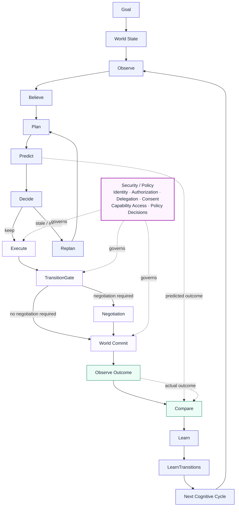

# MonkeyBrain — CognitiveOS

Most agent systems build agents that can call tools. Monkeypatched
builds the operating system that lets autonomous actors exist inside a
changing world.

CognitiveOS enables autonomous entities to interact with the world in
a state-aware way — continuously grounding decisions in changing world
state, updating local and global state through action, and learning
from the results.

A persistent, per-actor cognitive runtime, not a stateless request/
response tool-caller: each actor keeps its own beliefs, memory, goals,
and execution history inside a shared, persistent world, across every
tick — not reconstructed fresh per call. See
[Feature Set](#feature-set) below for what that means concretely, and
[Architecture](docs/architecture.md) for how it's actually built.

FastAPI entry point: `src/monkey_brain/api/main.py`, port 8031.


## Documentation

- [Install & Run](docs/install-and-run.md) — clone, install (Docker
  Compose or native), boot, verify, and your first real request.
- [Architecture](docs/architecture.md) — layering, geography/society
  split, world/policy split, timelines, and how it all actually fits
  together, as verified live across Gates 3-9.
- [OpenAPI spec](docs/openapi.md) — live and frozen spec, 337 paths /
  384 operations (snapshot as of 2026-08-26; the live endpoint is
  always the current count).
- [Examples](docs/examples.md) — real request/response pairs, captured
  live, not hand-written.
- [Deployment guide](docs/deployment.md) — Docker Compose, Kubernetes,
  Helm.
- [Troubleshooting guide](docs/troubleshooting.md) — real issues hit
  and diagnosed during this build.
- [Architecture Decision Records](docs/adr/) — the full decision record
  for Gates 3 through 11 (006-018).

## How It Works

The canonical CognitiveOS execution model — static structure, not live
data; same diagram the running app renders on its own Lemon Metrics
page (`living-world-explorer/src/components/ArchitectureDiagram.tsx`),
traced directly from the real per-tick stage list
(`ComparisonIntegratedPolicy.configure()`,
[`docs/architecture.md`](docs/architecture.md#cognitive-pipeline-per-actor-tick)).
TransitionGate/Negotiation/World Commit run *inside* Execute, gating
each action before it mutates shared state — not as steps after
Compare/Learn. Security/Policy governs the cycle as a boundary, not a
sequential stage in it.



## Feature Set

Current architecture and qualification status — consolidated
implementation inventory for the open-source (AGPL) edition.

### Cognitive Core

- Natural-language intent ingestion
- Intent → Goal transformation
- World-grounded planning
- Execution graph generation
- Plan validation
- Dependency reasoning
- Ordered execution
- Independent action decomposition
- Constraint-aware planning
- Priority-aware planning
- Preference-aware planning
- Prediction before execution
- Observe → Compare → Learn loop
- Belief update
- Replanning after world change

### World Model & Grounding

- Persistent world representation
- Current world-state grounding
- Entity resolution
- Capability grounding
- Provider grounding
- Availability reasoning
- Inventory reasoning
- World mutation handling
- Stale-state detection
- World-state validation
- World-change observation
- Belief/world consistency checking

### Execution Runtime

- CognitiveRuntime
- Plan / Observe / Act / Learn loop
- Execution Graph
- Execution state tracking
- Execution node dependencies
- Action dispatch
- Capability discovery
- Capability execution
- Execution result handling
- Execution provenance
- Correlation tracking
- Causation tracking
- Generic recovery contract
- Retry execution
- Same-tick recovery
- Partial-failure handling
- Dependency-failure handling

### Domain Isolation

- Dependency injection
- One-way capability registration seam
- Domain capabilities register into CognitiveOS
- No OS imports of grocery implementations
- ActionExecutor does not inspect domain parameters
- Domain parameters remain opaque to OS runtime
- Domain-specific recovery remains in capabilities
- Non-grocery domain compatibility
- Fictional machine domain verified
- Fictional robotics domain verified
- Static OS/domain boundary guard
- Behavioral domain-isolation tests
- 13/13 isolation tests passing
- 84/84 deterministic regression tests passing

### Failure & Recovery

- Deterministic fault injection
- Provider failure detection
- Capability failure detection
- Failure propagation
- Failure comparison
- Recoverable failure classification
- Generic retry
- Alternative-provider recovery
- Same-tick recovery
- Partial recovery
- No duplicate successful actions
- Recovery provenance
- Recovery boundedness
- Safe generic fallback

### Human-in-the-Loop

- Human approval requirement
- Approval boundary
- WAITING_FOR_HUMAN state
- Persistent pending approval
- Human approval
- Human rejection
- Resume original execution
- Approval survives restart
- No unauthorized action during pause
- No duplicate action after resume
- Live HTTP E2E verification

### Persistence & Checkpointing

- Execution checkpoints
- Persistent execution state
- Runtime restart recovery
- Pending execution restoration
- Completed-node preservation
- Pending-node preservation
- Resume from checkpoint
- Duplicate-action prevention
- Checkpoint goal preservation
- Original request preservation
- Live checkpoint/resume verification

### Multi-Agent Runtime

- Multiple cognitive actors
- Actor identity
- Actor-specific execution state
- Actor isolation
- Concurrent actors
- Conflicting beliefs/observations
- Shared goals
- Delegation
- AskActor
- Delegated execution
- Delegated result propagation
- Delegation fallback
- Negotiation
- Actor-to-actor coordination
- Correlated delegated transactions
- Causation/provenance

### Shared Resources

- Shared resource representation
- Shared budget
- Cross-actor budget accounting
- Budget reservation
- Budget reconciliation
- Concurrent budget enforcement
- Failed-transaction budget recovery
- Shared constraint enforcement
- Live shared-budget verification

### Learning

- Prediction
- Execution outcome capture
- Expected vs actual comparison
- Comparator
- Learning evidence generation
- Success learning
- Failure learning
- Provider performance learning
- Persistent learned state
- Cross-execution learning
- Learning inspection
- Learning from actual outcomes
- Historical evidence preservation

### Policy & Governance

- Policy enforcement
- Runtime policy
- Security policy
- Learning policy
- Fraud-review gate
- Fraud-risk evaluation
- Velocity/cooldown visibility
- Permission enforcement
- Communication permissions
- Policy-aware execution
- Security controls preserved during qualification
- No policy bypass

### Security

- Identity
- Authorization
- Delegation
- Consent
- Revocation
- Private cognition
- Pre-commit security
- Negotiation-before-commit
- TransitionGate
- World commit authorization
- Mutation protection
- Execution audit
- Actor attribution
- Policy audit
- Consent audit
- Negotiation audit
- Transition audit
- Capability audit
- Security audit
- Security monitoring
- Security violation detection
- Cross-actor access monitoring
- Security dashboard

### Trust, Membership & Society

- Society model
- Actor membership
- Actor Registry
- Agent Registry
- Capability Registry
- Provider Registry
- Membership scoping
- Membership revocation
- Shared World
- Trust network
- Affiliation Graph
- Governance
- Policy registry
- Society-level capabilities
- Society administration
- Trust relationships
- Actor affiliation
- Provider affiliation
- Trust-aware discovery

### Agents & Communication

- Agent model
- Agent identity
- Agent registry
- BrocaAgentRegistry
- Agent discovery
- AgentBus
- Agent routing
- Actor-to-agent communication
- Agent-to-agent communication
- Sender attribution
- Receiver attribution
- Conversation history
- Communication isolation
- Conversation security
- Agent authorization

### Capabilities

- Capability model
- CapabilityRegistry
- Capability discovery
- CapabilityBus
- Capability routing
- Capability execution
- Capability/provider separation
- Capability authorization
- Capability scope
- Capability security
- Capability observability
- Capability → provider routing

### Providers

- Provider model
- ProviderRegistry
- Provider discovery
- ARD discovery
- Local registry discovery
- OpenClaw provider
- N8n provider
- NANDA fallback
- Provider selection
- Provider → capability mapping
- Provider execution
- Provider health
- Provider observability
- Provider security/policy
- Provider admin UI

### Negotiation

- Negotiation model
- NegotiationPlanner
- TransactionCoordinator
- PendingNegotiation
- Contention detection
- Counterparty identification
- Negotiation lifecycle
- Accept/reject
- Negotiation state
- Negotiation isolation
- Negotiation before commit
- Negotiation → TransitionGate
- Negotiation admin UI
- Negotiation trace

### Commerce / Reference Grocery Domain

- Product selection
- Provider selection
- Order creation
- Payment confirmation
- Payment
- Order confirmation
- Delivery
- End-to-end transaction
- Real-world inventory
- Real-world availability
- Real execution state
- Wallet
- Actor orders
- Actor preferences
- Order → execution linkage
- Order → security linkage
- Order → negotiation linkage

### Edge / Cloud Deployment

- Edge CognitiveOS
- Cloud CognitiveOS services
- Per-actor process
- Per-actor PID/log
- Edge startup
- Edge shutdown
- Edge actor deployment
- Kubernetes deployment
- Actor-specific pods
- Shared Society infrastructure
- Edge → Cloud sync
- Actor-specific state
- Deployment scripts
- Actor deployment observability
- Durable production recovery
- Large-scale load qualification

### Observability & Admin Console

- Lemon metrics
- Runtime metrics
- Execution metrics
- Pipeline metrics
- Actor monitoring
- World monitoring
- Security monitoring
- Execution trace
- Debugger
- Plan Analyzer
- Context visualization
- Grounding visualization
- Audit visualization
- Provider monitoring
- Dashboard
- Actors
- Societies
- World Map
- Timeline
- Negotiations
- Knowledge Graph
- Grounding Graph
- Context Stream
- Memories
- Affiliations
- Capabilities
- Providers
- Communication
- Security
- Orders & Wallet
- Settings

### Verification & Qualification

- Unit test triage
- Integration — 85/85
- Deterministic solvers — 61/61
- Qualification regression — 10/10
- Actor isolation — 10/10
- State-transition gate — 8/8
- Milk E2E with strict ordering
- Frontend qualification
- Security qualification
- Deployment verification
- Provider tests
- Negotiation tests
- Remaining infra-timing qualification
- Remaining architecture/constitution cleanup

### Benchmark Scenarios

- MB-0001 Hello World / Milk — PASS
- MB-0002 Multi-Agent shared budget — PASS
- MB-0003 Provider Discovery — PASS
- MB-0004 Budget Constraint — PASS
- MB-0005 Priority Constraint — PASS
- MB-0006 Reservation — PASS
- MB-0008 Interruption — PASS
- MB-0009 Temporal reasoning — PASS
- MB-0010 Negotiation — PASS
- MB-0011 Belief vs Reality — PASS
- MB-0012 Human approval — PASS
- MB-0013 Long-running plan — PASS
- MB-0014 Partial failure — PASS
- MB-0015 Learning — PASS

### Completion by Domain

| Domain | Completion |
|---|---|
| CognitiveOS runtime | 98% |
| Cognitive loop | 97% |
| World model | 95% |
| Memory / beliefs | 97% |
| Agents | 95% |
| Capabilities | 95% |
| Providers | 95% |
| Society | 95% |
| Trust / affiliations | 95% |
| Negotiation | 95% |
| Governance | 95% |
| Security | 100% — qualified |
| Commerce | 95% |
| Edge/cloud | 90% |
| Observability | 95% |
| Admin frontend | 95% |
| Testing / qualification | 90% |
| Production hardening | 80–85% |
| **Overall** | **94–95%** |

## Install & Run

```bash
git clone https://github.com/monkeypatched-stack/cogitive-os.git
cd cogitive-os
docker compose up agentos
curl http://localhost:8031/live
```

That's Docker Compose; for a native install against your own
MongoDB/Redis/Neo4j, prerequisites, verifying the boot actually
succeeded, and your first real request — see
**[`docs/install-and-run.md`](docs/install-and-run.md)**.

## License

Copyright (C) 2026 Prashun Javeri. See [`NOTICE`](NOTICE) for the full
copyright/license notice.

CognitiveOS is fully open source under the
[GNU Affero General Public License v3.0 or later](LICENSE)
(AGPL-3.0-or-later). Free to use, modify, and self-host. If you modify
this software and make it available to users over a network, AGPLv3
requires you to make your complete modified source available to those
users under the same license. There is no restricted "Enterprise
Edition" — see [Commercial Services](#cognitiveos-commercial-services)
below for what Monkeypatched offers alongside the open-source runtime.

## CognitiveOS Commercial Services

CognitiveOS is fully open source under the GNU Affero General Public
License v3.0 or later (AGPL-3.0-or-later).

Monkeypatched does not restrict access to the CognitiveOS cognitive
runtime in order to create a paid "Enterprise Edition".

Instead, Monkeypatched provides optional commercial services for
organizations that need CognitiveOS adapted to their own environment.

### Enterprise World Integration

Organizations can engage Monkeypatched to connect CognitiveOS to their
specific enterprise world.

This may include:

#### Ontology

- Enterprise ontology design
- Entity and relationship modeling
- Ontology mapping
- Domain-specific semantics
- Ontology evolution

#### Data Integration

- ERP systems
- CRM systems
- WMS systems
- Databases
- Internal APIs
- Event streams
- Existing enterprise platforms

#### Capabilities

- Enterprise-specific capabilities
- Provider integrations
- Internal tools
- Domain-specific execution interfaces

#### Deployment

- Cloud deployment
- Edge deployment
- On-premises deployment
- Private infrastructure
- Production integration

#### Security and Governance

- Enterprise identity integration
- Authorization integration
- Policy integration
- Governance configuration
- Audit integration

#### Ongoing Services

- Ontology maintenance
- Integration maintenance
- Custom engineering
- Production support
- Architecture assistance
- Upgrades and migration

### Important Licensing Boundary

Commercial services are separate from the CognitiveOS open-source
license.

The CognitiveOS source code remains available under AGPL-3.0-or-later.

Purchasing commercial services does not remove the customer's rights
under the AGPL.

Likewise, using CognitiveOS under the AGPL does not create an
obligation to purchase commercial services from Monkeypatched.

Specific commercial services, deliverables, support commitments,
warranties, liability provisions, pricing, and other contractual terms
are defined separately in customer agreements.

This document is a description of the commercial model and is not a
commercial services agreement.

### LLM Costs

Customers may incur separate costs for LLM/API usage from their chosen
model providers. Such costs are independent of CognitiveOS licensing
and Monkeypatched professional-services fees.
