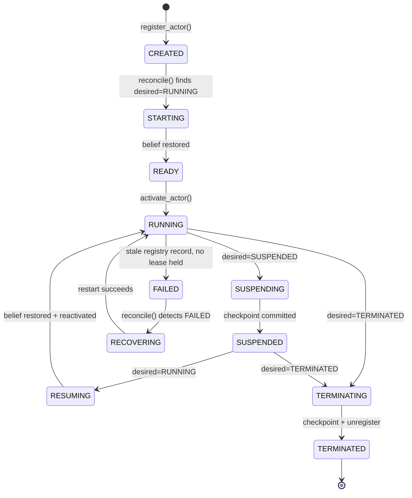
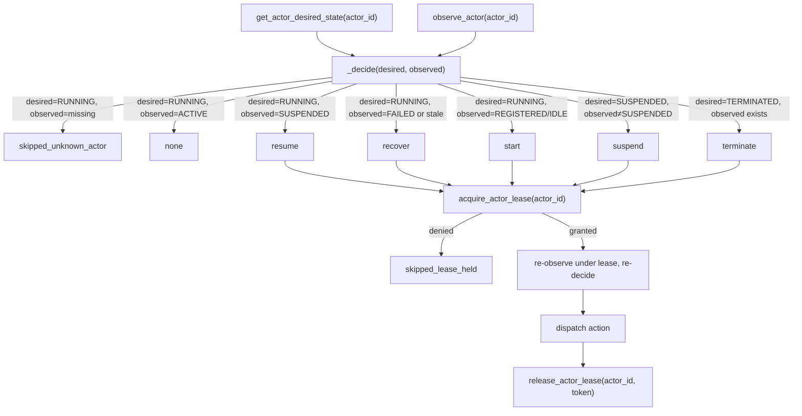
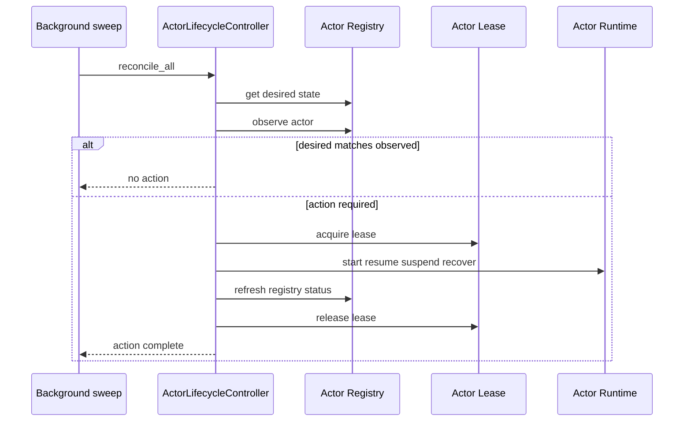

# Actor Lifecycle

The Actor Lifecycle Controller is CognitiveOS's control-plane component for managing an Actor's *lifecycle* — whether it exists, is running, suspended, or terminated — as distinct from the Actor's own *cognition* (belief, planning, decision-making). It is the CognitiveOS analog of a Kubernetes controller/reconciliation loop, built for the deployment abstraction established in `DEPLOYMENT_ARCHITECTURE.md`: an Actor is CognitiveOS's independently-deployable, autonomous cognitive unit — the structural analog of a Kubernetes Pod.

**The invariant this whole component exists to protect:**

> THE CONTROLLER MANAGES THE ACTOR. THE ACTOR MANAGES ITS COGNITION.

The controller never plans, decides, executes a capability, or forms a belief on an Actor's behalf. It only ever does one of three things: flip `is_active`/`status` on an already-constructed `ActorRuntimeState`, call an already-existing, already-governed method (`register_actor`, `checkpoint_actor_belief`, `restore_actor_belief`, `unregister_actor`), or publish an event describing what happened.

---

## 1. Actor Lifecycle



**Why STARTING/READY/SUSPENDING/RESUMING/TERMINATING are events, not persisted states.** The task that produced this document's spec asked for these as explicit states in the state machine. They are faithfully represented above and are real, ordered, published `LifecycleEvent`s (`ACTOR_STARTING` → `ACTOR_READY` → `ACTOR_STARTED`, etc.) — but they are deliberately **not** separately persisted in the actor registry. A persisted "currently mid-transition" flag is itself a piece of state that can desync from reality on a crash (if the process dies between writing `STARTING` and writing `RUNNING`, what does a second process do with a persisted `STARTING` it can't corroborate?) — exactly the class of bug this whole controller exists to close. Instead, "is a transition currently in flight" is answered by a single, already-correct source of truth: whether this Actor's ownership lease (`PlanetaryRuntime.acquire_actor_lease`) is currently held. `ActorStatus` (the *observed*, persisted state — `kernel/society/domain.py`) carries the stable states only: `REGISTERED`, `INITIALIZED`, `ACTIVE`, `IDLE`, `SUSPENDED`, `FAILED`, `TERMINATED`.

---

## 2. Desired vs. Observed State

| | Desired State | Observed State |
|---|---|---|
| Type | `ActorDesiredState` (`kernel/society/actor_lifecycle.py`) | `ActorStatus` (`kernel/society/domain.py`) + `ObservedActorState` |
| Values | `RUNNING`, `SUSPENDED`, `TERMINATED` | `REGISTERED`, `INITIALIZED`, `ACTIVE`, `IDLE`, `SUSPENDED`, `FAILED`, `TERMINATED` |
| Owned by | The control plane / operator intent | The Actor's own runtime, as last reported |
| Persisted | `monkeybrain:actor:desired_state:{actor_id}` (Redis, dedicated key — a plain `SET`, never a read-modify-write on the larger actor blob) | The actor registry hash `monkeybrain:actors:hash` (Redis) + live in-memory `ActorRuntimeState.status` |
| Kubernetes analog | Pod/Deployment `spec` | Pod `status` |

The controller's entire job is comparing these two and acting on the difference — exactly the Kubernetes controller pattern:



The re-observe-under-lease step is what makes `reconcile()` safe under concurrency (Section 8 below): a cheap, lock-free read decides *whether* an action might be needed; only then is ownership acquired, and the decision is re-checked once more before anything actually happens.

---

## 3. Controller Responsibilities

`ActorLifecycleController` (`kernel/society/actor_lifecycle_controller.py`) owns:

- **`reconcile(actor_id)`** — the core loop: compare desired vs. observed, act on the difference, idempotently.
- **`reconcile_all()`** — sweep every actor the registry knows about (the background loop's unit of work).
- **`set_desired_state` / `get_desired_state`** — the declarative front door.
- **`observe(actor_id)`** — merge the durable registry record with local residency and lease status into one `ObservedActorState`.
- **`lifecycle_history(actor_id)`** — durable transition history, via the existing `TimelineStore`.

It does **not** own: planning, belief formation, capability dispatch, governance, or authority. Those remain exactly where they were before this controller existed — `action_executor.py` → `TransitionGate`/`domain_security.py`, untouched.

## 4. Actor Responsibilities

An Actor (`CognitiveActor`/`ActorRuntimeState`) owns its own `Observe → Believe → Plan → Predict → Decide → Execute → Observe Outcome → Compare → Learn → Compile-Φ → Commit` cycle, run by `SocietyRuntime.tick_one_actor()` — completely unmodified by this controller. The controller only ever decides *whether* that cycle is currently allowed to run (`is_active`), never *what happens inside it*.

---

## 5. State Ownership

| State | Owner | Where it lives |
|---|---|---|
| Desired state | Control plane / whoever calls `set_desired_state` | Redis, `monkeybrain:actor:desired_state:{actor_id}` |
| Observed status | The Actor's own runtime, reported via `SocietyRuntime.activate_actor`/`deactivate_actor`/the controller's own `_do_*` methods | Redis actor registry hash + live `ActorRuntimeState.status` |
| Belief content | The Actor itself | `ActorStateStore` (Mongo), via `checkpoint_actor_belief`/`restore_actor_belief` — **reused, not reimplemented** |
| Lifecycle history | The controller (audit trail of its own actions) | `TimelineStore` (Redis), `TimelineKind.DECISION` entries prefixed `actor_lifecycle:` — **reused, not a new store** |
| Ownership / in-flight marker | Whichever node currently holds it | Redis, `monkeybrain:actor:lease:{actor_id}` (built for the ownership/lease gap, reused here unmodified) |

No new persistence system was introduced. Every durable fact the controller needs was either already real (the actor registry, `TimelineStore`, `ActorStateStore`, the actor lease) or is a single new dedicated Redis key (desired state) chosen specifically to avoid a read-modify-write race on the much larger existing actor blob.

---

## 6. Persistence

See the table above. The one genuinely new persistence surface is `set_actor_desired_state`/`get_actor_desired_state` (`PlanetaryRuntime`) — a plain Redis `SET`/`GET` on a dedicated per-actor key, with an in-memory fallback (`self._desired_state_fallback`, non-durable, single-process) when Redis is unavailable, matching every other store's degrade-gracefully contract in this codebase.

---

## 7. Failure Recovery

**Crash detection.** A `RUNNING`-desired actor whose registry record has not been refreshed in `ACTOR_LIFECYCLE_STALE_SECONDS` (default 600s — 2× the default auto-tick interval, plus margin for a slow LLM-bound tick) **and** whose lease no one currently holds is treated as `FAILED`. The lease check is what distinguishes a genuinely crashed actor from one that's merely mid-tick on a long-running call.

**Recovery restarts the Actor, never replays a business action.** `recover_actor` reuses `_do_start`'s exact reconstruct-and-restore path: reload from the registry if not resident, restore belief from the last real Mongo checkpoint (`checkpoint_actor_belief` only ever commits *after* a cognitive cycle has actually finished — never mid-action), reactivate. The Actor's next real tick begins a fresh planning cycle from that restored belief. Nothing in recovery re-invokes a capability, resubmits a plan, or touches `execution_checkpoint_store.py`/`negotiation_store.py` state directly — those are a *different* checkpoint mechanism, scoped to one in-flight plan execution, not the actor-level lifecycle concern this controller owns.

**Known limitation, stated plainly:** `negotiation_store.py` and `execution_checkpoint_store.py` are keyed by `execution_id`, not `actor_id` — there is no general "list every outstanding commitment for this actor" query in the current architecture. `terminate_actor` does a best-effort check of the actor's own last tick result for a pending `requires_negotiation` flag and logs a warning if found, but this is not exhaustive. Building a full cross-store, actor-indexed commitment query was judged out of scope (Section 23: do not overengineer) — it would require schema changes to two existing stores for a guarantee this document does not claim to provide.

**Checkpoint-before-terminate.** `PlanetaryRuntime.unregister_actor()` — the one canonical termination path, called by both `terminate_actor` above and `DELETE /actors/{actor_id}` — checkpoints belief before removing the actor, and searches every managed society to find its cognition (not only the default one, which was the actual reason `DELETE` previously needed its own inline search loop: an actor registered against a non-default `society_id` could not be found by the old, narrower `unregister_actor`). The safety guarantee lives in this one place rather than being the caller's responsibility to remember, so any future termination entry point inherits it automatically.

---

## 8. Identity

`ActorIdentity.actor_id` (`kernel/society/domain.py`) was already independent of PID, container ID, pod name, hostname, IP, or process memory address before this controller existed — a stable UUID generated at registration, referenced by every lifecycle transition. The controller adds nothing here except confirming, via tests, that no lifecycle action ever changes it (`test_15_actor_id_never_changes_across_any_lifecycle_transition`). `PlanetaryRuntime._node_id` (added for the actor-registry work this controller builds on) is the *execution location* identity — deliberately a separate concept, never conflated with `actor_id`.

---

## 9. Communication

The controller has no dependency on NATS. Every lifecycle action operates through Redis (registry, lease, desired state) and Mongo (belief checkpoint) only — `test_24_lifecycle_actions_do_not_depend_on_nats` asserts this directly. Cross-process *discovery* (finding which node an actor lives on) is the Actor Registry's job (`locate_actor`/`list_registry`, built in the prior increment of this work), which the controller consumes but does not duplicate.

---

## 10. Governance Boundary

**Starting an Actor never grants it authority.** The controller's `_do_start`/`_do_resume`/`_do_recover` methods call `restore_actor_belief` and `sr.activate_actor` — nothing else. They never touch `TransitionGate`, `domain_security.grant_delegation`, or any capability-authorization path. `test_16_lifecycle_actions_never_touch_capability_or_governance_state` enforces this structurally (asserts the controller module's own source never references those surfaces). Every real action an Actor takes after being started still passes through the exact same governed path — `action_executor.py` → `TransitionGate`/`domain_security.py` — it always did. Deployment lifecycle and world-action authorization remain two separate concerns, exactly as required.

---

## 11. Kubernetes Architectural Analogy

```
Kubernetes                          CognitiveOS
─────────────────────────────       ─────────────────────────────
Desired Pod state (spec)      →     ActorDesiredState
Controller                    →     ActorLifecycleController
Observed Pod state (status)   →     ActorStatus + ObservedActorState
Reconciliation                →     reconcile() / reconcile_all()
Pod runtime                   →     Actor runtime (CognitiveActor / ActorRuntimeState)
```

The analogy is architectural, not cosmetic: the controller owns Actor **lifecycle** (existence, running/suspended/terminated, crash recovery), never Actor **cognition** — the same separation Kubernetes draws between "the Deployment controller" and "the application process inside the container." A Kubernetes controller does not know what your web server is doing; this controller does not know what an Actor is planning.

---

## Reconciliation Loop



Repeat the sweep for each actor in the registry. Nested `loop` / `alt` blocks
are omitted because GitHub's Mermaid renderer does not handle them reliably.

Background loop wiring: `PlanetaryRuntime.start_actor_lifecycle_reconciliation()` (default 60s, `ACTOR_LIFECYCLE_RECONCILE_INTERVAL` env var), started at boot in `kernel.py` alongside the existing auto-tick scheduler — a second, independent loop, since lifecycle reconciliation and cognition ticking answer different questions on different cadences.

---

## Known Limitations

Stated plainly, per the instruction not to claim guarantees that don't exist:

1. **No exhaustive in-flight-work check on terminate.** `negotiation_store.py`/`execution_checkpoint_store.py` are `execution_id`-keyed, not `actor_id`-keyed; `terminate_actor` only checks the actor's last tick result for a pending negotiation, not every store.
2. **`reconcile_all()` only discovers actors already in the registry.** An actor_id with a desired-state record but no registration is only correctly reported (`skipped_unknown_actor`) via a direct `reconcile(actor_id)` call, not the background sweep.
3. **Staleness-based crash detection has a detection window**, not instant detection — up to `ACTOR_LIFECYCLE_STALE_SECONDS` (default 600s) plus the reconciliation loop's own interval (default 60s) before a genuinely crashed actor is recovered.
4. **No distributed consensus, no leader election, no quorum.** The actor lease is a Redis `SET NX EX` + Lua compare-and-delete — correct for "don't let two nodes tick/transition the same actor concurrently," not a substitute for genuine distributed consensus if that's ever needed elsewhere.
5. **In-memory fallback (no Redis) is single-process only**, by design — desired state and lease enforcement both degrade to "there is only one process, so there's nothing to race" when Redis is unavailable, the same fallback contract every other store in this codebase already has.
6. **`SocietyGovernanceEngine` and `SocietyRuntime._message_queue` remain independent, unrelated cross-process gaps** (documented in `DEPLOYMENT_ARCHITECTURE.md`) — this controller does not touch either.
