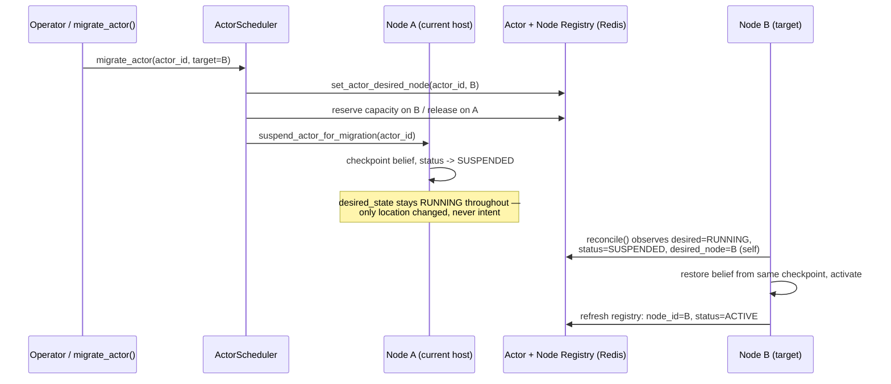
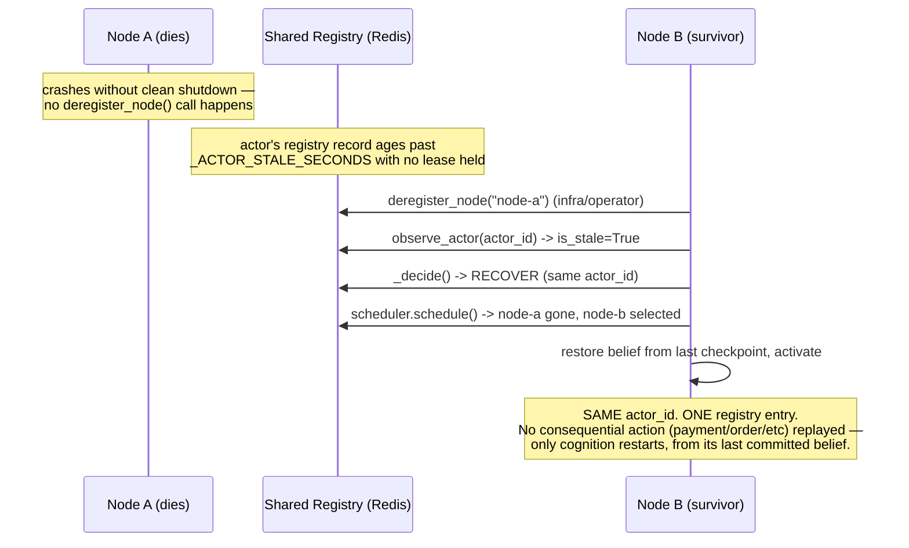

# The CognitiveOS Actor Scheduler

## Central invariant

**ACTOR IDENTITY ≠ ACTOR LOCATION.**

An actor's `actor_id` is permanent, assigned once at registration
(`PlanetaryRuntime.register_actor`), and never changes for the actor's
entire lifetime — regardless of how many times it is started, suspended,
crashed, recovered, or migrated. The Scheduler answers one question only:
*given this actor should be running, which execution node should host
it right now?* It never answers *should this actor exist*, *what should
it believe*, *what is it allowed to do*, or *is it currently running* —
those are the Actor Registry, the Actor's own cognition, governance
(`TransitionGate`/`domain_security.py`), and the Actor Lifecycle
Controller's job, respectively, and this module imports none of them.

```
Actor Desired State
       ↓
Actor Registry
       ↓
Actor Scheduler        ← this document
       ↓
Execution Node
       ↓
Actor Runtime
```

## Why this is not a rebuild of `edge_device_coordinator.py`

`kernel/distributed/edge_device_coordinator.py` already explored this
problem — `EdgeDevice`, `DeviceCluster`, `DistributedExecutionCoordinator`
— but confirmed, by exhaustive grep, to have **zero live callers**
anywhere in this codebase. It also has two properties that make it unsafe
to build directly on:

1. **No persistence.** `_devices`/`_clusters`/`_actor_placement` are
   plain process-local dicts. A real scheduler needs a registry every
   node and every reconciler can see, the same requirement the Actor
   Registry itself already solved with Redis.
2. **A disconnected actor model.** Its `DistributedActor` mixin assumes
   `self.id`/`self._device_id` — it never touches `ActorRuntimeState`/
   `ActorIdentity`, the real actor abstraction this session's Actor
   Registry, Actor Lifecycle Controller, and this Scheduler all share.

Rather than wrap a disconnected, unpersisted prototype, this Scheduler
reuses its *good ideas* — a node-class enum, explicit capacity/available
capacity, capability-based filtering — as fresh code
(`kernel/society/actor_scheduler.py`) integrated with the infrastructure
this session already built and proved: the Redis-backed Actor Registry,
the per-actor ownership lease, and the Actor Lifecycle Controller's
reconcile loop.

## Node model

An `ExecutionNode` (`kernel/society/actor_scheduler.py`) represents
compute/execution location — never an actor:

| Field | Meaning |
|---|---|
| `node_id` | Stable identity. For a `PlanetaryRuntime` process, this is the same `self._node_id` the Actor Registry and lease already key on — not a second identity system. |
| `node_class` | `CLOUD` / `EDGE` / `DEVICE` |
| `capacity` / `current_actor_count` | Actor-slot based, matching `edge_device_coordinator.py`'s own model. `available_capacity` is derived. |
| `capabilities` | Free-text tags (`"gpu"`, `"low_latency"`, …) — same "no code change for a new value" convention as `Society.society_type`. |
| `region` | Free-text, for soft region preference. |
| `reported_health` | What the node last reported. Recomputed to `UNKNOWN` at every read if the heartbeat is stale — see `PlanetaryRuntime._node_with_computed_health`. |

Nodes are stored in a Redis hash (`monkeybrain:nodes:hash`), same shape as
the Actor Registry's own `monkeybrain:actors:hash` — one hash field per
node, JSON-encoded. A `PlanetaryRuntime` process self-registers as a
`CLOUD` node when its lifecycle reconciliation loop starts
(`register_self_as_node`, opt-out via `SCHEDULER_SELF_REGISTER=false`),
and heartbeats every reconciliation interval. An edge device or any
other process can also call `register_node`/`heartbeat_node` directly.

## Unmanaged mode

If **no node has ever been registered anywhere**, the Scheduler is not
"empty of candidates" — it is not participating at all. `schedule()`
returns `scheduled=True, node_id=""` (placement unconstrained), and the
Lifecycle Controller proceeds exactly as it did before this Scheduler
existed. This is deliberate: every environment that never opts into the
node registry — including this repository's own pre-existing test suite
— must see unchanged behavior.

## Placement requirements (`ActorPlacementRequirements`)

The declarative "what does this actor need" record — the Scheduler's
half of what `DEPLOYMENT_ARCHITECTURE.md` Section 4 described only in
prose as `ActorSpecification`. Two independent kinds of constraint:

- **Hard** (`required_capabilities`, `required_node_class`,
  `prohibited_node_ids`, `min_available_capacity`) — eliminate a node
  outright. A node failing any hard constraint is never a candidate,
  never scored, never selected.
- **Soft** (`preferred_node_class`, `preferred_region`) — only influence
  *ranking* among nodes that already pass every hard constraint.

Stored per-actor (`PlanetaryRuntime.set_/get_actor_placement_requirements`),
defaulting to "no constraints" for every actor that never opts in.

## Algorithm

Deterministic. No ML, no LLM, no randomness.

```
candidates = list_nodes()
healthy    = [n for n in candidates if n.reported_health == HEALTHY]
qualifying = [n for n in healthy if satisfies_all_hard_constraints(n)]

if not qualifying:
    return UNSCHEDULABLE(reason, rejected=[(node_id, why), ...])

ranked = sort(qualifying, key = -preference_score, then node_id)
for node in ranked:
    if atomically_reserve_capacity(node):   # Section "Concurrency safety" below
        return SCHEDULED(node)
return UNSCHEDULABLE("every qualifying node lost its reservation race")
```

Every decision — scheduled or not — carries `candidates_considered` and
`candidates_rejected: [(node_id, reason), ...]`, so *why* a node was or
wasn't chosen is always inspectable, never a black box.

## UNSCHEDULABLE is a valid state, not a failure to fix silently

When no healthy node satisfies an actor's requirements, the Scheduler
returns `scheduled=False` with an explicit reason. It never invents a
placement, never silently retries into a degraded node, and never
crashes. The Lifecycle Controller treats this as a terminal
`ReconciliationResult` (`action="unschedulable"`) and publishes an
`ACTOR_UNSCHEDULABLE` event — visible, not swallowed. The actor is left
in its prior state; the next reconciliation pass tries again (a node
might register, or capacity might free up), matching Kubernetes' own
`Pending` Pod behavior.

## Strict Scheduler ↔ Lifecycle Controller separation

The Scheduler **never touches an actor process directly**. Its only
write is a placement record (`set_actor_desired_node`) plus an atomic
capacity reservation. It never calls `activate_actor`, never checkpoints
belief, never starts a tick. `test_22_scheduling_alone_never_touches_actor_runtime_state`
(`tests/scenarios/test_actor_scheduler.py`) asserts this directly:
calling `scheduler.schedule()` alone leaves the actor's status and
`is_active` completely unchanged.

The Lifecycle Controller is the only thing that *acts* on a placement
decision. Before `_do_start`/`_do_resume` do anything, they call
`_consult_scheduler`, which:

- Returns `None` (proceed normally) if this node **is** the scheduled
  node, or if the Scheduler is in unmanaged mode.
- Returns a terminal `unschedulable` result if the Scheduler found no
  candidate.
- Returns a terminal `scheduled_elsewhere` result if a *different* node
  is the scheduled one — this node correctly does nothing further.

## Desired vs. observed placement

Same split the Lifecycle Controller already draws for actor *state*,
applied to actor *location*:

- **Desired placement** — `PlanetaryRuntime.get_actor_desired_node`,
  the Scheduler's current decision. Analogous to a Kubernetes Pod's
  `spec.nodeName` once bound.
- **Observed placement** — `ActorRegistryEntry.node_id` /
  `ObservedActorState.node_id`, where the Actor Registry last actually
  saw this actor running. Already existed from this session's earlier
  Actor Registry work; the Scheduler reuses it rather than inventing a
  second "where is it really" concept.

Reconciling the two is exactly what `_decide()`'s migration branch does
(next section).

## Migration (safe checkpoint-and-restart, never live)



`ActorScheduler.migrate_actor()` computes (or accepts) a target node,
updates the desired-placement record, and — if the actor happens to be
resident on the process making the call — checkpoints and locally
suspends it. It does **not** reach into a different process to stop
anything. Whichever node's own reconcile loop next observes
`(desired=RUNNING, status=SUSPENDED, desired_node == that node)` resumes
it via the ordinary, already-existing `SUSPENDED → RESUME` path,
restoring from the exact same checkpoint every other recovery uses.
This is deliberately *not* unsafe live migration (no in-flight process
handoff) — see `DEPLOYMENT_ARCHITECTURE.md` for why that tradeoff is
correct for a persistent, belief-owning actor.

## Node failure → reschedule, never a new identity



This is the single most safety-critical property in this whole
component, and it is enforced by construction, not by convention:
`_do_recover` always calls `_do_start`'s existing reconstruct-and-restore
path (`reconcile_actors_from_redis` + `restore_actor_belief` +
`sr.activate_actor`) — the *same* `actor_id`, the *same* checkpoint
mechanism, the *same* registry record, just possibly on a different
node. Nothing in the recovery path re-invokes a capability, resubmits a
plan, or replays a business action — recovery restarts cognition from
its last committed belief; business-action safety comes from
`execution_checkpoint_store.py`/idempotency keys already in place
upstream, unchanged by this work. `tests/scenarios/test_actor_scheduler.py::test_21`
is a destructive end-to-end test of exactly this scenario, asserting the
actor_id is unchanged, exactly one registry entry exists afterward, and
placement correctly reflects the surviving node.

## Concurrency safety (no over-allocation)

Two `schedule()` calls for two different actors, racing for the last
slot on one node, must never both succeed. A plain
"read `current_actor_count`, check capacity, write `count+1`" from
Python has exactly that race. `PlanetaryRuntime._reserve_node_capacity`
instead runs a single atomic Lua script server-side
(`_RESERVE_NODE_CAPACITY_SCRIPT`, using Redis's built-in `cjson`) that
reads, checks, and writes in one round trip — the same reasoning this
session's `_RELEASE_LOCK_IF_OWNER_SCRIPT` (actor lease) and
`_DRAIN_INBOX_SCRIPT` (message inbox) already established for this
codebase. No separate distributed lock is taken; the hash write itself
is the atomic unit, matching the spec's explicit "no unnecessary
distributed locking" requirement. `test_16_concurrent_scheduling_decisions_never_overallocate`
exercises this with two real OS threads.

This reservation is a **short-lived guard against the scheduling race
window**, not the system of record for a node's load — `heartbeat_node`'s
own `len(sr.all_actors())` recount, run every reconciliation interval,
periodically overwrites it with ground truth, so any drift self-heals.

## Idempotency

Calling `schedule()` repeatedly for an already-validly-placed actor
returns the *same* node without re-ranking or writing anything new
(`test_12`). This matters operationally: the Lifecycle Controller
consults the Scheduler on every `_do_start`/`_do_resume`, and repeated
reconciliation of a healthy, correctly-placed actor must never cause
churn or an unnecessary restart.

## Explicitly not implemented

- **Preemption.** No actor is ever evicted to make room for a
  higher-priority one. Documented here as deliberate future scope, not
  an oversight — the spec explicitly asked this not be built unless
  required.
- **Live migration.** See "Migration" above — checkpoint-and-restart
  only.
- **Advanced scoring / autoscaling / bin-packing.** The ranking function
  is intentionally simple (two preference weights + a tiny capacity-
  headroom tiebreak) and deterministic. A more sophisticated scorer can
  replace `_rank_by_preferences` later without touching anything else in
  this module — the hard/soft constraint split and the reservation
  mechanism are the load-bearing parts, not the specific scoring
  formula.

## Kubernetes analogy — where it holds and where it doesn't

| Kubernetes | CognitiveOS | Note |
|---|---|---|
| Node | `ExecutionNode` | Same "compute location, not workload identity" role. |
| `kube-scheduler` | `ActorScheduler` | Same filter → rank → select shape, same "propose, don't execute" boundary vs. the kubelet analog. |
| kubelet | `ActorLifecycleController` (per reconciling process) | Only the controller acts on a placement; the Scheduler only proposes it. |
| Pod spec / status | Actor desired state / observed state | Already established by `docs/ACTOR_LIFECYCLE.md`. |
| `Pod.spec.nodeName` | `get_actor_desired_node` | Desired placement. |
| Pod eviction | *(not built — no preemption)* | Deliberately out of scope. |

Where the analogy **breaks**, deliberately: a Pod is disposable —
rescheduling a Pod is "delete and recreate," and a new Pod has a new
identity. An Actor is **not** disposable — it has a permanent identity,
owns a persistent belief, and rescheduling it must never fabricate a new
one. This is why `ACTOR IDENTITY ≠ ACTOR LOCATION` is stated as the
governing invariant of this whole document, not a minor footnote: it is
the one place this component's design consciously diverges from its
Kubernetes analog rather than copying it.

## Known limitations

1. **Capacity is actor-count based, not CPU/memory/GPU-quantity based** —
   matching `edge_device_coordinator.py`'s own model. A future
   resource-quantity model (`cpu_millicores`, `memory_mb`, `gpu_count`)
   would replace `ExecutionNode.capacity`/`current_actor_count` without
   changing the hard/soft constraint architecture around it.
2. **No affinity/anti-affinity between actors** — only node-level
   constraints exist today (e.g. "must be EDGE"), not "must run near
   actor X" or "must not run with actor Y." Documented as P1 future
   work, not built here.
3. **Reservation drift is bounded by the heartbeat interval, not
   instant.** Between a scheduling decision and the target node's next
   heartbeat recount, `current_actor_count` reflects reservations, not
   yet-confirmed residency. Acceptable because the reservation itself is
   atomic (no over-allocation), but a node that never actually starts a
   reserved actor (e.g. it silently fails `_do_start`) leaves a phantom
   reservation until the next heartbeat corrects it.
4. **Not validated against a real multi-node deployment.** Every claim
   above was verified by direct code tracing and unit tests against a
   fake Redis (`tests/scenarios/test_actor_scheduler.py`) — no process
   was actually run across multiple real nodes/replicas as part of this
   work. Raising `deploy/k8s/deployment.yaml`'s `replicas` remains a
   deliberate operator decision after real validation, unchanged from
   `DEPLOYMENT_ARCHITECTURE.md`'s existing position on this.
