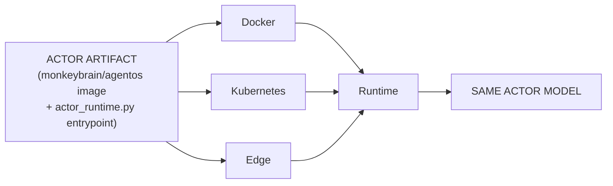
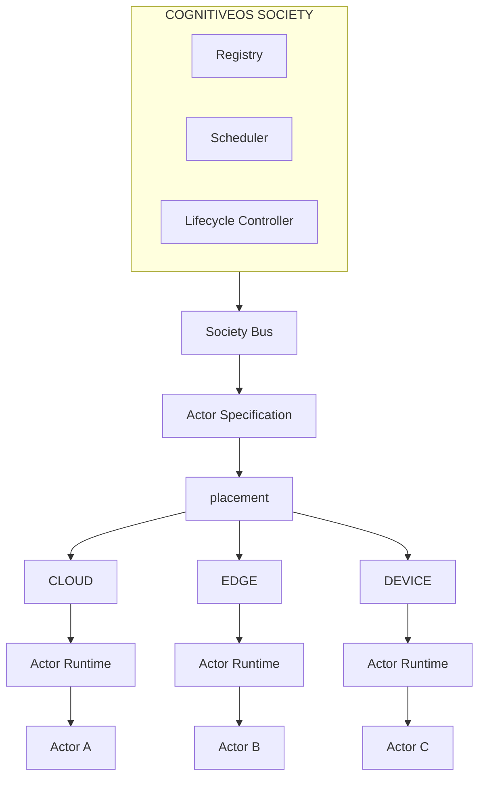
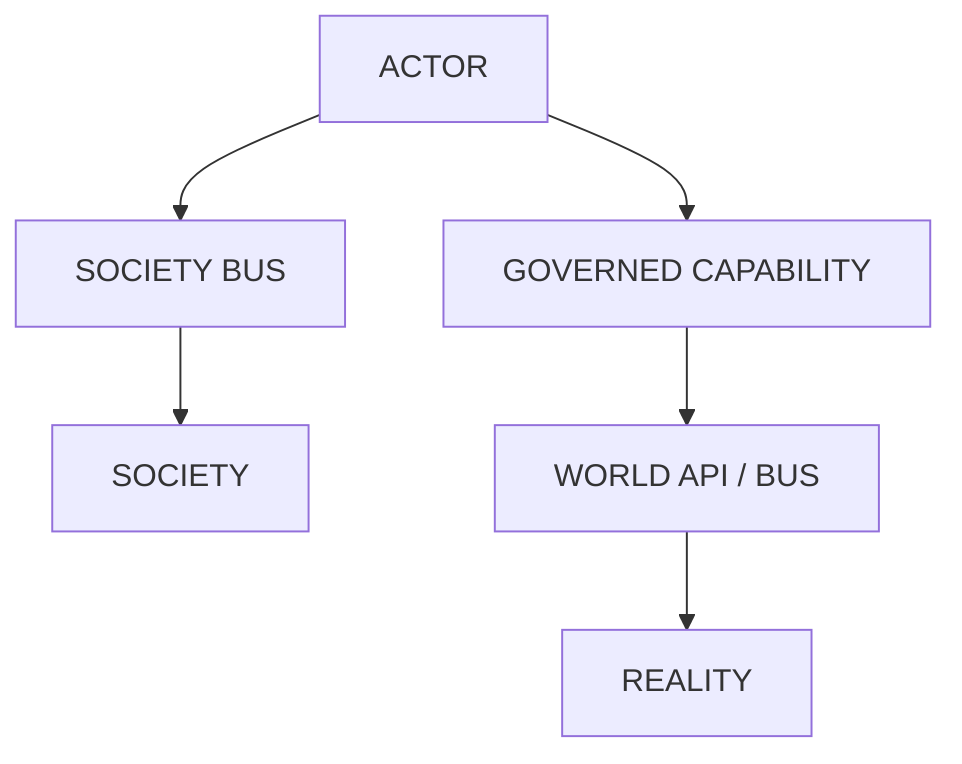
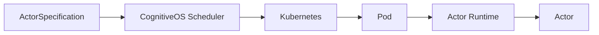
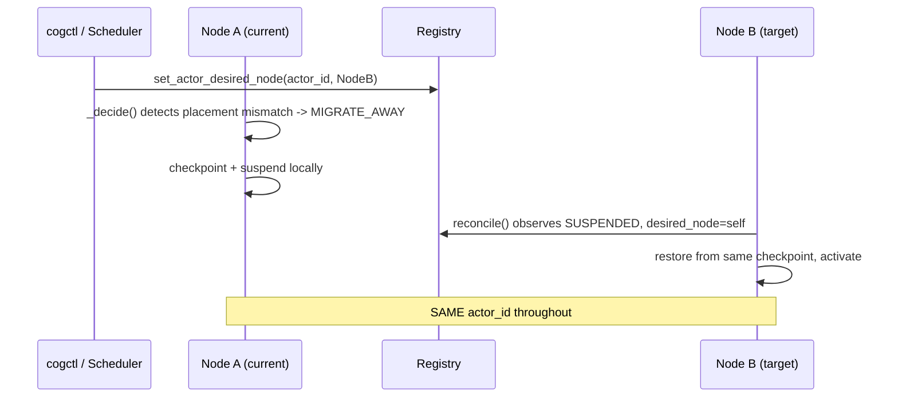

# CognitiveOS — Final Architecture

The consolidated reference for the Actor deployment architecture built
across this session's work. Companion documents this one indexes rather
than duplicates: `docs/ACTOR_SCHEDULER.md`, `docs/ACTOR_ARTIFACT.md`,
`docs/CLOUD_EDGE_ACTOR_ARCHITECTURE.md`, `docs/HORIZONTAL_SCHEDULER_
SCALING.md`, `docs/DEPLOYMENT_MIGRATION.md`, `docs/ACTOR_LIFECYCLE.md`.

## 1. Actor Artifact architecture



One image, one entrypoint module (`src/monkey_brain/actor_runtime.py`),
selected via container `command:`. `ACTOR_ARTIFACT_VERSION` (operator/CI
metadata) is independent of `actor_id` (permanent identity) — an
artifact upgrade never creates a new Actor. Full detail:
`docs/ACTOR_ARTIFACT.md`.

## 2. Actor Runtime architecture

Actor (`CognitiveActor`: identity, cognition, belief, goals,
capabilities) vs. Runtime (`actor_runtime.py`: process lifecycle,
health, checkpoint triggers, node registration) — a literal file
boundary. The Runtime never performs cognition; the Actor never manages
its own process lifecycle. Full detail: `docs/ACTOR_ARTIFACT.md` Section
"Actor vs. Runtime."

## 3. Control Plane architecture



Registry (`PlanetaryRuntime.locate_actor`/`list_registry`, Redis-backed),
Scheduler (`ActorScheduler` — deterministic filter→rank→select,
`docs/ACTOR_SCHEDULER.md`), Lifecycle Controller (`ActorLifecycleController`
— desired-vs-observed reconciliation, `docs/ACTOR_LIFECYCLE.md`). All
three are facilitators composed onto `PlanetaryRuntime`, none owns
cognition, and control-plane load never scales with per-tick cognition
(`docs/HORIZONTAL_SCHEDULER_SCALING.md`'s control/data-plane separation,
verified directly by test).

## 4. Society Bus architecture

NATS (`PlanetaryRuntime.connect_nats`, per-actor inbox subjects
`monkeybrain.actor.{id}.inbox`) + the Redis-backed durable inbox
(`push_actor_message`/`drain_actor_inbox`, fallback when NATS is down) —
built in an earlier pass, unchanged this pass. Supports registration
events, lifecycle events, Actor-to-Actor request/reply
(`AskActorCapability`), broadcasts, and world-change propagation, all
through the SAME transport — no second messaging system exists or was
added.

## 5. World interaction architecture



Every consequential action passes through `ActionExecutor` →
`TransitionGate`/`domain_security.py` — unchanged, untouched by any
deployment-layer work. The offline-safety gate
(`kernel/pipeline/offline_safety.py`, built in the Cloud/Edge Convergence
pass) sits BEFORE this boundary as a connectivity precondition — it
refuses to even attempt a call when connectivity is insufficient, but
never overrides or bypasses `TransitionGate`'s own verdict. No deployment
mechanism (Docker/K8s/edge/`cogctl`) has, or was given, a path that
skips this boundary — `cogctl` in particular never calls a capability at
all; it only ever writes desired state/placement (Section 8 below).

## 6. Cloud deployment

`src/monkey_brain/api/main.py` (Society control plane, many actors) or
`actor_runtime.py --node-class cloud` (one Actor). `deploy/k8s/
deployment.yaml` / `docker-compose.yml`. Unchanged this pass.

## 7. Kubernetes deployment



`deploy/k8s/actor-deployment.yaml` — per-actor template
(`ACTOR_ID`/`ACTOR_NODE_CLASS` envsubst). Kubernetes decides nothing
about WHICH actor_id runs — that's `ActorScheduler`'s decision, recorded
in the Registry before any Pod exists; Kubernetes only knows how to keep
a process matching that decision running (`command: [...,
actor_runtime:app]`, `livenessProbe`/`readinessProbe` against `/live`/
`/ready`). No CognitiveOS code imports the Kubernetes API — the Actor
Runtime doesn't know it's running under Kubernetes at all.

## 8. Edge deployment

Same artifact, `--node-class edge`. `scripts/start_actor.sh --node-class
edge` / `scripts/start_edge_actor.sh` (thin wrapper, migrated this
session's Deployment Migration pass). Edge-specific: the offline-safety
gate defaults ON. Not edge-specific: cognition, capabilities, identity —
all identical to cloud. Full detail: `docs/CLOUD_EDGE_ACTOR_ARCHITECTURE.md`.

## 9. Actor lifecycle

`docs/ACTOR_LIFECYCLE.md` (full state diagram, unchanged this pass).
Summary: REGISTERED → (Scheduler consulted) → ACTIVE/INITIALIZED →
SUSPENDED/FAILED → RECOVER/RESUME → ACTIVE → TERMINATED. Desired state
(`ActorDesiredState`: RUNNING/SUSPENDED/TERMINATED) vs. observed state
(`ActorStatus` + registry `node_id`/`updated_at`) reconciled by
`ActorLifecycleController._decide()`/`reconcile()` — event-driven
(Redis queue, `docs/HORIZONTAL_SCHEDULER_SCALING.md`), with a periodic
full-table sweep as a correctness backstop only.

## 10. Actor migration



Safe checkpoint-and-restart, never live migration (deliberate — see
`docs/ACTOR_SCHEDULER.md`). Verified across node CLASSES specifically
(cloud→edge) in the Cloud/Edge Convergence pass.

## 11. Actor recovery

Staleness-based crash detection (`_ACTOR_STALE_SECONDS`) PLUS (added in
the Actor-Artifact pass) immediate same-node-identity fast-restart
detection — a process that restarts with the same `node_id` before the
staleness timeout elapses is recovered immediately, not after waiting
out the timeout. `docs/HORIZONTAL_SCHEDULER_SCALING.md`'s failure model
table covers node/actor/scheduler/registry failure scenarios with test
references.

## 12. cogctl usage

```
cogctl apply -f actor.yaml
cogctl create actor --name buyer-123 --node-class edge --required-capability camera
cogctl get actors [-o json]
cogctl describe actor buyer-123
cogctl logs actor buyer-123
cogctl restart actor buyer-123
cogctl stop actor buyer-123
cogctl delete actor buyer-123
```

Pure HTTP client (`src/monkey_brain/cogctl.py`) against the Control API
(`api/routes/actors.py`). Never starts a process, never imports
`PlanetaryRuntime`. `cogctl apply`/`create` → `POST /actors/apply`
(create-or-update, same semantics as `kubectl apply`) → registers (if
new) via the canonical `PlanetaryRuntime.register_actor()`, writes
placement requirements/desired state, wakes the event-driven
reconciliation queue — and stops there. Whichever node's Actor Runtime
the Scheduler assigns is what actually reaches READY, on its own
reconciliation loop, not synchronously inside the `apply` request.

`cogctl logs` is honestly scoped: it surfaces the Actor's *lifecycle
event history* (start/stop/migrate/recover transitions), not application
stdout — no centralized log aggregation pipeline exists in this
architecture; a real implementation would tail the specific deployment
mechanism's own log sink (`kubectl logs`, a systemd journal, a file).

## 13. ActorSpecification

```yaml
apiVersion: cognitiveos/v1
kind: Actor
metadata:
  name: buyer-123
spec:
  artifact: cognitiveos-actor
  version: "1.4"
  placement:
    node_class: edge
    required_capabilities: [camera]
    preferred_region: us-east
    claim_node: edge-node-4
  resources:
    capacity: 1
  configuration:
    goals: [get_best_grocery_deals]
    objective: cost
    tenant_id: default
```

`kernel/society/actor_specification.py::ActorSpecification` — pure data
+ validation, no I/O (mirrors `ActorDesiredState`/`ObservedActorState`'s
own "pure data, all I/O in the caller" split). `node_class` is
deliberately unconstrained (`""`) by default — a spec that never
mentions placement must not silently impose a hard cloud-only
requirement. CognitiveOS-native: the `apiVersion`/`kind`/`metadata`/
`spec` shape is borrowed because it's a proven, familiar pattern for
declarative intent, not because this format has any Kubernetes
compatibility goal — the file imports nothing Kubernetes-related, and a
`kubectl apply -f actor.yaml` would do nothing meaningful (Kubernetes has
no `kind: Actor`).

## 14. Kubernetes analogy

| Kubernetes | CognitiveOS |
|---|---|
| Container Image | Actor Artifact |
| Container | Actor Runtime |
| Pod / workload | Actor Execution Instance |
| Node | Execution Node |
| Scheduler | Actor Scheduler |
| Controller | Actor Lifecycle Controller |
| Service discovery | Actor Registry |
| Persistent state | Actor State (Mongo/`ActorStateStore` + Redis registries) |
| `kubectl` | `cogctl` |

**The critical, deliberately-preserved difference:** Kubernetes manages
*process* deployment — a replaced Pod is, by convention, a new identity.
CognitiveOS manages *Actor* deployment — a replaced Runtime, container,
Pod, or Node is still the SAME persistent Actor. Every migration/recovery
test in this session's work (`test_actor_scheduler.py`, `test_
horizontal_scheduler_scaling.py`, `test_actor_runtime_artifact.py`,
`test_cogctl_and_actor_specification.py`) asserts `actor_id` unchanged
and registry-entry-count unchanged across exactly this class of
replacement — this is not aspirational, it is the specific, repeatedly-
verified property distinguishing this architecture from a literal
Kubernetes clone.

## Observability

Every Actor Runtime process exposes `actor_id`, `artifact_version`,
`runtime_version`, `node_id` (execution-node/runtime-instance identity),
and lifecycle state via `GET /status`/`GET /artifact`
(`actor_runtime.py`) — and the same fields are recorded on the Actor's
own Registry entry (`ActorRegistryEntry.artifact_version`/
`runtime_version`, added in the Actor-Artifact pass) so `cogctl get
actors`/`describe` can see them without reaching the specific runtime
process directly. `runtime_instance_id` maps to `ACTOR_NODE_ID` — a
separate field from `actor_id` everywhere it's used, never conflated
(verified directly: `ActorRuntimeConfig.load()` requires `ACTOR_ID`
independently of `ACTOR_NODE_ID`, and `ActorRegistryEntry` carries both
as distinct fields).
