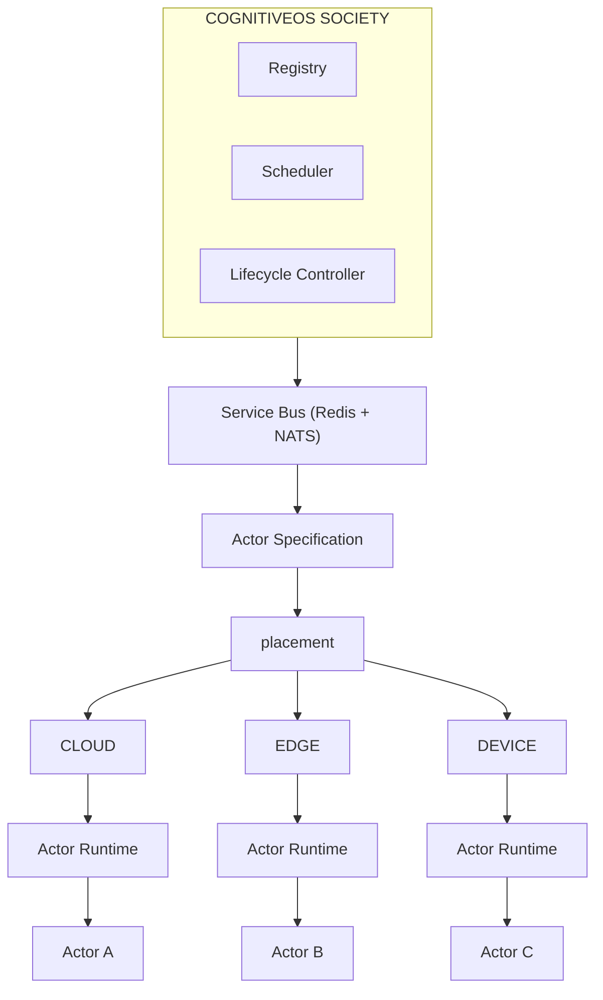
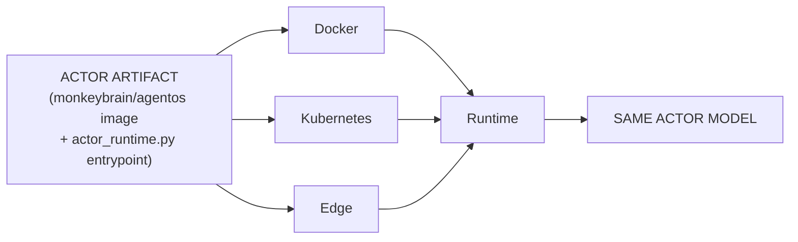

# Deployment Surface Audit & Migration — Actor Artifact Architecture

Companion to `docs/ACTOR_ARTIFACT.md` (the artifact/binary model itself)
and `docs/CLOUD_EDGE_ACTOR_ARCHITECTURE.md` (the unified Actor
abstraction it packages). This document is the full repository audit and
migration record: every deployment surface found, how each was
classified, and exactly what changed and what didn't.

## Target architecture

## 1. Deployment surface inventory

Every file/directory found by direct inspection, not assumed from the
task's own example list (which understated the actual `docker/services/`
count — 24 domain-microservice Dockerfiles exist, not just `agentos`'s).

| Path | Purpose | Classification |
|---|---|---|
| `src/monkey_brain/api/main.py` | Society control-plane ASGI app (Registry/Scheduler/Lifecycle Controller/Governance host, many actors in-process) | **SOCIETY CONTROL PLANE** |
| `src/monkey_brain/actor_runtime.py` | Canonical Actor executable entry point (built this session) | **ACTOR RUNTIME** |
| `src/sync/edge_server.py`, `edge_actor.py` | Standalone "Thesis 14" tabular-RL prototype, disconnected from the Registry | **DEVELOPMENT/TEST TOOL** (explicitly, per its own status note — see `docs/CLOUD_EDGE_ACTOR_ARCHITECTURE.md` Section 1) |
| `deploy/k8s/deployment.yaml`, `service.yaml`, `configmap.yaml`, `secret.yaml`, `pvc.yaml` | Society control-plane K8s workload + its config/secrets/storage | **SOCIETY CONTROL PLANE** |
| `deploy/k8s/opa.yaml` | Policy engine (stateless, shared) | **SOCIETY SHARED SERVICE** |
| `deploy/k8s/servicemonitor.yaml`, `prometheusrule.yaml` | Observability wiring for the Society control-plane Service | **SOCIETY SHARED SERVICE** |
| `deploy/k8s/kustomization.yaml` | Base resource set (Society control plane only — see its own updated comment) | **SOCIETY CONTROL PLANE** (orchestration) |
| `deploy/k8s/edge-actor-deployment.yaml` | Per-actor template, OLD disconnected EdgeActor prototype | **DEVELOPMENT/TEST TOOL** (unchanged; superseded by `actor-deployment.yaml` for real deployments) |
| `deploy/k8s/actor-deployment.yaml` | Per-actor template, real canonical Actor Runtime (built earlier this session) | **ACTOR RUNTIME** |
| `deploy/service_manager.sh` | Local dev: starts infra (mongo/redis/nats/influx) + `main.py` (Society) | **SOCIETY CONTROL PLANE** (dev tooling) |
| `docker-compose.yml` | Society infra (mongo/redis/neo4j/influx/es/nats/opa) + Society control plane (`agentos`) + ~24 unrelated manufacturing-domain microservices | **SOCIETY SHARED SERVICE** + **SOCIETY CONTROL PLANE** (mixed, by design — see Section 2 below for the domain-microservice caveat) |
| `docker-compose.actors.yml` | Actor instances layered on top of the above (new this session) | **ACTOR RUNTIME** |
| `docker/services/agentos/Dockerfile` | Builds the ONE shared image both `main.py` and `actor_runtime.py` run from | **ACTOR RUNTIME** + **SOCIETY CONTROL PLANE** (shared image, selected by `command:` — the deliberate design, not an ambiguity) |
| `docker/services/*/Dockerfile` (23 others) | Manufacturing-domain microservices (customers, orders, workorders, ...) | **SOCIETY SHARED SERVICE** (domain layer) — see Section 2 caveat |
| `docker/Dockerfile.base`, `docker/generate_dockerfiles.py` | Build tooling for the domain microservice Dockerfiles | **DEVELOPMENT/TEST TOOL** (build-time only) |
| `scripts/start_server.sh`, `stop_server.sh`, `start.sh`, `shutdown.sh`, `run_gateway.sh` | Boot/stop the Society control-plane process locally | **SOCIETY CONTROL PLANE** |
| `scripts/start_actor.sh`, `stop_actor.sh` | Boot/stop ONE Actor Runtime instance locally (new this session) | **ACTOR RUNTIME** |
| `scripts/start_edge_actor.sh`, `stop_edge_actor.sh` | Now thin wrappers around the above with `--node-class edge` (migrated this session) | **ACTOR RUNTIME** |
| `scripts/start_edge_actor_legacy_thesis14.sh`, `stop_edge_actor_legacy_thesis14.sh` | The ORIGINAL edge scripts, preserved verbatim under a new name | **DEVELOPMENT/TEST TOOL** |
| `scripts/healthcheck.sh` | Generic health-check utility | **DEVELOPMENT/TEST TOOL** |
| `scripts/*.py` (seed/migration/validation scripts, ~50 files) | Domain data seeding, DB migration, architecture-conformance checks — unrelated to Actor deployment | **DEVELOPMENT/TEST TOOL** |
| `deployment/mongodb/security_setup.md`, `deployment/sql/rls_setup.sql` | Infrastructure/state hardening documentation | **EXECUTION NODE INFRASTRUCTURE** (documentation, not a script) |
| `deployments/factory_manifests/template.customer.yaml` | Customer factory ONTOLOGY/domain configuration (plants/lines/stages/ERP adapters) | **NOT an Actor deployment concern** — see Section 2 caveat, deliberately not modified |
| `install.sh`, `pyproject.toml` | Python packaging / venv bootstrap | **ACTOR RUNTIME** (packaging, updated this session) + **DEVELOPMENT/TEST TOOL** (the rest of `install.sh`) |
| `.github/workflows/ci.yml` | Lint/typecheck/test + (new) Actor Artifact build verification | **ACTOR RUNTIME** (new job) + **DEVELOPMENT/TEST TOOL** (existing jobs) |
| `.github/workflows/architecture-conformance.yml` | Runs `scripts/check_architecture_conformance.py` | **DEVELOPMENT/TEST TOOL** |

## 2. Two important classification caveats, stated explicitly rather than papered over

**`docker-compose.yml`'s ~24 manufacturing-domain microservices**
(customers, orders, workorders, iot, taxonomy, ...) are NOT part of the
CognitiveOS Actor/Society control-plane architecture at all — they are a
separate REST-microservice layer the manufacturing domain depends on
(each with its own Mongo-backed CRUD API). They were correctly left
untouched: migrating them to "Actor Artifacts" would be a category
error — they are not cognitive workloads, have no `actor_id`, and never
will. `docker-compose.yml` mixing them with the real Society
control-plane (`agentos`) in one file is pre-existing, and orthogonal to
this migration — Section 9's requirement ("do not make docker-compose.yml
imply all Actors are one process") is fully satisfied by
`docker-compose.actors.yml` existing as a separate, additive layer;
splitting the 24 domain microservices out of `docker-compose.yml` itself
was out of scope (a different, unrelated refactor).

**`deployments/factory_manifests/template.customer.yaml`** is a customer
ONBOARDING/ontology template (which manufacturing modules are enabled,
the customer's physical plant/line/stage/workstation hierarchy, ERP/QMS/
LIMS system adapter bindings, operator roles) — genuinely unrelated to
Actor compute placement. Section 20 of the originating task assumed this
file was (or should become) an Actor deployment spec; on inspection it
answers a completely different question ("who is this customer and what
does their factory look like"), not "where does compute run." Forcing
Actor-artifact/placement fields into it would conflate two independent
concerns. Left unmodified.

## 3. Migration map

| Old | New | Status |
|---|---|---|
| `scripts/start_edge_actor.sh <id> [node] [port] [cloud_url]` boots `src.sync.edge_server:app` (disconnected `EdgeActor`) | `scripts/start_edge_actor.sh <id> [node] [port] [claim]` boots `src.monkey_brain.actor_runtime:app --node-class edge` (real, governed `CognitiveActor`) | **Migrated.** Old positional shape kept (4th arg's meaning changed: `cloud_url` → `claim`, since offline/cloud connectivity is now handled by `kernel/pipeline/offline_safety.py`, not a per-invocation URL). Original behavior preserved verbatim in `*_legacy_thesis14.sh`. |
| No canonical local Actor launcher existed | `scripts/start_actor.sh` / `stop_actor.sh` | **New.** |
| No canonical Actor CLI entry point existed | `cognitiveos-actor` console script (`pyproject.toml`), `python -m src.monkey_brain.actor_runtime run` | **New.** |
| `docker-compose.yml` had no notion of an individual Actor container | `docker-compose.actors.yml` (layered, additive) | **New.** `docker-compose.yml` itself untouched — Society infra/control-plane definition is unchanged. |
| No Kubernetes Actor template existed (only the disconnected `edge-actor-deployment.yaml`) | `deploy/k8s/actor-deployment.yaml` (built earlier this session; audited/annotated this pass) | **Already migrated** (previous session); this pass audited it against the full repository and confirmed no other K8s manifest needed a corresponding change. |
| No `ActorRegistryEntry` artifact/runtime version fields | `artifact_version`/`runtime_version` (built earlier this session) | **Already migrated.** |
| CI had no Actor Artifact build step | `actor-artifact-build` job in `ci.yml` (build + smoke-import only, `continue-on-error: true`, no push, no deploy) | **New.** |

**Deliberately NOT migrated** (see Section 1 classifications): `start_server.sh`/`stop_server.sh`/`start.sh`/`shutdown.sh`/`run_gateway.sh`/`service_manager.sh` (correctly Society control-plane launchers, not Actor launchers — migrating them would be the exact "turn cognitiveos-actor into the entire CognitiveOS server" mistake Section 17 explicitly warns against); the 24 domain-microservice Dockerfiles/compose entries; `deployments/factory_manifests/`; `edge_server.py`/`edge_actor.py`'s own source (kept for `tests/unit/test_edge_cloud.py`).

## 4. Actor Artifact — how it's built

One image (`docker/services/agentos/Dockerfile`, unchanged), one
`requirements.txt`, one `src/` tree. There is no separate build step that
produces a distinct "Actor-only" artifact — the artifact IS this image;
`command:` selects which entrypoint (`services.agentos.main:app` for
Society, `src.monkey_brain.actor_runtime:app` for an Actor) a given
container instance runs. `ACTOR_ARTIFACT_VERSION` (operator-supplied) and
the new CI job's `${GITHUB_SHA:0:12}`-derived tag are both pure metadata
attached at deploy time, never baked into a distinct binary per Actor —
see `docs/ACTOR_ARTIFACT.md`'s "Artifact model" for why this is correct
(one artifact instantiates many Actors, Section 3/27 of the originating
task).

## 5. Local deployment

`scripts/start_server.sh` (Society) → `scripts/start_actor.sh <id>`
(Actor, any number of times, independently) → `scripts/stop_actor.sh <id>`
(stops ONE Actor, checkpoints, never touches Society or other Actors) —
directly satisfies Section 15's "start Society, then start Actor A, then
Actor B, without restarting Society."

## 6. Docker deployment

`docker build -f docker/services/agentos/Dockerfile .` (unchanged) →
`docker run ... --entrypoint python <image> -m uvicorn
src.monkey_brain.actor_runtime:app` (or via `command:` in compose/K8s).
No secrets baked in (`NEO4J_PASSWORD` etc. remain external — env var/
K8s Secret only, confirmed by inspection — grep found zero hardcoded
credentials in `actor_runtime.py`, `docker-compose.actors.yml`, or
`actor-deployment.yaml`).

## 7. Docker Compose

`docker-compose.yml` (Society, unchanged) + `docker-compose.actors.yml`
(new, Actor instances, additive layer) — `docker compose -f
docker-compose.yml -f docker-compose.actors.yml up -d`. Each Actor
service has its own distinct `ACTOR_ID`; no Actor identity is embedded in
the shared image itself.

## 8. Kubernetes

Audited all 9 pre-existing manifests (Section 1 table) — 6 are Society
control-plane/shared-service resources (unchanged), `edge-actor-
deployment.yaml` is the old prototype template (unchanged, superseded),
`actor-deployment.yaml` is the real per-actor template (built earlier
this session, verified consistent with the rest of the audit this pass —
no changes needed). `kustomization.yaml` now explicitly documents why the
two per-actor templates are excluded from its base resource list (they
are rendered per-`ACTOR_ID`, never applied as static resources).

## 9. Edge

`scripts/start_edge_actor.sh`/`stop_edge_actor.sh` now boot the real
canonical Actor Runtime (`--node-class edge`) — migrated per Section 14's
explicit instruction, since `EdgeActor` does represent a different
cognitive entity (disconnected belief/policy/no governance — see
`docs/CLOUD_EDGE_ACTOR_ARCHITECTURE.md` Section 1), not a pure execution
adapter, so the "unless EdgeActor is purely an execution adapter" carve-out
does not apply.

## 10. Device/robot

Same canonical entrypoint, `--node-class device`/`robot` — no new
scripts were needed beyond `start_actor.sh` already supporting
`--node-class` as a free parameter. `kernel/society/actor_scheduler.py::
NodeClass` now defines `CLOUD`/`EDGE`/`DEVICE`/`ROBOT` (added this pass —
previously `ROBOT` fell back to `CLOUD` in `actor_runtime.py`'s
`NodeClass(...)` conversion, silently mislabeling a robot deployment;
now taken literally). No Scheduler logic yet differentiates `ROBOT` from
`DEVICE` behaviorally — both are placement-matching labels today, see
"Remaining gaps."

## 11. Registry / 12. Scheduler / 13. Lifecycle Controller

Unchanged this pass — all built/audited in earlier sessions
(`docs/ACTOR_SCHEDULER.md`, `docs/HORIZONTAL_SCHEDULER_SCALING.md`).
Deployment scripts never bypass them: every launcher (`start_actor.sh`,
`actor-deployment.yaml`, `docker-compose.actors.yml`) invokes
`actor_runtime.py`, which itself only ever calls
`PlanetaryRuntime.register_self_as_node`/`ActorLifecycleController.
reconcile`/`ActorScheduler.migrate_actor` — no deployment script
constructs or mutates an Actor's cognition/registry record directly.

## 12. Persistence

Unchanged — `deploy/k8s/pvc.yaml` backs only the FALLBACK local
world-tensor file and legacy local-file checkpoints (Redis-backed by
default); no PVC represents Actor identity, and none was added for
`actor-deployment.yaml` (deliberately — an Actor's persistent state lives
in Mongo/Redis, external to any specific pod's filesystem, satisfying
Section 13's "Actor state should be external persistent state," not an
Actor-specific PV).

## 13. Identity

No deployment script generates `actor_id` from a runtime-only identifier.
`ACTOR_NODE_ID` (`ACTOR_NODE_ID`/`COGNITIVEOS_NODE_ID` env var, defaulting
to a pod name or random UUID) is explicitly a SEPARATE, runtime-instance/
execution-node identifier — `actor_runtime.py`'s `ActorRuntimeConfig`
never derives `actor_id` from it, and `ActorRuntimeConfig.load()` raises
if `ACTOR_ID` is unset, regardless of what `ACTOR_NODE_ID` resolves to.

## 14. Versioning

`ACTOR_ARTIFACT_VERSION` (operator/CI-assigned), `ACTOR_RUNTIME_VERSION`
(module constant, `actor_runtime.ACTOR_RUNTIME_VERSION`), `actor_id`
(permanent), `ACTOR_NODE_ID` (runtime instance) — four independent axes,
confirmed never conflated anywhere in this pass's changes (see
`docs/ACTOR_ARTIFACT.md`'s "Versioning" section).

## 15. CI/CD

`ci.yml`'s new `actor-artifact-build` job: `docker build` (verifies the
image still builds) → smoke-imports `src.monkey_brain.actor_runtime`
inside the built image (verifies the entrypoint every deployment
mechanism depends on actually exists and loads) → stops. No push to any
registry (no registry credentials exist in this repo's CI secrets to use
even if it tried), no `kubectl apply`, no `docker-compose up`. Build and
deployment remain fully separate steps, per Section 21's explicit
instruction — this job produces evidence the artifact builds; deploying
one is always a separate, explicit, human/operator-triggered action
(`kubectl apply` with a rendered template, or `docker compose -f
docker-compose.actors.yml up`), never automatic.

## 16. Failure recovery

Unchanged mechanism, already covered by `docs/HORIZONTAL_SCHEDULER_
SCALING.md`/`docs/ACTOR_ARTIFACT.md`. This pass's deployment-surface
changes introduce no new failure mode: every new script/manifest is a
thin launcher around the already-tested `actor_runtime.py`.

## Test results

No new Python test logic was needed for this pass specifically (the
underlying `actor_runtime.py`/Scheduler/Lifecycle Controller behavior
this migration invokes was already covered by
`tests/scenarios/test_actor_runtime_artifact.py` in the prior session).
What WAS verified this pass, by direct static checks (consistent with
this session's "verify without executing business logic" convention):

- Every new/modified shell script (`start_actor.sh`, `stop_actor.sh`,
  `start_edge_actor.sh`, `stop_edge_actor.sh`, both
  `*_legacy_thesis14.sh` files) passes `bash -n` (syntax-only check).
- `docker-compose.actors.yml` and the modified `ci.yml` both parse as
  valid YAML (`yaml.safe_load`).
- `pyproject.toml`'s new console-script entry follows the exact same
  `module:function` shape as the three pre-existing entries.

**What was NOT tested:** an actual `docker compose up`, `docker build`,
or `kubectl apply` was not run by the assistant — per this session's
"written/configured but not executed" convention, and because this
environment has no running Docker/Kubernetes to exercise. The new CI job
(`actor-artifact-build`) is the mechanism that will provide the first
real, automated verification that the Docker build side of this
migration actually works, the next time it runs in GitHub Actions —
explicitly `continue-on-error: true` until it has run and been observed
at least once.

## Remaining gaps

1. **No real `docker build`/`docker compose up`/`kubectl apply` was
   executed** — see "Test results" above.
2. **The new CI job is not yet a real gate** (`continue-on-error: true`)
   — deliberately, matching this repo's own established precedent for a
   first-run job with no track record yet.
3. **`docker-compose.yml`'s 24 domain microservices remain mixed with
   Society infrastructure in one file** — correctly out of scope for
   this migration (Section 2 caveat), not a gap in the Actor Artifact
   architecture itself.
4. **No automated "deployment consistency" test exists** verifying LOCAL/
   DOCKER/COMPOSE/K8s/EDGE all produce literally the same `actor_id`
   end-to-end in one CI run (Section 28/29 of the originating task) — the
   underlying identity/state logic each path depends on IS tested
   (`test_actor_runtime_artifact.py`), but no test spins up more than one
   of these deployment mechanisms simultaneously to compare them
   directly; doing so would require real Docker/K8s infrastructure this
   environment doesn't have.
5. **`ROBOT` is a real `NodeClass` member now, but no Scheduler logic yet
   differentiates it from `DEVICE`** (fixed this pass — `ACTOR_NODE_CLASS=
   robot` is taken literally rather than silently falling back to
   `CLOUD` — but both classes are today just placement-matching labels
   with no behavioral difference).

## Deployment Architecture Score: 8/10

**Deductions:**
- **-1**: No real `docker build`/`kubectl apply`/`docker compose up` was
  executed to empirically confirm any of this works end-to-end — every
  claim rests on static verification (syntax, YAML validity, code
  reading) plus the already-tested `actor_runtime.py` logic underneath,
  not a live run.
- **-1**: No cross-environment deployment-consistency test exists
  (Remaining gap 4) — the "same Actor across LOCAL/DOCKER/K8s/EDGE" claim
  is architecturally true (same artifact, same identity contract, same
  Registry) but has not been demonstrated by one test that actually
  exercises more than one deployment mechanism at once.

Everything else — the audit's completeness, the classification
discipline (no ambiguous responsibility left unclassified), the
identity/versioning separation, the CI job's deliberate build/deploy
separation, and every launcher genuinely converging on one canonical
entrypoint — was verified directly against the current repository state,
not assumed from the task's own example file list.
