# CognitiveOS — Architecture and Sequence Diagrams

Visual reference for deployment topology, the cognitive loop, and key runtime flows.
Diagrams use [Mermaid](https://mermaid.js.org/). Syntax is kept compatible with
**GitHub's Mermaid renderer** (quoted labels, no `&` node chains, ASCII punctuation).

**Canonical sources:**

| Topic | Document |
|-------|----------|
| Deployment audit and target model | [`DEPLOYMENT_ARCHITECTURE.md`](../DEPLOYMENT_ARCHITECTURE.md) |
| Consolidated architecture | [`COGNITIVEOS_FINAL_ARCHITECTURE.md`](COGNITIVEOS_FINAL_ARCHITECTURE.md) |
| Runtime layering and pipeline | [`architecture.md`](architecture.md) |
| Actor lifecycle | [`ACTOR_LIFECYCLE.md`](ACTOR_LIFECYCLE.md) |
| Actor scheduler | [`ACTOR_SCHEDULER.md`](ACTOR_SCHEDULER.md) |
| Actor artifact and boot | [`ACTOR_ARTIFACT.md`](ACTOR_ARTIFACT.md) |
| Horizontal scaling | [`HORIZONTAL_SCHEDULER_SCALING.md`](HORIZONTAL_SCHEDULER_SCALING.md) |
| Interactive UI diagram | living-world-explorer, Architecture tab |

---

## Table of contents

1. [Cognitive loop](#1-cognitive-loop-per-actor-tick)
2. [API to Kernel to Persistence](#2-api-to-kernel-to-persistence)
3. [World interaction and security](#3-world-interaction-and-security-boundary)
4. [Docker Compose (local)](#4-docker-compose-local)
5. [Kubernetes](#5-kubernetes)
6. [Current vs target deployment](#6-current-vs-target-deployment)
7. [Control plane and actor artifact](#7-control-plane-and-actor-artifact)
8. [Horizontal scaling shape](#8-horizontal-scaling-shape)
9. [Sequence: POST /prompt (grocery)](#9-sequence-post-prompt-grocery-purchase)
10. [Sequence: UPI payment (two-phase)](#10-sequence-upi-payment-two-phase)
11. [Sequence: Actor identity at boot](#11-sequence-actor-identity-at-boot)
12. [Actor runtime startup](#12-actor-runtime-startup-state-machine)
13. [Sequence: Lifecycle reconciliation](#13-sequence-lifecycle-reconciliation)
14. [Sequence: Actor migration](#14-sequence-actor-migration)
15. [Sequence: Node failure recovery](#15-sequence-node-failure-reschedule)
16. [Sequence: Rolling artifact upgrade](#16-sequence-rolling-artifact-upgrade)
17. [Sequence: cogctl apply](#17-sequence-cogctl-apply)
18. [Actor lifecycle states](#18-actor-lifecycle-states)
19. [Geography vs Society](#geography-vs-society-structural-axes)

---

## 1. Cognitive loop (per-actor tick)

Stage order:
`observe -> believe -> plan -> predict -> decide -> execute -> observe_outcome -> compare -> learn -> learn_transitions -> compile_phi -> commit`

Inside **execute**, per action: `TransitionGate -> Negotiation (if required) -> Commit`.

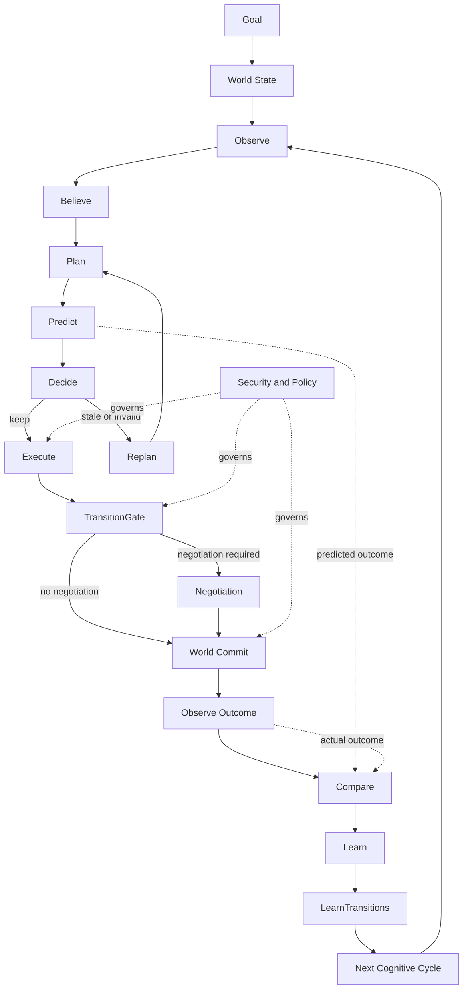

---

## 2. API to Kernel to Persistence

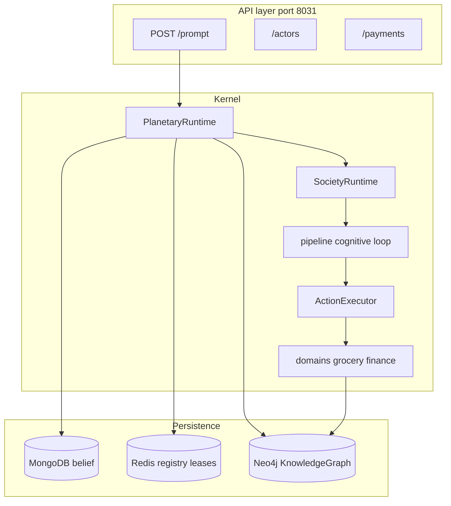

---

## 3. World interaction and security boundary

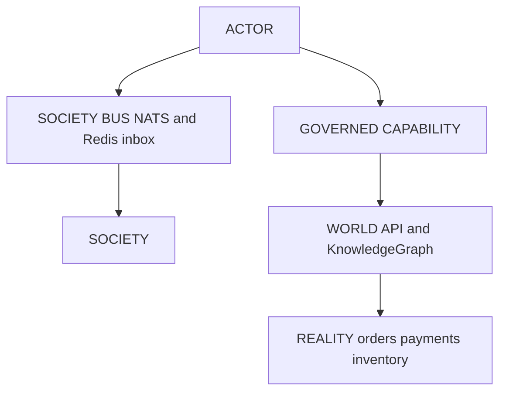

---

## 4. Docker Compose (local)

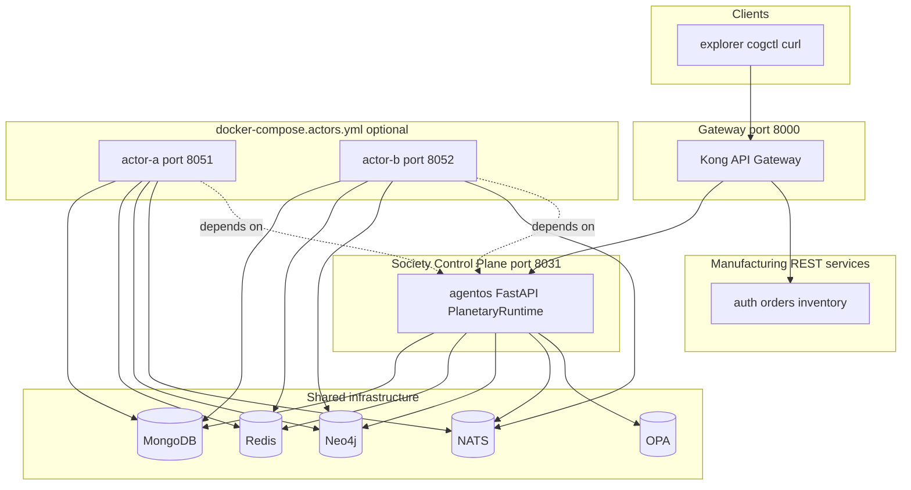

**Bring up:**

```bash
docker compose up agentos
docker compose up kong
docker compose -f docker-compose.yml -f docker-compose.actors.yml up -d
```

---

## 5. Kubernetes

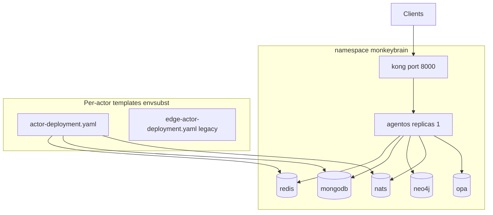

**Per-actor deploy:**

```bash
ACTOR_ID=alice ACTOR_NODE_CLASS=cloud \
  envsubst < deploy/k8s/actor-deployment.yaml | kubectl apply -f -
```

---

## 6. Current vs target deployment

### Current (monolithic cloud plus optional edge pods)

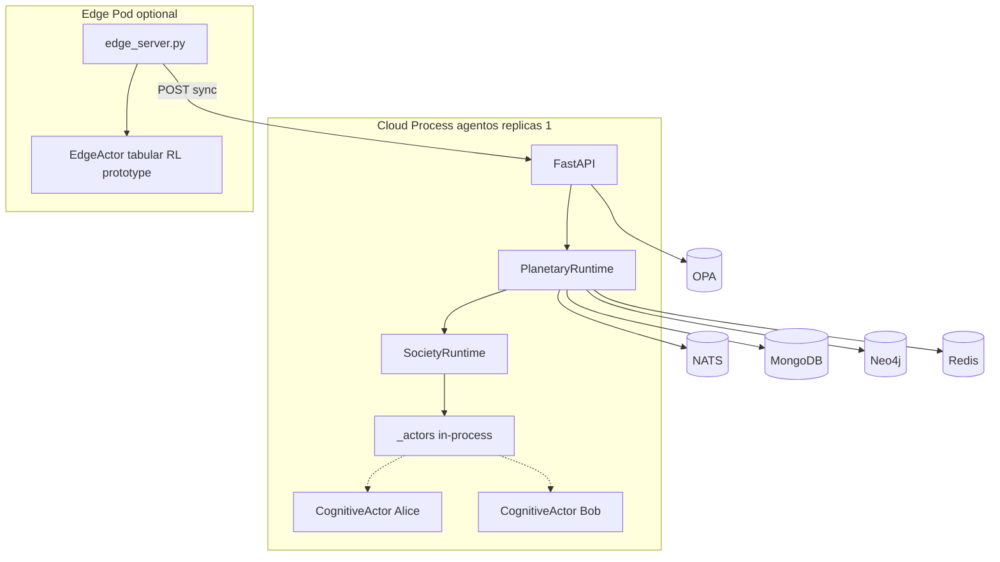

### Target (Actor as Pod, shared control plane)

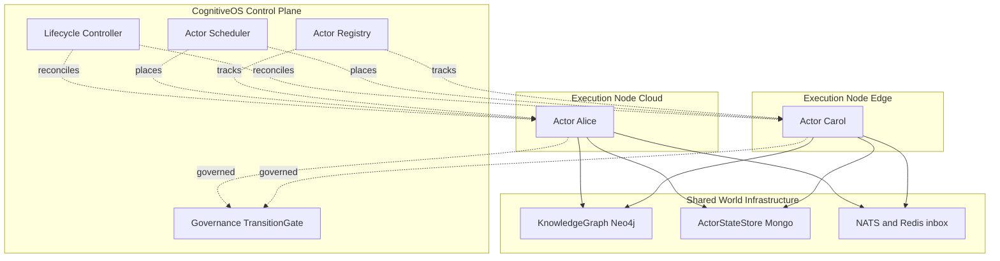

**Core mapping:** Actor is analogous to Pod. Identity must survive placement changes
(actor identity is not actor location).

---

## 7. Control plane and actor artifact

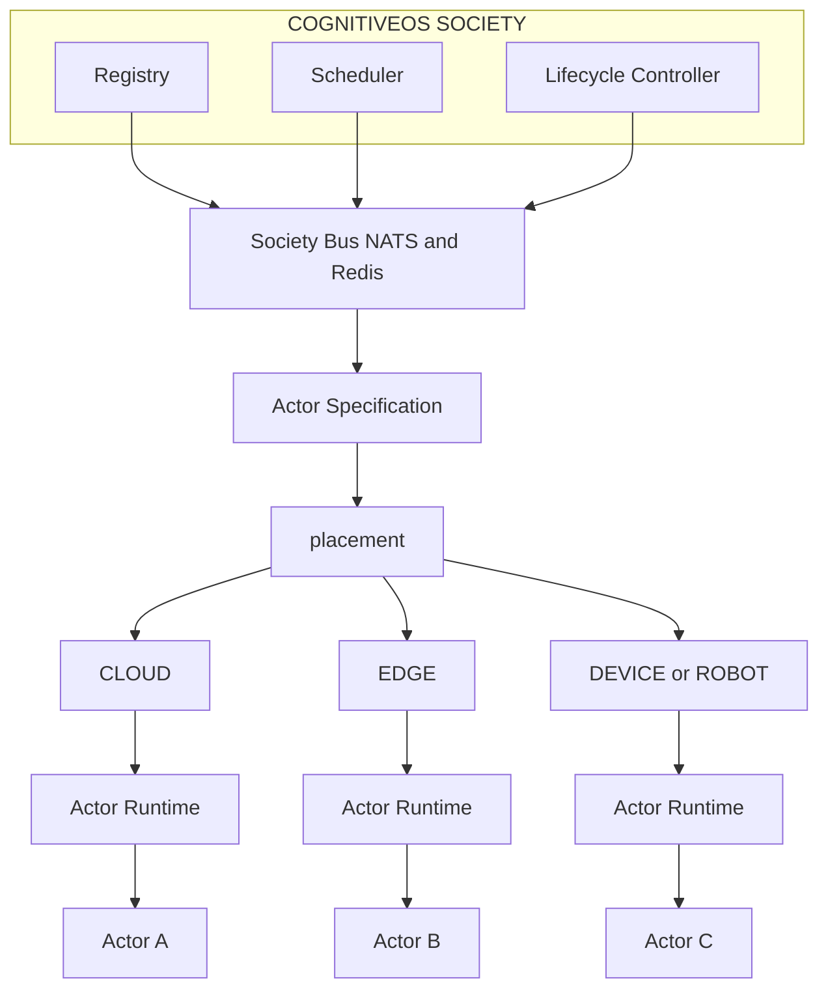

**One image, many placements:**

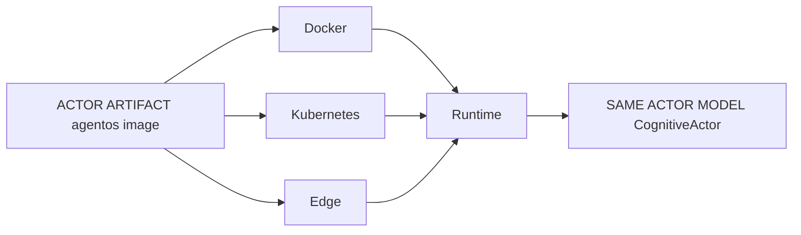

**Kubernetes placement:**

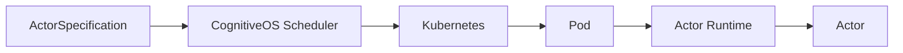

---

## 8. Horizontal scaling shape

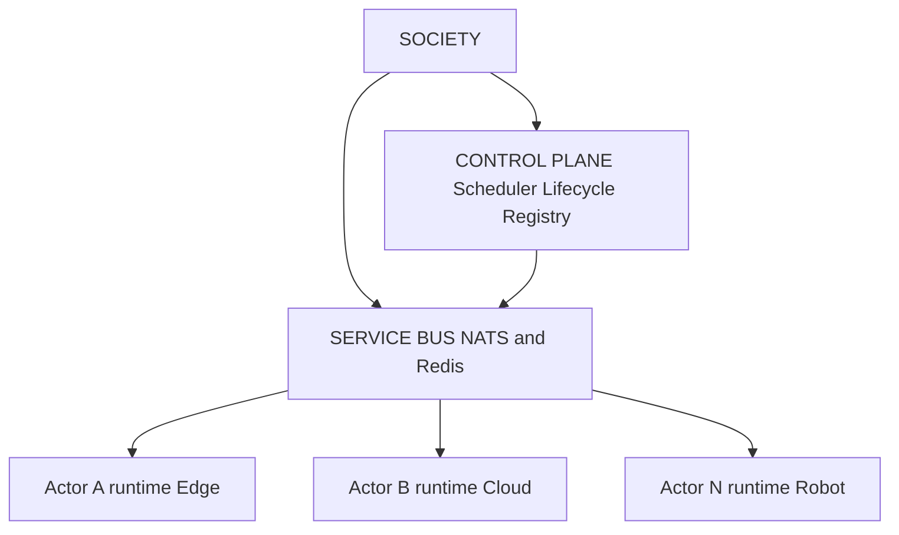

---

## 9. Sequence: POST /prompt (grocery purchase)

```mermaid
sequenceDiagram
    participant Client
    participant Kong
    participant API as agentos API
    participant PR as PlanetaryRuntime
    participant SR as SocietyRuntime
    participant Actor as CognitiveActor
    participant Loop as Cognitive Pipeline
    participant KG as Neo4j KG
    participant Redis as Redis
    participant Mongo as MongoDB

    Client->>Kong: POST /prompt buy milk
    Kong->>API: proxy with X-User-ID
    API->>PR: restore_actor_belief
    API->>PR: execute_actor_request
    PR->>Redis: acquire_actor_lease
    PR->>SR: tick_one_actor
    SR->>Actor: tick

    Actor->>Loop: observe believe plan
    Note over Loop: LLM planner
    Loop->>Loop: predict and decide
    Note over Loop: TransitionModel gate

    Loop->>KG: ProductSelection
    Loop->>KG: OrderCreation
    Loop->>KG: PaymentConfirmation
    Loop->>KG: Payment
    Loop->>KG: OrderConfirmation

    Loop->>Loop: compare learn commit
    Actor-->>SR: tick result
    SR-->>PR: actor result
    PR->>Mongo: checkpoint_actor_belief
    PR->>Redis: release_actor_lease
    API-->>Client: PromptResponse
```

**Local demo:** `scripts/run_clean_grocery_pass.py`

---

## 10. Sequence: UPI payment (two-phase)

```mermaid
sequenceDiagram
    participant Loop as Payment step
    participant KG as KnowledgeGraph
    participant PSP as RazorpayUPI
    participant Redis as PendingPayment
    participant Webhook as Webhook or dev-complete

    Loop->>KG: PaymentConfirmation
    Loop->>PSP: reserve funds
    PSP-->>Loop: reservation_id pending
    Loop->>Redis: save PendingPayment
    Loop-->>Loop: tick pauses awaiting approval

    Note over Webhook: UPI approval or dev-complete
    Webhook->>PSP: authorize and capture
    Webhook->>Redis: resolve pending payment
    Webhook->>Loop: resume execution

    Loop->>PSP: capture
    Loop->>KG: debit wallet credit store
    Loop-->>Loop: success
```

---

## 11. Sequence: Actor identity at boot

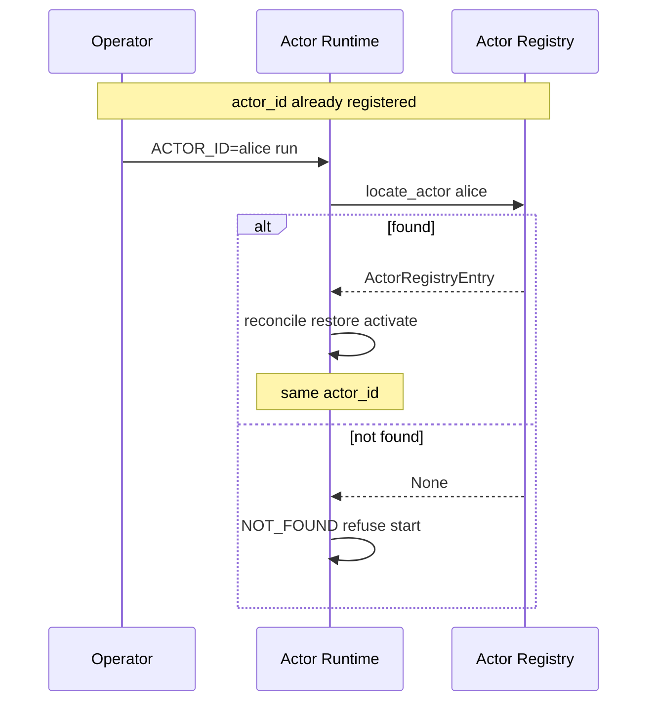

---

## 12. Actor runtime startup (state machine)

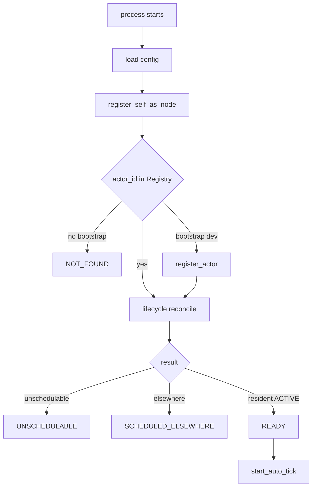

| Endpoint | Meaning |
|----------|---------|
| `GET /live` | Process alive (liveness probe) |
| `GET /ready` | 503 unless READY (readiness probe) |
| `GET /status` | Full readiness and placement debug |
| `GET /artifact` | actor_id, version, node_id, node_class |

---

## 13. Sequence: Lifecycle reconciliation

```mermaid
sequenceDiagram
    participant Loop as Reconcile loop
    participant Ctrl as LifecycleController
    participant Reg as Actor Registry
    participant Lease as Actor Lease
    participant Runtime as Actor Runtime

    Loop->>Ctrl: reconcile_all
    loop each actor
        Ctrl->>Reg: get desired state
        Ctrl->>Reg: observe actor
        alt settled
            Ctrl-->>Loop: action none
        else action needed
            Ctrl->>Lease: acquire lease
            alt denied
                Ctrl-->>Loop: skipped lease held
            else granted
                Ctrl->>Runtime: start resume suspend recover
                Ctrl->>Reg: refresh status
                Ctrl->>Lease: release lease
            end
        end
    end
```

---

## 14. Sequence: Actor migration

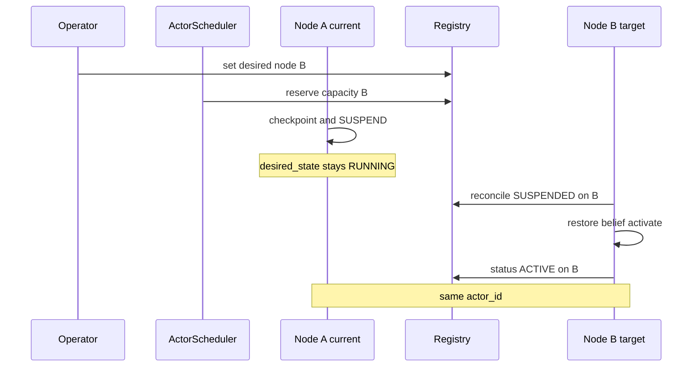

---

## 15. Sequence: Node failure reschedule

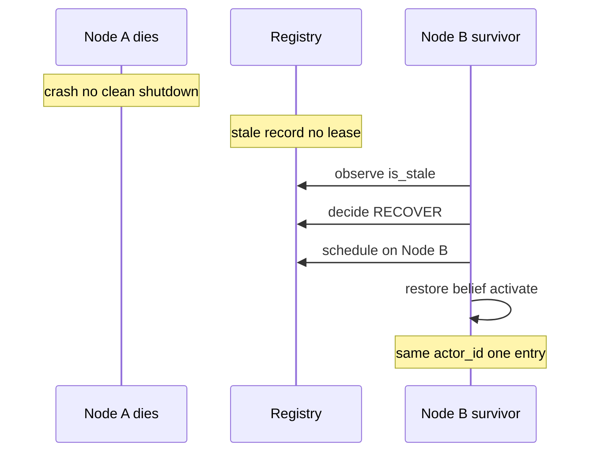

---

## 16. Sequence: Rolling artifact upgrade

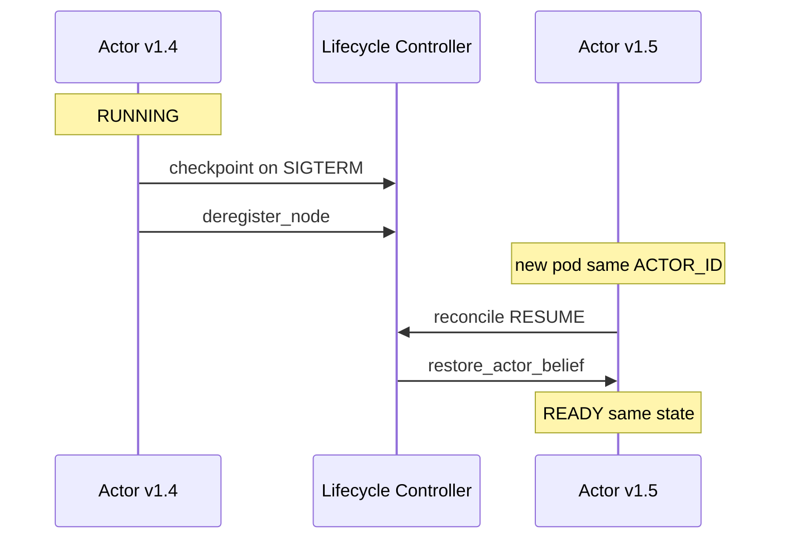

---

## 17. Sequence: cogctl apply

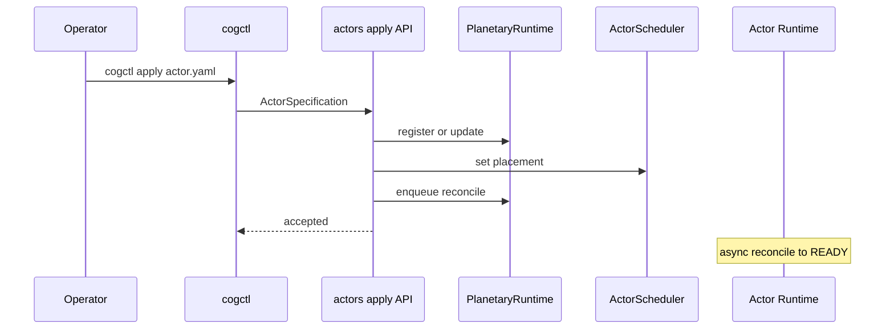

---

## 18. Actor lifecycle states

```mermaid
stateDiagram-v2
    [*] --> CREATE
    CREATE --> SCHEDULE
    SCHEDULE --> START
    START --> READY
    READY --> RUNNING
    RUNNING --> SUSPEND
    SUSPEND --> RESUME
    RESUME --> RUNNING
    RUNNING --> RESTART
    RESTART --> START
    RUNNING --> TERMINATE
    SUSPEND --> TERMINATE
    TERMINATE --> [*]
```

---

## Geography vs Society (structural axes)

```mermaid
flowchart LR
    subgraph geoGrp["Geography where"]
        P[Planet] --> Co[Country] --> Ci[City] --> Sp[Space]
    end

    subgraph socGrp2["Society who governs"]
        Soc[Society] --> T[Team] --> Act[Actor]
    end

    Sp -.->|hosts| Soc
```

---

## OPA vs in-world governance

| Layer | Mechanism | Question answered |
|-------|-----------|-------------------|
| Infrastructure authZ | OPA | Who can call which API route? |
| In-world authority | TransitionGate and KG delegations | What may this actor do in the world? |

Kubernetes RBAC is not a substitute for in-world actor authority.
