# CognitiveOS — Architecture and Sequence Diagrams

Visual reference for deployment topology, the cognitive loop, and key runtime flows.
Diagrams use [Mermaid](https://mermaid.js.org/). Syntax targets **GitHub's renderer**.

**GitHub compatibility rules used in this file:**

- Do not use participant id `Loop` (conflicts with the `loop` keyword; GitHub treats it case-insensitively).
- Do not use `classDef loop` in flowcharts (same keyword conflict).
- Avoid nested `loop` / `alt` blocks inside sequence diagrams.
- Avoid self-messages (`X-->>X`) when the participant id could be parsed as a keyword.
- Keep message text plain ASCII (no quotes, slashes, or parentheses in arrow labels).

**Canonical sources:**

| Topic | Document |
|-------|----------|
| Deployment audit and target model | [`DEPLOYMENT_ARCHITECTURE.md`](../DEPLOYMENT_ARCHITECTURE.md) |
| Consolidated architecture | [`COGNITIVEOS_FINAL_ARCHITECTURE.md`](COGNITIVEOS_FINAL_ARCHITECTURE.md) |
| Runtime layering and pipeline | [`architecture.md`](architecture.md) |
| Actor lifecycle | [`ACTOR_LIFECYCLE.md`](ACTOR_LIFECYCLE.md) |
| Actor scheduler | [`ACTOR_SCHEDULER.md`](ACTOR_SCHEDULER.md) |
| Actor artifact and boot | [`ACTOR_ARTIFACT.md`](ACTOR_ARTIFACT.md) |
| Horizontal scaling | [`HORIZONTAL_SCHEDULER_SCALING.md`](HORIZONTAL_SCHEDULER_SCALING.md) |
| SittingFace knowledge retrieval | [`SITTINGFACE_KNOWLEDGE_RETRIEVAL.md`](SITTINGFACE_KNOWLEDGE_RETRIEVAL.md) |
| Interactive UI diagram | living-world-explorer, Architecture tab |

---

## Table of contents

1. [Cognitive loop](#1-cognitive-loop-per-actor-tick)
2. [API to Kernel to Persistence](#2-api-to-kernel-to-persistence)
3. [World interaction and security](#3-world-interaction-and-security-boundary)
4. [Docker Compose (local)](#4-docker-compose-local)
5. [Kubernetes](#5-kubernetes)
6. [Current vs target deployment](#6-current-vs-target-deployment)
7. [Control plane and actor artifact](#7-control-plane-and-actor-artifact)
8. [Horizontal scaling shape](#8-horizontal-scaling-shape)
9. [Sequence: POST /prompt (grocery)](#9-sequence-post-prompt-grocery-purchase)
10. [Sequence: UPI payment (two-phase)](#10-sequence-upi-payment-two-phase)
11. [Sequence: Actor identity at boot](#11-sequence-actor-identity-at-boot)
12. [Actor runtime startup](#12-actor-runtime-startup-state-machine)
13. [Sequence: Lifecycle reconciliation](#13-sequence-lifecycle-reconciliation)
14. [Sequence: Actor migration](#14-sequence-actor-migration)
15. [Sequence: Node failure recovery](#15-sequence-node-failure-reschedule)
16. [Sequence: Rolling artifact upgrade](#16-sequence-rolling-artifact-upgrade)
17. [Sequence: cogctl apply](#17-sequence-cogctl-apply)
18. [Actor lifecycle states](#18-actor-lifecycle-states)
19. [SittingFace knowledge retrieval](#19-sittingface-knowledge-retrieval)
20. [Geography vs Society](#geography-vs-society-structural-axes)

---

## 1. Cognitive loop (per-actor tick)

Stage order:
`observe -> believe -> plan -> predict -> decide -> execute -> observe_outcome -> compare -> learn -> learn_transitions -> compile_phi -> commit`

Before **plan**, `ContextConstructionEngine` retrieves external knowledge from SittingFace
(keyword chart search plus optional vector via SemanticMemory). Retrieved facts are injected
into the LLM prompt — they inform reasoning but do not mutate authoritative world state.

Inside **execute**, per action: `TransitionGate -> Negotiation (if required) -> Commit`.

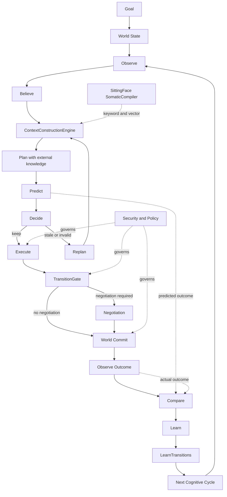

---

## 2. API to Kernel to Persistence

SittingFace loads `somatic/charts/` at AgentOS boot (`init_sittingface`). The
`SittingFaceKnowledgeRetriever` serves chart knowledge to planning and ETASS compile
paths. Neo4j remains authoritative world state; SittingFace is external reference knowledge.

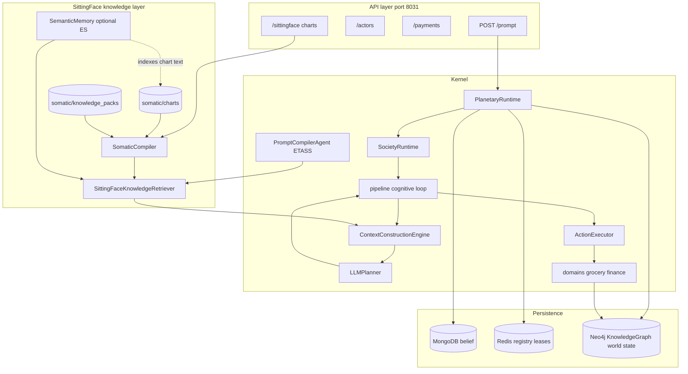

---

## 3. World interaction and security boundary

SittingFace external knowledge informs LLM reasoning only. It does not write to
the KnowledgeGraph or replace authoritative world state.

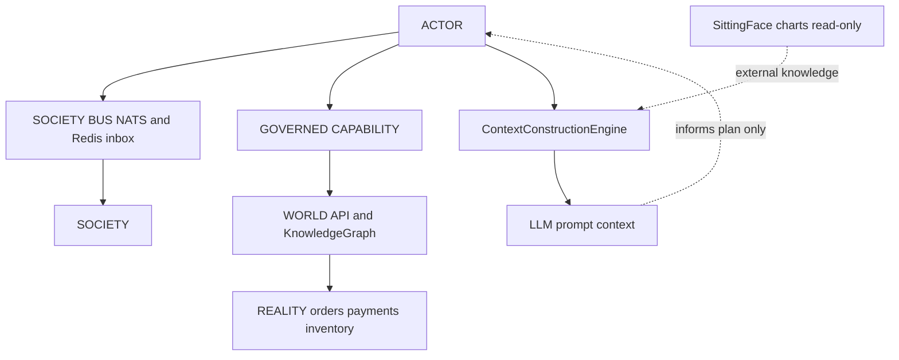

---

## 4. Docker Compose (local)

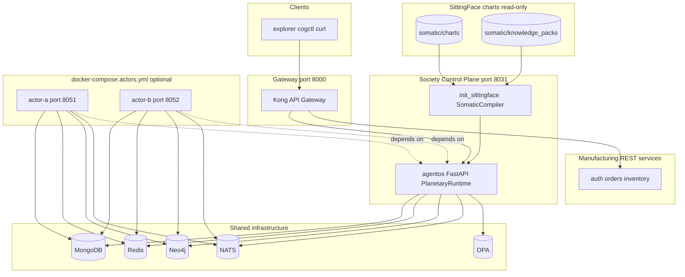

**Bring up:**

```bash
docker compose up agentos
docker compose up kong
docker compose -f docker-compose.yml -f docker-compose.actors.yml up -d
```

---

## 5. Kubernetes

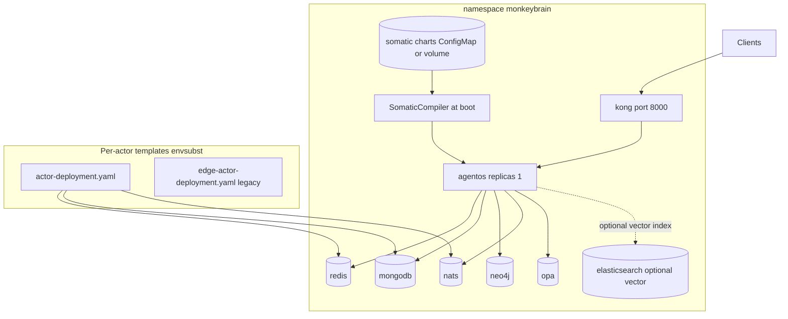

**Per-actor deploy:**

```bash
ACTOR_ID=alice ACTOR_NODE_CLASS=cloud \
  envsubst < deploy/k8s/actor-deployment.yaml | kubectl apply -f -
```

---

## 6. Current vs target deployment

### Current (monolithic cloud plus optional edge pods)

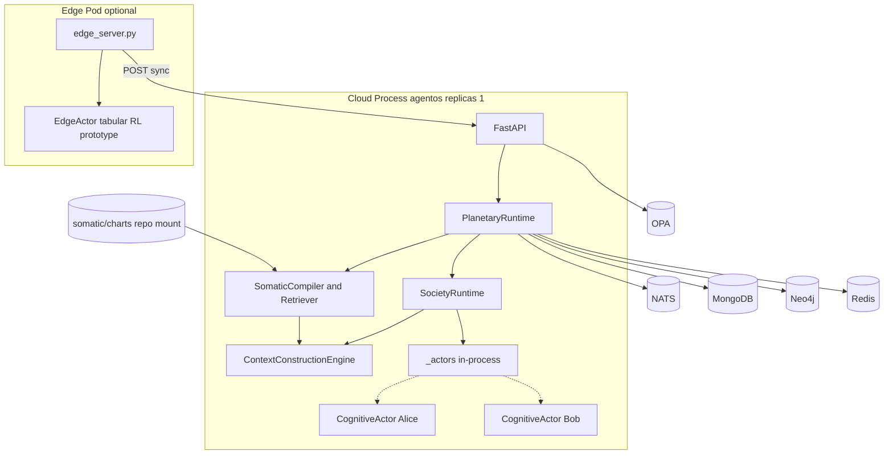

### Target (Actor as Pod, shared control plane)

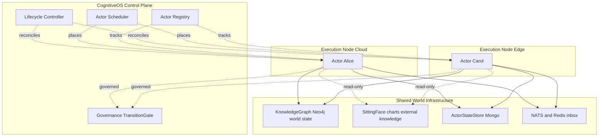

**Core mapping:** Actor is analogous to Pod. Identity must survive placement changes
(actor identity is not actor location).

---

## 7. Control plane and actor artifact

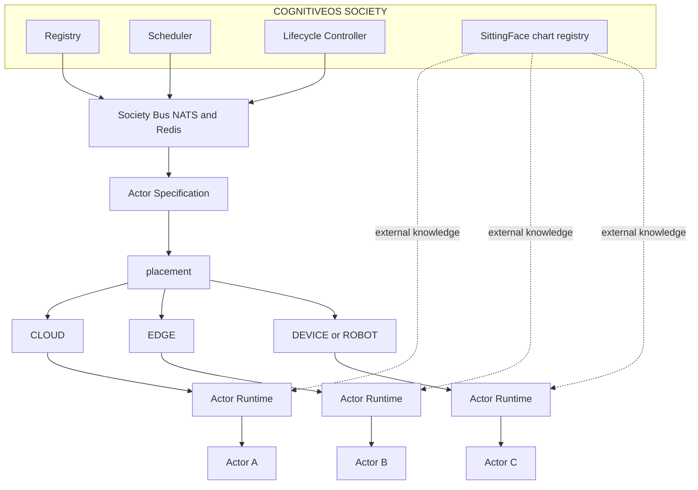

**One image, many placements:**

Charts (`somatic/charts`) mount on the control plane — not inside each actor image.

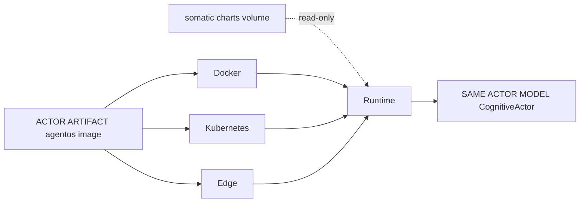

**Kubernetes placement:**

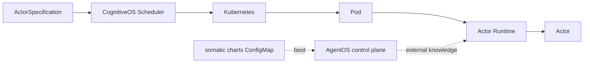

---

## 8. Horizontal scaling shape

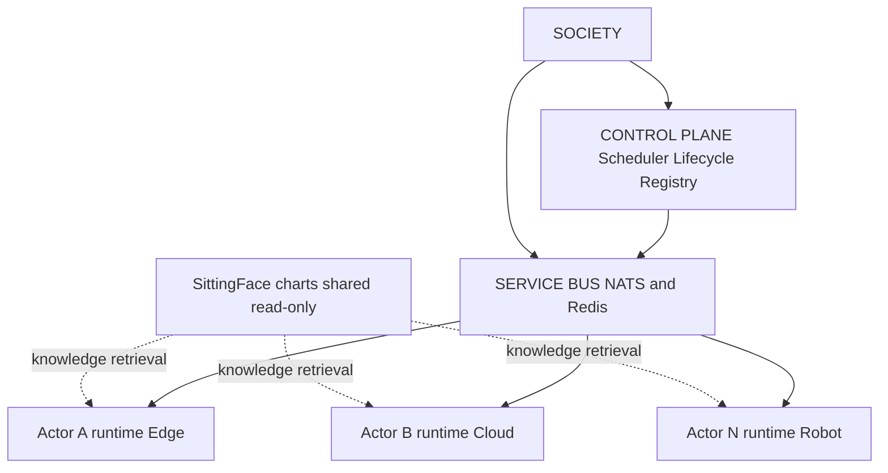

---

## 9. Sequence: POST /prompt (grocery purchase)

Knowledge-seeking questions also trigger SittingFace retrieval before planning.
Transactional grocery goals skip external retrieval by policy.

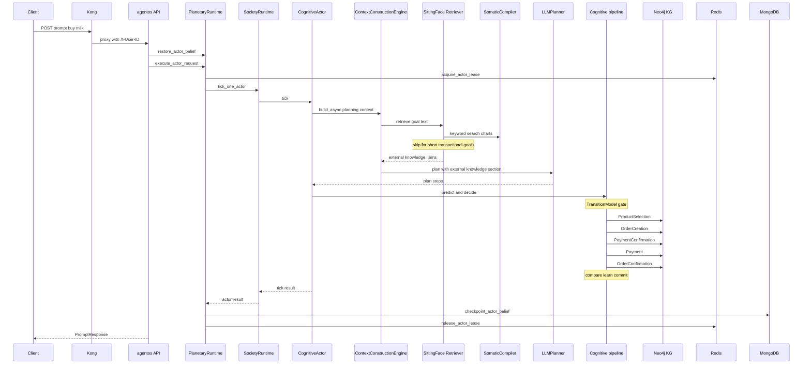

**Local demo:** `scripts/run_clean_grocery_pass.py`

---

## 10. Sequence: UPI payment (two-phase)

Payment execution uses KnowledgeGraph world state only — no SittingFace retrieval on this path.

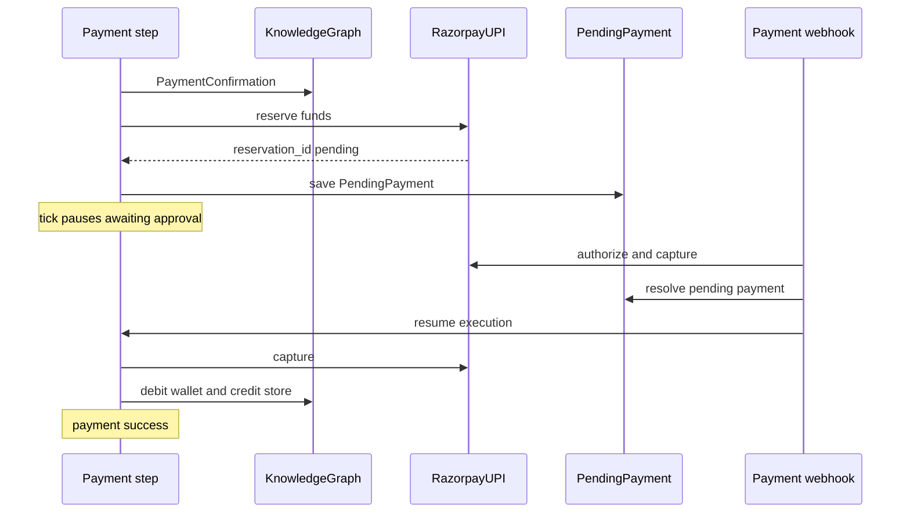

---

## 11. Sequence: Actor identity at boot

AgentOS kernel boot loads SittingFace charts via `init_sittingface` before actors tick.
Actor pods inherit the shared chart registry from the control plane — they do not own it.

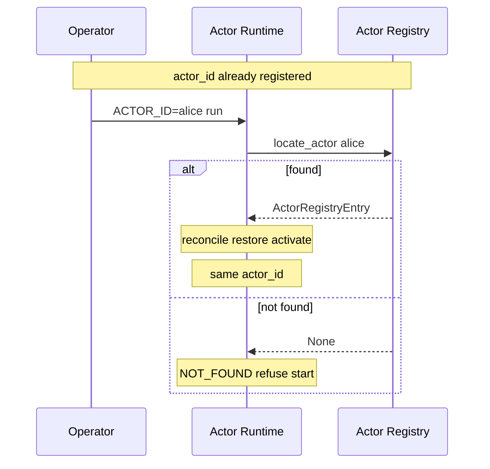

---

## 12. Actor runtime startup (state machine)

Kernel boot phase SittingFace loads `somatic/charts` into `SomaticCompiler` before
PlanetaryRuntime serves `/prompt` requests.

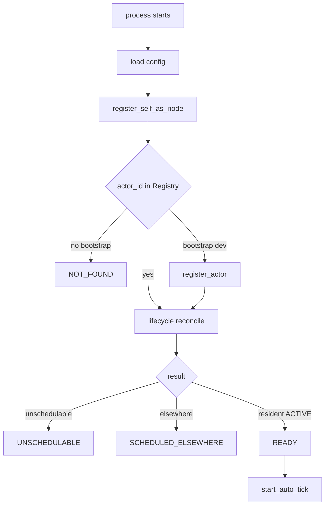

**AgentOS boot (separate from actor pod):**

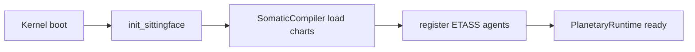

| Endpoint | Meaning |
|----------|---------|
| `GET /live` | Process alive (liveness probe) |
| `GET /ready` | 503 unless READY (readiness probe) |
| `GET /status` | Full readiness and placement debug |
| `GET /artifact` | actor_id, version, node_id, node_class |

---

## 13. Sequence: Lifecycle reconciliation

Lifecycle reconciliation does not reload SittingFace charts — chart registry is
owned by AgentOS boot, not per-actor reconcile sweeps.

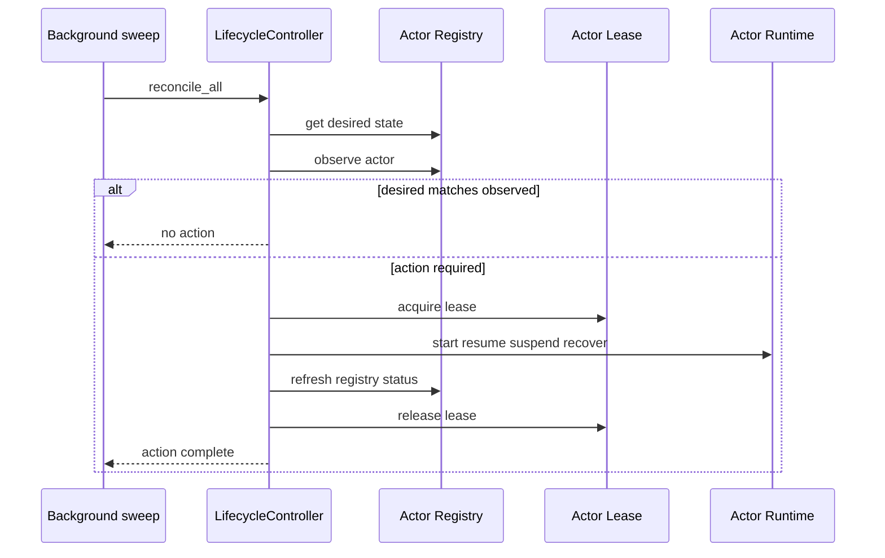

---

## 14. Sequence: Actor migration

Actor state migrates via Mongo belief checkpoints. SittingFace charts remain
shared external knowledge on the control plane — not migrated with the actor.

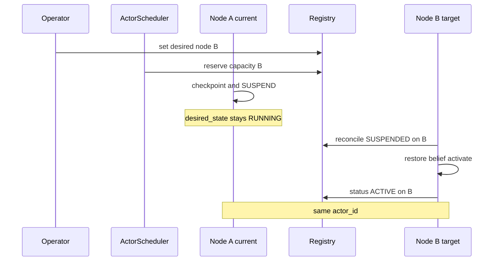

---

## 15. Sequence: Node failure reschedule

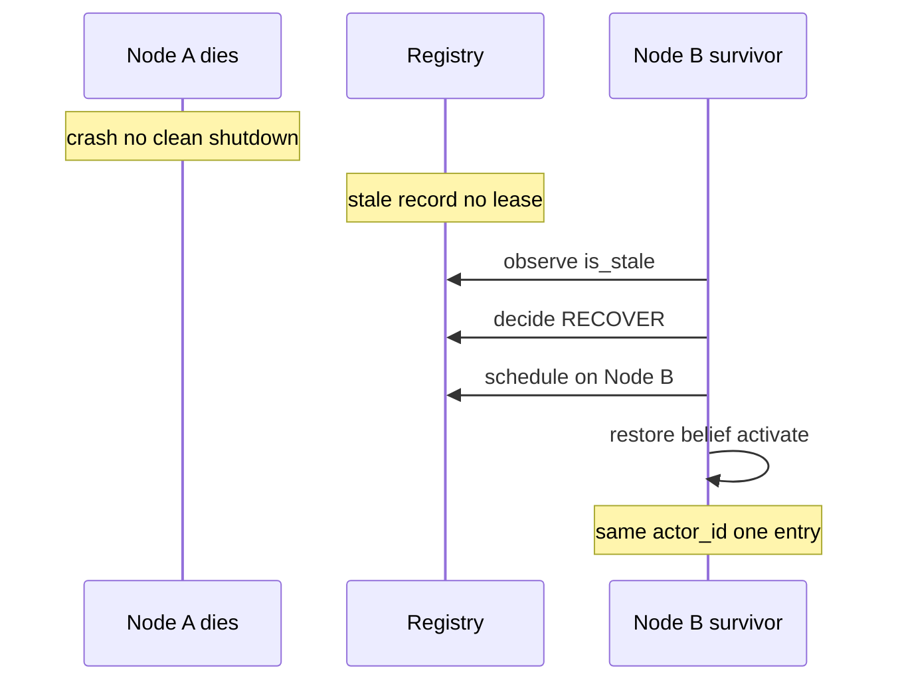

---

## 16. Sequence: Rolling artifact upgrade

Rolling upgrades replace actor runtime images. SittingFace chart content updates
require AgentOS redeploy or chart volume refresh — not the actor artifact alone.

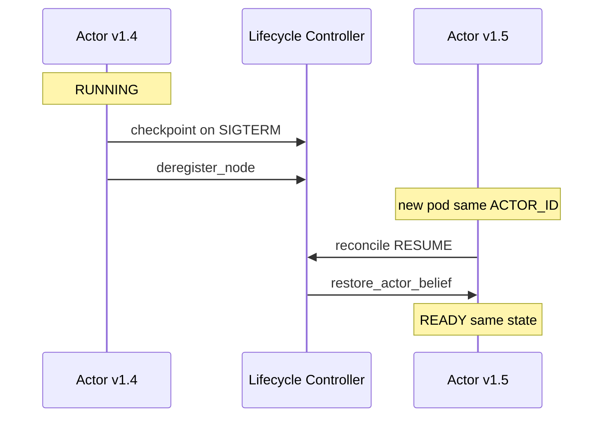

---

## 17. Sequence: cogctl apply

```mermaid
sequenceDiagram
    participant Op as Operator
    participant Cog as cogctl
    participant API as actors apply API
    participant PR as PlanetaryRuntime
    participant Sched as ActorScheduler
    participant RT as Actor Runtime

    Op->>Cog: cogctl apply actor.yaml
    Cog->>API: ActorSpecification
    API->>PR: register or update
    API->>Sched: set placement
    API->>PR: enqueue reconcile
    API-->>Cog: accepted
    Note over RT: async reconcile to READY
```

---

## 18. Actor lifecycle states

```mermaid
stateDiagram-v2
    [*] --> CREATE
    CREATE --> SCHEDULE
    SCHEDULE --> START
    START --> READY
    READY --> RUNNING
    RUNNING --> SUSPEND
    SUSPEND --> RESUME
    RESUME --> RUNNING
    RUNNING --> RESTART
    RESTART --> START
    RUNNING --> TERMINATE
    SUSPEND --> TERMINATE
    TERMINATE --> [*]
```

---

## 19. SittingFace knowledge retrieval

End-to-end path from chart registry to LLM prompt. External knowledge is distinct
from Neo4j world state and from actor belief checkpoints.

```mermaid
flowchart TB
    subgraph sources["Knowledge sources"]
        CHARTS[("somatic/charts")]
        PACKS[("somatic/knowledge_packs")]
        ES[("Elasticsearch optional")]
    end

    subgraph boot["AgentOS boot"]
        INIT["init_sittingface"]
        SC["SomaticCompiler"]
        SM["SemanticMemory"]
    end

    subgraph retrieval["Retrieval layer"]
        RET["SittingFaceKnowledgeRetriever"]
        POL["retrieval policy"]
        CACHE["per-cycle cache"]
    end

    subgraph paths["Consumption paths"]
        CCE["ContextConstructionEngine build_async"]
        PC["PromptCompilerAgent ETASS"]
        HYB["HybridRouter RetrievalHandler"]
    end

    subgraph output["LLM input"]
        CTX["PlanningContext relevant_external_knowledge"]
        PROMPT["LLMPlanner External knowledge section"]
        IR["StructuredPromptIR compiled_prompt"]
    end

    CHARTS --> INIT
    PACKS --> INIT
    INIT --> SC
    SC --> RET
    CHARTS --> SM
    SM --> RET
    ES -.-> SM
    POL --> RET
    CACHE --> RET
    RET --> CCE
    RET --> PC
    RET --> HYB
    CCE --> CTX
    CTX --> PROMPT
    PC --> IR
```

**Retrieval policy (deterministic):**

| Condition | Retrieval |
|-----------|-----------|
| `meta.include_external_knowledge` | Always |
| `meta.skip_external_knowledge` | Never |
| Knowledge-seeking query patterns | Yes |
| Short transactional goal e.g. buy milk | No |
| Vector backend unavailable | Keyword fallback |

**Sequence: knowledge question via POST /prompt**

```mermaid
sequenceDiagram
    participant Client
    participant API as agentos API
    participant PR as PlanetaryRuntime
    participant CCE as ContextConstructionEngine
    participant RET as SittingFace Retriever
    participant SC as SomaticCompiler
    participant SM as SemanticMemory
    participant LLM as LLMPlanner

    Client->>API: POST prompt What is CAPA
    API->>PR: execute_actor_request
    PR->>CCE: build_async
    CCE->>RET: retrieve query
    RET->>SC: keyword search
    RET->>SM: vector search optional
    SM-->>RET: embedding hits or empty
    SC-->>RET: chart snippets
    RET-->>CCE: ExternalKnowledgeItem list
    CCE->>LLM: plan with external knowledge
    Note over LLM: retrieved facts in prompt text
    LLM-->>API: plan and response
```

See [`SITTINGFACE_KNOWLEDGE_RETRIEVAL.md`](SITTINGFACE_KNOWLEDGE_RETRIEVAL.md) for implementation detail.

---

## Geography vs Society (structural axes)

```mermaid
flowchart LR
    subgraph geoGrp["Geography where"]
        P[Planet] --> Co[Country] --> Ci[City] --> Sp[Space]
    end

    subgraph socGrp2["Society who governs"]
        Soc[Society] --> T[Team] --> Act[Actor]
    end

    subgraph knowGrp["SittingFace what reference"]
        SF[Somatic charts] -.->|read-only| Act
    end

    Sp -.->|hosts| Soc
```

---

## OPA vs in-world governance

| Layer | Mechanism | Question answered |
|-------|-----------|-------------------|
| Infrastructure authZ | OPA | Who can call which API route? |
| In-world authority | TransitionGate and KG delegations | What may this actor do in the world? |
| External reference | SittingFace charts and knowledge packs | What documented facts inform the LLM prompt? |

Kubernetes RBAC is not a substitute for in-world actor authority.
SittingFace knowledge informs reasoning but does not mutate authoritative world state.
