# CognitiveOS — Architecture & Sequence Diagrams

Visual reference for deployment topology, the cognitive loop, and key runtime flows.
Diagrams use [Mermaid](https://mermaid.js.org/); they render on GitHub and in most Markdown viewers.

**Canonical sources (for detail beyond these pictures):**

| Topic | Document |
|-------|----------|
| Deployment audit & target model | [`DEPLOYMENT_ARCHITECTURE.md`](../DEPLOYMENT_ARCHITECTURE.md) |
| Consolidated architecture | [`COGNITIVEOS_FINAL_ARCHITECTURE.md`](COGNITIVEOS_FINAL_ARCHITECTURE.md) |
| Runtime layering & pipeline | [`architecture.md`](architecture.md) |
| Actor lifecycle | [`ACTOR_LIFECYCLE.md`](ACTOR_LIFECYCLE.md) |
| Actor scheduler | [`ACTOR_SCHEDULER.md`](ACTOR_SCHEDULER.md) |
| Actor artifact / boot | [`ACTOR_ARTIFACT.md`](ACTOR_ARTIFACT.md) |
| Horizontal scaling | [`HORIZONTAL_SCHEDULER_SCALING.md`](HORIZONTAL_SCHEDULER_SCALING.md) |
| Interactive UI diagram | `living-world-explorer` → Architecture tab |

---

## Table of contents

1. [Cognitive loop](#1-cognitive-loop-per-actor-tick)
2. [API → Kernel → Persistence](#2-api--kernel--persistence)
3. [World interaction & security](#3-world-interaction--security-boundary)
4. [Docker Compose (local)](#4-docker-compose-local)
5. [Kubernetes](#5-kubernetes)
6. [Current vs target deployment](#6-current-vs-target-deployment)
7. [Control plane & actor artifact](#7-control-plane--actor-artifact)
8. [Horizontal scaling shape](#8-horizontal-scaling-shape)
9. [Sequence: POST /prompt (grocery)](#9-sequence-post-prompt-grocery-purchase)
10. [Sequence: UPI payment (two-phase)](#10-sequence-upi-payment-two-phase)
11. [Sequence: Actor identity at boot](#11-sequence-actor-identity-at-boot)
12. [Actor runtime startup](#12-actor-runtime-startup-state-machine)
13. [Sequence: Lifecycle reconciliation](#13-sequence-lifecycle-reconciliation)
14. [Sequence: Actor migration](#14-sequence-actor-migration)
15. [Sequence: Node failure recovery](#15-sequence-node-failure--reschedule)
16. [Sequence: Rolling artifact upgrade](#16-sequence-rolling-artifact-upgrade)
17. [Sequence: cogctl apply](#17-sequence-cogctl-apply)
18. [Actor lifecycle states](#18-actor-lifecycle-states)

---

## 1. Cognitive loop (per-actor tick)

The live per-tick path traced from `ComparisonIntegratedPolicy.configure()` in
`kernel/pipeline/comparison/integration.py`. Same diagram as the living-world-explorer
Architecture tab and the README.

**Stage order:**
`observe → believe → plan → predict → decide → execute → observe_outcome → compare → learn → learn_transitions → compile_phi → commit`

Inside **execute**, per action: `TransitionGate → Negotiation (if required) → Commit`.

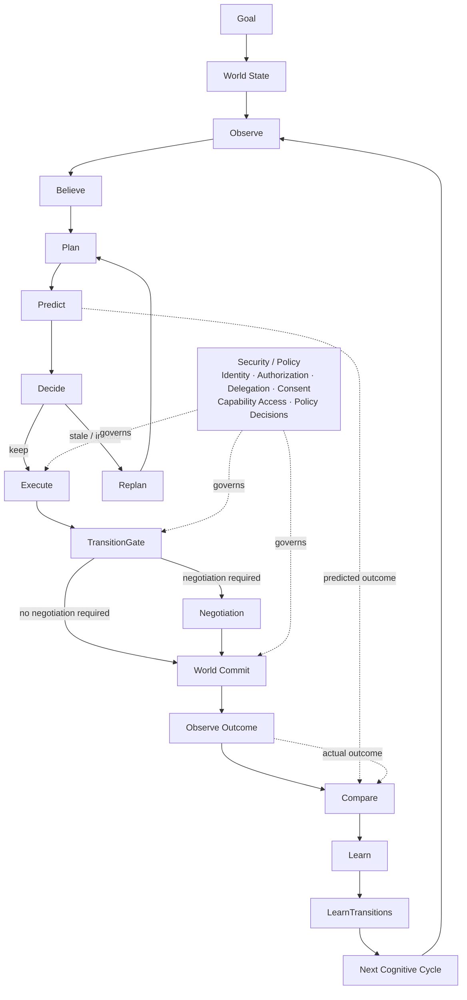

---

## 2. API → Kernel → Persistence

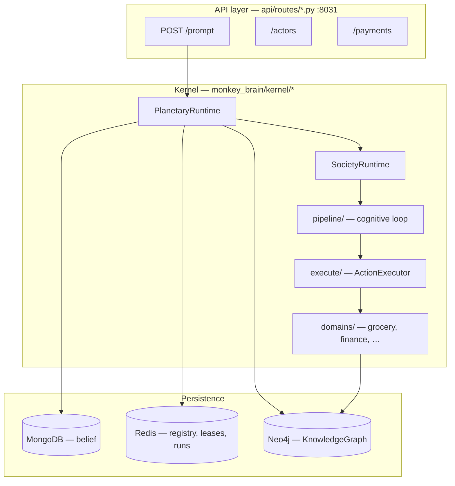

---

## 3. World interaction & security boundary

Every consequential action passes through `ActionExecutor → TransitionGate → Capability`.
The offline-safety gate (`kernel/pipeline/offline_safety.py`) may refuse a call when
connectivity is insufficient; it never bypasses `TransitionGate`.

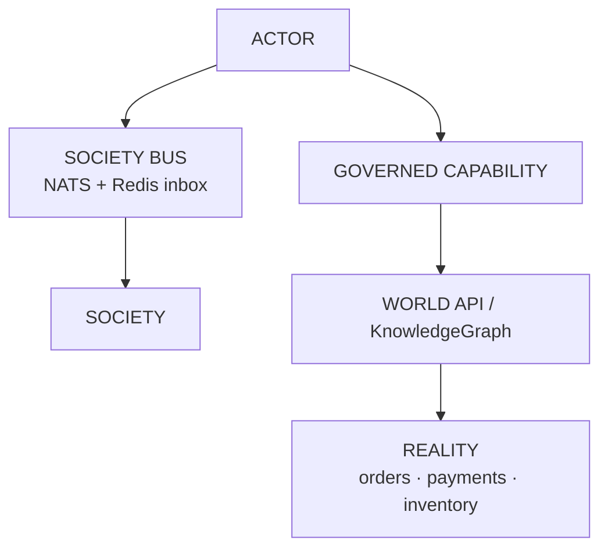

---

## 4. Docker Compose (local)

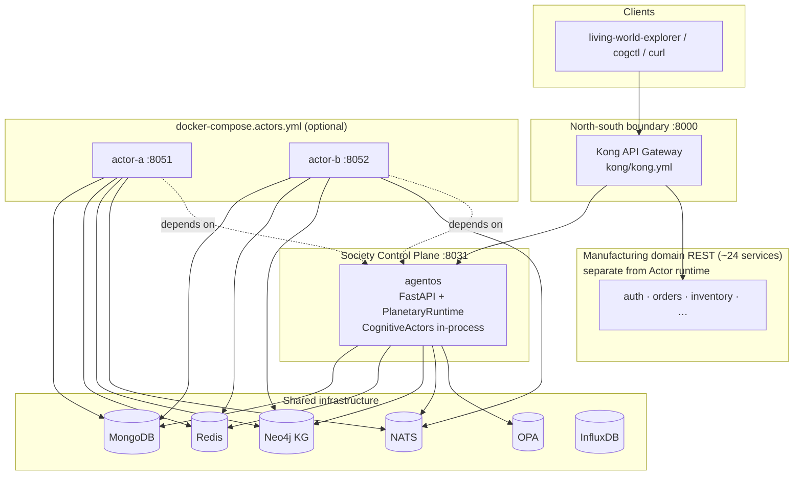

**Bring up:**

```bash
docker compose up agentos          # control plane + infra
docker compose up kong             # gateway on :8000
docker compose -f docker-compose.yml -f docker-compose.actors.yml up -d   # per-actor containers
```

---

## 5. Kubernetes

Base stack: `kubectl apply -k deploy/k8s/`. Per-actor workloads are templates applied
separately via `envsubst` (see `deploy/k8s/kustomization.yaml` header comment).

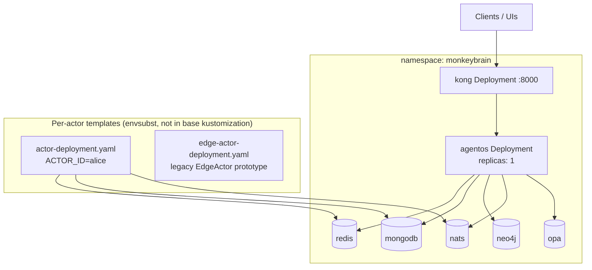

**Per-actor deploy:**

```bash
ACTOR_ID=alice ACTOR_NODE_CLASS=cloud \
  envsubst < deploy/k8s/actor-deployment.yaml | kubectl apply -f -
```

---

## 6. Current vs target deployment

### Current (monolithic cloud + optional edge pods)

From [`DEPLOYMENT_ARCHITECTURE.md`](../DEPLOYMENT_ARCHITECTURE.md) §1. Red boxes in the
original doc marked process-memory-only state; many of those gaps are now closed in code
(registry, Redis world store, message inbox) but `replicas: 1` remains the default K8s posture.

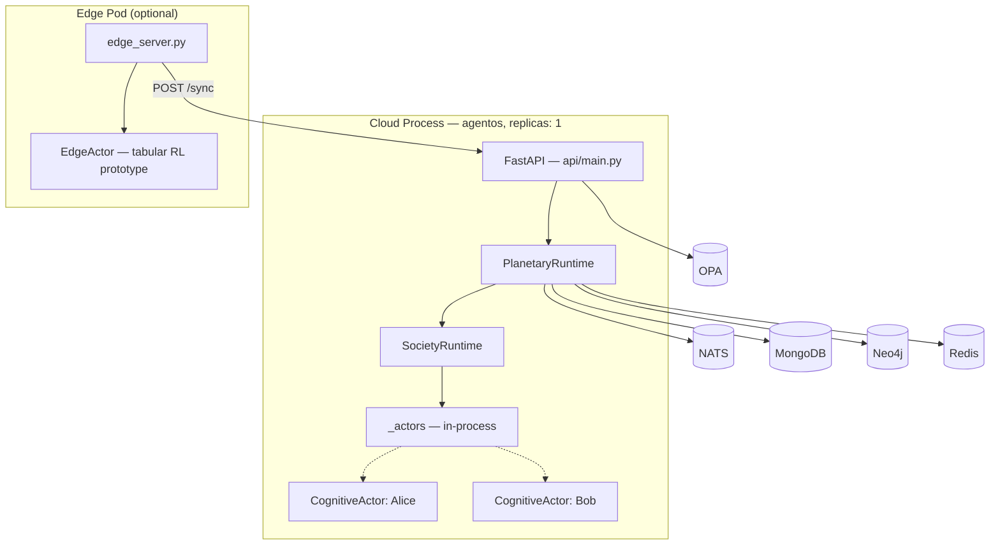

### Target (Actor ≈ Pod, shared control plane)

From [`DEPLOYMENT_ARCHITECTURE.md`](../DEPLOYMENT_ARCHITECTURE.md) §2 and
[`COGNITIVEOS_FINAL_ARCHITECTURE.md`](COGNITIVEOS_FINAL_ARCHITECTURE.md).

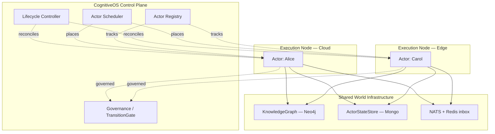

**Core mapping:** Actor ≈ Pod — independently deployable, identity-bearing unit that a
scheduler places and a controller reconciles. Identity must survive placement changes
(`ACTOR IDENTITY ≠ ACTOR LOCATION`).

---

## 7. Control plane & actor artifact

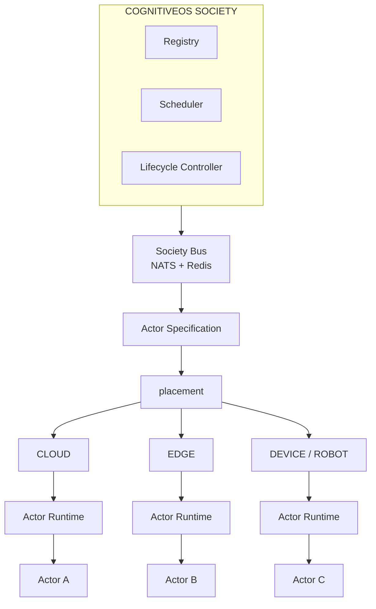

**One image, many placements** (`src/monkey_brain/actor_runtime.py` entrypoint, same
`docker/services/agentos/Dockerfile` image, different `command:`):

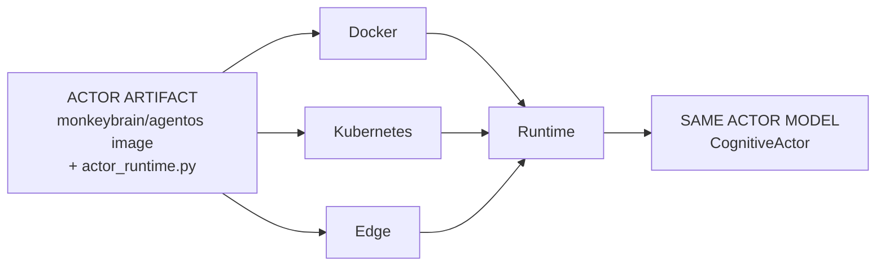

**Kubernetes placement** (K8s runs the process; CognitiveOS Scheduler decides *which* actor):

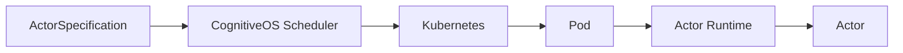

---

## 8. Horizontal scaling shape

Control plane and service bus are off the hot path of ordinary cognition.
From [`HORIZONTAL_SCHEDULER_SCALING.md`](HORIZONTAL_SCHEDULER_SCALING.md).

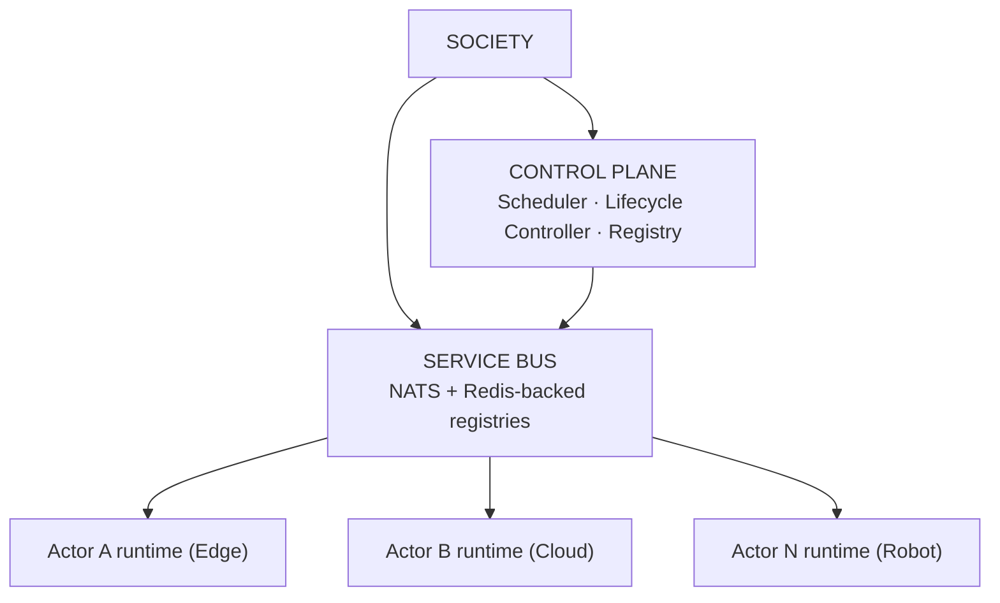

---

## 9. Sequence: POST /prompt (grocery purchase)

Representative flow for `POST /api/v1/agentos/prompt` with `X-User-ID` set to an actor
(e.g. Priya Sharma buying milk). See `api/routes/prompt.py` and
`kernel/pipeline/comparison/integration.py`.

```mermaid
sequenceDiagram
    participant Client
    participant Kong
    participant API as agentos API
    participant PR as PlanetaryRuntime
    participant SR as SocietyRuntime
    participant Actor as CognitiveActor
    participant Loop as Cognitive Pipeline
    participant KG as Neo4j KG
    participant Redis as Redis
    participant Mongo as MongoDB

    Client->>Kong: POST /prompt "buy 1 liter of milk"
    Kong->>API: proxy + X-User-ID + Idempotency-Key
    API->>PR: restore_actor_belief(actor_id)
    API->>PR: execute_actor_request(actor_id, payload)
    PR->>Redis: acquire_actor_lease(actor_id)
    PR->>SR: tick_one_actor(actor_id)
    SR->>Actor: tick()

    Actor->>Loop: observe → believe → plan
    Note over Loop: LLM planner (Ollama / dev_bridge)
    Loop->>Loop: predict → decide
    Note over Loop: TransitionModel gate<br/>may reject learned-negative plans

    Loop->>Loop: execute plan steps
    Loop->>KG: ProductSelection
    Loop->>KG: OrderCreation
    Loop->>KG: PaymentConfirmation
    Loop->>KG: Payment
    Loop->>KG: OrderConfirmation

    Loop->>Loop: compare → learn → commit
    Actor-->>SR: tick result
    SR-->>PR: actor result
    PR->>Mongo: checkpoint_actor_belief(actor_id)
    PR->>Redis: release_actor_lease(actor_id)
    API-->>Client: PromptResponse (goal_achieved, world_changes)
```

**Local demo helper:** `scripts/run_clean_grocery_pass.py` (requires `MODEL_BACKEND=dev_bridge`,
debit wallet, and cleared transition-model state for a reliable pass).

---

## 10. Sequence: UPI payment (two-phase)

`PaymentCapability` with `account_type: upi_reserve_pay` reserves funds and pauses the tick;
resume happens via webhook or `POST /payments/{id}/dev-complete`. See
`kernel/domains/grocery.py` and `api/routes/payments.py`.

```mermaid
sequenceDiagram
    participant Loop as Payment step
    participant KG as KnowledgeGraph
    participant PSP as RazorpayUPIProvider
    participant Redis as PendingPayment store
    participant Webhook as Webhook or dev-complete

    Loop->>KG: PaymentConfirmation (balance / RBAC)
    Loop->>PSP: reserve(amount, payer, order_id)
    PSP-->>Loop: reservation_id, pending_authorization
    Loop->>Redis: save PendingPayment(execution_id, reservation_id)
    Loop-->>Loop: requires_payment_confirmation=true<br/>tick pauses

    Note over Webhook: Real UPI approval or dev-complete
    Webhook->>PSP: record_authorization + capture (or force_capture)
    Webhook->>Redis: resolve pending payment
    Webhook->>Loop: resume via meta.resume_execution_id

    Loop->>PSP: capture(reservation_id)
    Loop->>KG: confirm_reservation + debit wallet + credit store
    Loop-->>Loop: success → OrderConfirmation proceeds
```

**Synchronous path:** seed a `debit` wallet alongside UPI; `_find_wallet` prefers non-UPI
accounts (`kernel/domains/finance.py`).

---

## 11. Sequence: Actor identity at boot

From [`ACTOR_ARTIFACT.md`](ACTOR_ARTIFACT.md). The runtime never silently creates a new identity.

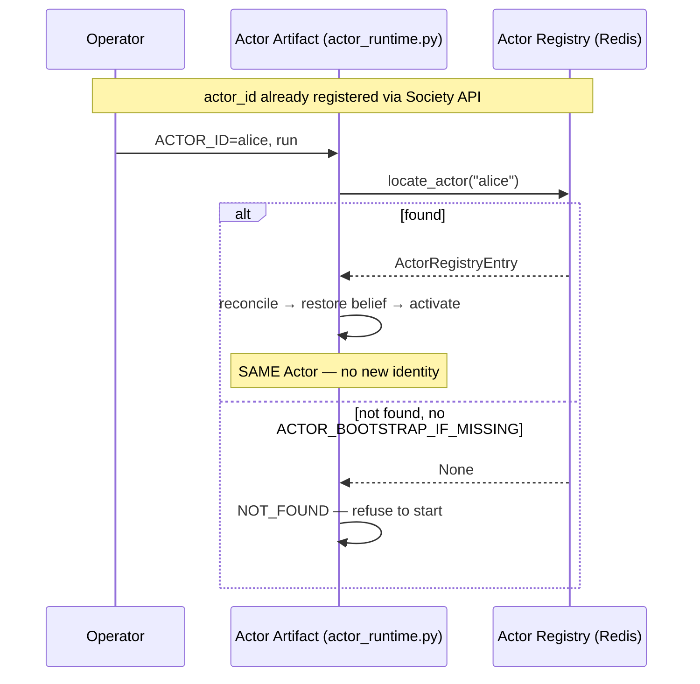

---

## 12. Actor runtime startup (state machine)

From [`ACTOR_ARTIFACT.md`](ACTOR_ARTIFACT.md).

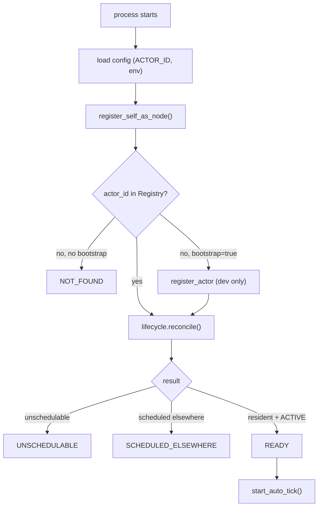

| Endpoint | Meaning |
|----------|---------|
| `GET /live` | Process alive (liveness probe) |
| `GET /ready` | 503 unless `state == READY` (readiness probe) |
| `GET /status` | Full readiness + placement debug |
| `GET /artifact` | actor_id, artifact_version, node_id, node_class |

---

## 13. Sequence: Lifecycle reconciliation

From [`ACTOR_LIFECYCLE.md`](ACTOR_LIFECYCLE.md). Background loop via
`PlanetaryRuntime.start_actor_lifecycle_reconciliation()` (default ~60s; event-driven queue
also drains reconcile work — see horizontal scaling doc).

```mermaid
sequenceDiagram
    participant Loop as Reconciliation loop
    participant Ctrl as ActorLifecycleController
    participant Reg as Actor Registry (Redis)
    participant Lease as Actor Lease (Redis)
    participant Runtime as Actor Runtime

    Loop->>Ctrl: reconcile_all()
    loop each actor in registry
        Ctrl->>Reg: get_actor_desired_state(actor_id)
        Ctrl->>Reg: observe_actor(actor_id)
        alt desired == observed
            Ctrl-->>Loop: action=none
        else action needed
            Ctrl->>Lease: acquire_actor_lease(actor_id)
            alt lease denied
                Ctrl-->>Loop: skipped_lease_held
            else lease granted
                Ctrl->>Runtime: start / resume / suspend / terminate / recover
                Ctrl->>Reg: refresh registry status
                Ctrl->>Lease: release_actor_lease(actor_id)
            end
        end
    end
```

---

## 14. Sequence: Actor migration

Safe checkpoint-and-restart — never live migration. From [`ACTOR_SCHEDULER.md`](ACTOR_SCHEDULER.md)
and [`COGNITIVEOS_FINAL_ARCHITECTURE.md`](COGNITIVEOS_FINAL_ARCHITECTURE.md) §10.

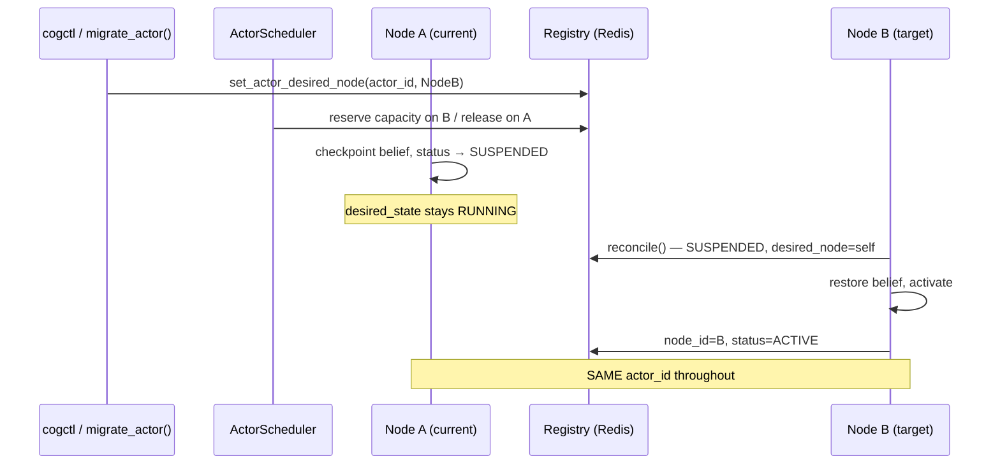

---

## 15. Sequence: Node failure → reschedule

From [`ACTOR_SCHEDULER.md`](ACTOR_SCHEDULER.md). Recovery restarts cognition from last
checkpoint; business actions are not replayed.

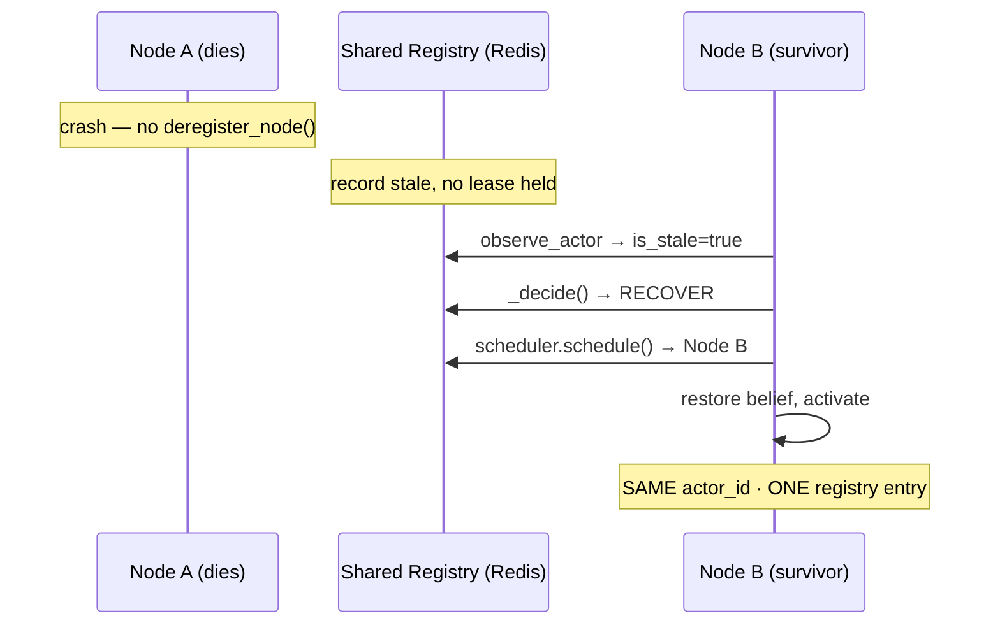

---

## 16. Sequence: Rolling artifact upgrade

From [`ACTOR_ARTIFACT.md`](ACTOR_ARTIFACT.md). `artifact_version` is metadata only;
`actor_id` is unchanged.

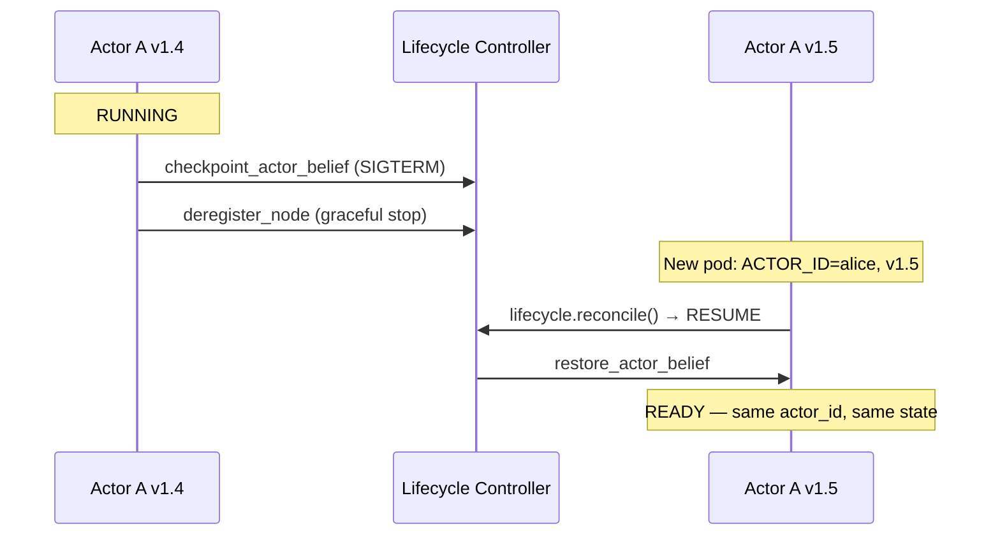

---

## 17. Sequence: cogctl apply

From [`COGNITIVEOS_FINAL_ARCHITECTURE.md`](COGNITIVEOS_FINAL_ARCHITECTURE.md) §12.
`cogctl` is a pure HTTP client (`src/monkey_brain/cogctl.py`); it never starts a process.

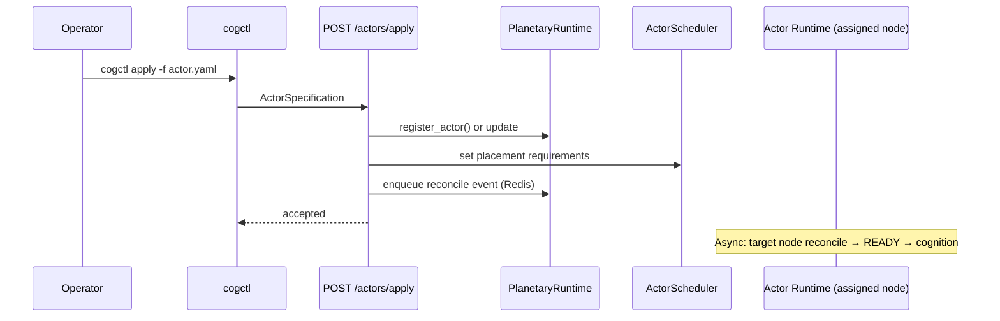

---

## 18. Actor lifecycle states

Target model from [`DEPLOYMENT_ARCHITECTURE.md`](../DEPLOYMENT_ARCHITECTURE.md) §6.
Implemented states include `REGISTERED`, `ACTIVE`, `SUSPENDED`, `FAILED`, `TERMINATED`
(via `ActorLifecycleController` — see [`ACTOR_LIFECYCLE.md`](ACTOR_LIFECYCLE.md)).

```mermaid
stateDiagram-v2
    [*] --> CREATE
    CREATE --> SCHEDULE
    SCHEDULE --> START
    START --> READY
    READY --> RUNNING
    RUNNING --> SUSPEND
    SUSPEND --> RESUME
    RESUME --> RUNNING
    RUNNING --> RESTART
    RESTART --> START
    RUNNING --> TERMINATE
    SUSPEND --> TERMINATE
    TERMINATE --> [*]
```

---

## Geography vs Society (structural axes)

From [`architecture.md`](architecture.md). Two independent hierarchies; an actor's tick is
coordinated across both.

```mermaid
graph LR
    subgraph Geography["Geography — where"]
        P[Planet] --> C[Country] --> City[City] --> S[Space]
    end

    subgraph Society["Society — who governs"]
        Soc[Society] --> T[Team] --> Act[Actor]
    end

    S -. hosts .-> Soc
```

---

## OPA vs in-world governance (do not conflate)

| Layer | Mechanism | Question answered |
|-------|-----------|-------------------|
| Infrastructure authZ | OPA (`deploy/k8s/opa.yaml`) | Who can call which API route? |
| In-world authority | `TransitionGate`, `domain_security.py` delegations (KG) | What is this actor allowed to do in the world? |

Kubernetes RBAC / network policy is not a substitute for in-world actor authority.
