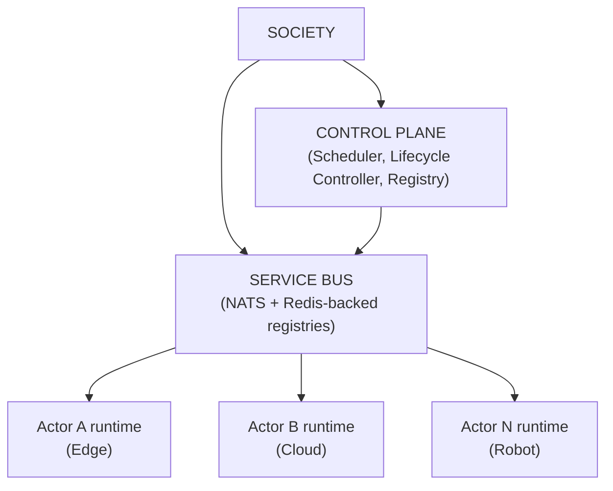

# Horizontal CognitiveOS Scheduler Scaling

Builds on `docs/ACTOR_SCHEDULER.md` (the placement algorithm itself) and
`DEPLOYMENT_ARCHITECTURE.md` (the overall control-plane shape). This
document covers one dimension only: **does the Scheduler/Registry/
Lifecycle Controller design scale as the number of Actors grows, without
becoming a bottleneck or a single point of failure** — and is explicit
about what was actually verified versus what remains unverified at real
scale.

## Target shape

This is the shape confirmed live in this codebase, not aspiration: the
Control Plane (`ActorScheduler` + `ActorLifecycleController` +
`PlanetaryRuntime`'s registries) and the Service Bus (Redis-backed
registries/leases/queue + NATS) are both reachable from every Actor
runtime, and — the property this document exists to verify — **the
Service Bus, not the Control Plane, is on the hot path of ordinary
cognition.** See "Control Plane vs. Data Plane" below.

## Current architecture (as found)

`ActorScheduler`, `ActorLifecycleController`, and the Actor/Node
Registries (built earlier this session — see `DEPLOYMENT_ARCHITECTURE.md`
Section 13 and `docs/ACTOR_SCHEDULER.md`) already share the right shape
for this problem: every registry is a Redis hash keyed by `actor_id` or
`node_id`, every mutation is a targeted per-key write (`HSET`/`HGET`, not
a read-modify-write of one giant blob), and every placement decision is
scoped to one actor at a time with an atomic capacity reservation. No
gRPC, no Kafka exist anywhere in this repository (verified by exhaustive
grep) — Redis and NATS are the only cross-process substrates, and this
work reuses both rather than introducing a third.

**What was NOT yet true, and is what this pass fixes:** the reconciliation
loop's only trigger was a full-table sweep (`reconcile_all()` →
`list_registry()` → one `HGETALL` of the entire actor hash), run on a
fixed interval regardless of whether anything had actually changed —
exactly the O(N) global-reconciliation-as-primary-mechanism anti-pattern
this task's Section 27 warns against. There was also no bounded-
concurrency admission control on how many reconcile() calls could run at
once, and no tested scenario with more than one `PlanetaryRuntime`
instance acting as scheduler/reconciler simultaneously.

## Scalability bottlenecks identified

1. **O(N) full-table reconciliation as the *only* mechanism.** Every
   reconciliation pass, regardless of how few actors actually needed
   attention, read the entire actor registry hash. At 100,000 actors this
   is a multi-megabyte `HGETALL` every interval, for zero-actor-changed
   passes the overwhelming common case. **Fixed** — see "Event-driven
   reconciliation" below.
2. **No backpressure on reconciliation concurrency.** A burst of actor
   registrations had no mechanism bounding how many `reconcile()` calls
   (each its own handful of Redis round trips) could run concurrently.
   **Fixed** — bounded-concurrency queue drain.
3. **Registry unavailability was undocumented, not untested-and-silently-
   fine.** A Redis outage fails the per-actor lease closed (deliberately,
   for split-brain safety — see `DEPLOYMENT_ARCHITECTURE.md`), which
   means an already-running actor's *next* tick is skipped until Redis
   recovers. This was true before this pass and remains true by default
   after it — **now explicitly documented and given an opt-in override**,
   not silently claimed away. See "Failure model."
4. **Not a bottleneck, on inspection:** the actor and node registries
   themselves (plain Redis hashes). Redis hashes handle millions of
   fields with O(1) field-level HSET/HGET; the previously-fixed
   `_save_actor()`-vs-`_save_actors()` distinction (confirmed live this
   session's history: 200 actors via the old whole-array resave took
   222s and climbing) already established the "per-key write, never a
   whole-collection resave" discipline this pass extends to reconciliation.

## Implementation

### Event-driven reconciliation (Sections 26/27)

`PlanetaryRuntime._enqueue_reconciliation(actor_id)` — a plain `RPUSH`
onto `monkeybrain:reconcile:queue` — is now called from every place that
changes something a reconciliation might need to act on:
`register_actor`, `set_actor_desired_state`, `set_actor_desired_node`.
`ActorLifecycleController`'s reconciliation is now two independent loops:

- **Fast, event-driven queue drain** (`ACTOR_RECONCILE_QUEUE_INTERVAL`,
  default 2s): `LPOP` up to `ACTOR_RECONCILE_QUEUE_BATCH_SIZE` (default
  50) actor_ids per pass, `reconcile()` only those, with at most
  `ACTOR_RECONCILE_QUEUE_CONCURRENCY` (default 10) reconcile() calls in
  flight at once via an `asyncio.Semaphore`.
- **Slow, full-table backstop sweep** (`ACTOR_LIFECYCLE_RECONCILE_INTERVAL`,
  default raised from 60s to 300s to make its role explicit): the
  original `reconcile_all()`, kept for exactly what the queue can't
  precisely target — a node's capacity freeing up doesn't identify which
  specific unschedulable actors might now fit, and a dropped enqueue
  (a Redis blip during the write) self-heals within one backstop
  interval. Section 27 explicitly allows this: "a periodic full
  reconciliation may exist as a correctness backstop, but must not be the
  primary scaling mechanism" — it no longer is.

No new distributed database, no new message broker: `RPUSH`/`LPOP` on a
Redis list already atomic server-side, reusing the exact substrate every
other registry in this codebase already depends on.

### Backpressure (Section 25)

The queue-drain loop's `asyncio.Semaphore(queue_concurrency)` is the
actual admission-control point: a burst of 100,000 `register_actor()`
calls fills the Redis list instantly (an O(1) `RPUSH` each — this was
never the bottleneck), but the drain loop only ever has
`queue_concurrency` `reconcile()` calls genuinely running at once,
regardless of how many thousands of items are sitting in the list. This
is verified directly by `test_08_burst_registration_backpressure_bounds_
concurrency` (1,000 simulated registrations, asserts peak concurrent
reconcile() calls never exceeds the configured limit).

### "Scheduler Pool" — multiple reconciler instances (Section 6)

No static partitioning was built, deliberately: `LPOP`-with-count is
atomic server-side, so **any number of independent `PlanetaryRuntime`
processes**, each running its own `start_actor_lifecycle_reconciliation()`
loop against the same Redis, naturally divide the queue's work with zero
coordination logic between them — whichever instance's `LPOP` call lands
first gets that batch; a second instance's simultaneous `LPOP` gets the
next batch, never overlapping items. The per-actor ownership lease
(`acquire_actor_lease`, built in the earlier Actor Registry work) remains
as defense-in-depth underneath this — even in the hypothetical case of a
duplicate dispatch, the lease still prevents two nodes from actually
executing the same actor's transition concurrently. This is the
"Scheduler Pool" the spec's Section 6 diagram asks for, built from
existing primitives (a Redis list plus the already-existing lease), not
a new one. Verified by `test_03_multiple_reconciler_instances_never_
duplicate_work` and `test_10_multiple_reconciler_instances_converge`
(two independent `PlanetaryRuntime` instances sharing one Redis).

### Sharding / partitioning model (Section 7)

**Chosen approach: dynamic work-stealing via the shared queue, not static
partitioning by actor_id/tenant/region.** A static partition scheme (e.g.
"scheduler instance N handles `hash(actor_id) % N`") would need its own
coordination mechanism to reassign shards when an instance joins or
leaves — exactly the kind of new distributed-coordination problem this
task's Section 6 says not to invent. The queue-drain model achieves the
stated goal ("Actor A scheduling must not block Actor B scheduling"; "10
Actors in region A must not require one global scheduling transaction for
region B") for free: every actor_id is an independent queue item and an
independent Redis key — there has never been a multi-actor transaction
anywhere in this design, even before this pass. `tenant_id`/`region`
(already present on `Society`/`ExecutionNode.region`) remain available as
a *future* Redis Cluster hash-tag partitioning key if the registry itself
(not just reconciliation) ever needs physical sharding — not built, since
nothing found in this pass indicates the registry itself (as opposed to
the old full-sweep reconciliation pattern) is a real bottleneck at
today's understood scale. See "Remaining gaps."

### Control plane / data plane separation (Sections 8/9/17/18/23)

Verified directly, not just claimed: `test_11_steady_state_ticking_
never_touches_scheduler_or_node_registry` spies on `ActorScheduler.
schedule` and counts Redis `EVAL` calls (the capacity-reservation
mechanism) across 20 repeated `reconcile()` passes on an already-
correctly-placed, already-ACTIVE actor — both stay at zero. This was
already true by construction (`_consult_scheduler` is only called from
inside `_do_start`/`_do_resume`, i.e. only at a state *transition*, never
on the `action == "none"` fast path `_decide()` returns for a settled
actor) — this pass adds the test that proves it, rather than changing
the design. `SocietyRuntime.tick_one_actor()` — the actual cognition
entry point — has never called into the Scheduler at all; it only
acquires the actor's own lease (a single, targeted Redis key), never
reads the node registry or asks for a placement decision.

### Failure model (Sections 12, 18, 21, 22)

| Failure | Effect | Verified by |
|---|---|---|
| One Actor crashes (registry record goes stale) | Only that actor is marked `is_stale`/recovered; every other actor's registry record, status, and node placement are untouched | `test_05` |
| One execution node dies | Only the actors whose *desired* node was the dead one are rescheduled; actors on other nodes are never touched, never re-evaluated | `test_04` |
| The Scheduler/reconciliation loop stops entirely | Already-ACTIVE actors keep ticking indefinitely — `tick_one_actor()` has no Scheduler/reconciliation dependency | `test_06` |
| Redis (Registry) becomes unreachable | **Default:** the per-actor lease fails closed — `tick_one_actor()` skips ticks for actors whose `SocietyRuntime` has a `PlanetaryRuntime` attached, until Redis recovers. This is a deliberate split-brain-safety trade-off from the earlier Actor Registry work, not an oversight, and is *not* "actors keep running through any Registry outage" — that claim would be false. **Opt-in override:** `ACTOR_LEASE_FAIL_OPEN_SINGLE_NODE=true` proceeds without a lease on a Redis error — safe ONLY when the operator can guarantee no peer process could also be ticking the same actor_id (e.g. a genuine one-actor-per-edge-process deployment); default OFF. | `test_07` (default fail-closed), `test_07b` (opt-in fail-open) |
| Multiple reconciler/"scheduler" instances run concurrently | Work is naturally divided via the shared queue; the lease prevents any duplicate execution even in a race | `test_02`, `test_03`, `test_10` |
| A burst of many simultaneous placement decisions targets one node's last slot | Exactly one wins — atomic Lua-script capacity reservation (`_RESERVE_NODE_CAPACITY_SCRIPT`, built in the earlier Scheduler work) | `test_02` |

Node/Actor failure detection here is **timeout-based staleness**
(`_ACTOR_STALE_SECONDS`/`_NODE_STALE_SECONDS`), not a distributed-consensus
failure detector (no Raft/Paxos, nothing resembling one, was built or is
claimed) — a genuinely partitioned-but-still-alive node/actor is
indistinguishable, by this mechanism alone, from a truly dead one until
its lease/heartbeat window lapses. This is the same trade-off Kubernetes
itself makes with `nodeMonitorGracePeriod`, named here explicitly rather
than left implicit.

### Migration model

Unchanged from `docs/ACTOR_SCHEDULER.md` — safe checkpoint-and-restart,
never live migration, identity/authority/persistent state preserved
throughout. This pass adds nothing new here beyond confirming migration
composes correctly with the event queue (`set_actor_desired_node` — the
call `migrate_actor` makes — is itself now one of the three enqueue
trigger points).

### Communication model

Unchanged from `docs/ACTOR_SCHEDULER.md`/`DEPLOYMENT_ARCHITECTURE.md`
Section 8: Actor-to-Actor addressing already resolves via the Actor
Registry (`AskActorCapability`'s `locate_actor()` fallback, built earlier
this session), never a raw node/pod/container address — already
location-independent, verified previously, not re-verified here.

### Consistency model

- **Locally authoritative, immediately consistent:** an actor's own lease
  state, its own registry record once written, and this process's local
  `_desired_state_fallback`/`_node_registry_fallback` dicts (used only
  when Redis is entirely absent, e.g. a from-scratch dev/test boot).
- **Globally authoritative, eventually consistent within one interval:**
  the node registry as observed by any OTHER process (bounded by
  `_NODE_STALE_SECONDS`, default 200s, for staleness detection) and the
  reconcile queue (bounded by `ACTOR_RECONCILE_QUEUE_INTERVAL`, default
  2s, for the fast path; `ACTOR_LIFECYCLE_RECONCILE_INTERVAL`, default
  300s, worst case via the backstop).
- **Never strongly consistent across regions/processes:** there is no
  distributed transaction anywhere in this design — every write is a
  single Redis key, and cross-actor coordination (if a future vertical
  needs it) remains the domain's own concern (e.g. `TransitionGate`),
  outside the Scheduler entirely.
- **Multi-region:** not built or tested. A second region would today mean
  a second, entirely independent Redis + `PlanetaryRuntime` fleet with no
  cross-region communication at all — not a documented gap so much as an
  honest statement that Section 28's multi-region requirement was not
  attempted in this pass. See "Remaining gaps."

### Observability

`ActorScheduler`/`ActorLifecycleController` already publish structured
events (`ContextEvent`/`record_decision_event`) for every real scheduling
decision and lifecycle transition (built in the earlier Scheduler work).
This pass adds one metric: `offline_safety.blocked.total` (tagged by
`waiting_state`/`capability`, from the Cloud/Edge convergence work) is
unrelated to this document but shares the same `_obs` counter/gauge
sink already used throughout this codebase — no new observability
system was introduced. **Not built in this pass:** a dedicated
scheduling-latency histogram, a queue-depth gauge, or a per-region load
metric — `_obs.counter`/`_obs.gauge` calls for these would be a small,
low-risk follow-up (the sink and convention already exist), named here
as a real, not-yet-closed gap rather than silently omitted.

## Scale test results

`tests/scenarios/test_horizontal_scheduler_scaling.py` — 15 tests, all
against an in-memory fake Redis in a single Python process (per this
repo's session convention, written but not executed by the assistant).
**These are correctness/logic tests, not load or performance tests.**
Specifically verified at this level:

- 10, 100, and 1,000 simulated actors: scheduling converges, no node
  exceeds capacity, no duplicate registry entries (`test_12`–`test_14`).
- A combined, representative-scale (30 actors, 3 node classes)
  destructive scenario chaining node death + independent actor crash +
  a paused-then-replaced reconciler + a transient Registry outage +
  added capacity, verifying convergence with no duplicate identity and
  no actor left stuck (`test_15`).
- Real-OS-thread concurrency for the one place a genuine race exists
  (two Scheduler instances racing for one node's last capacity slot) —
  `test_02`, using actual `threading.Thread`, not just simulated
  sequential calls.

**What was explicitly NOT tested, and must not be inferred from the
above:** real multi-process concurrency (every "multiple instance" test
here uses two `PlanetaryRuntime` objects in one OS process sharing one
in-memory fake, not two real processes against a real Redis server);
real network latency or partition behavior; real Redis Cluster sharding;
throughput/latency numbers at any scale (no timing assertions exist in
this suite); and 10,000+ or 100,000+ actor counts (1,000 was chosen as
the largest count worth the test's own construction/runtime cost in a
single-process fake-Redis harness — the placement algorithm's correctness
at 1,000 gives no reason to expect it degrades qualitatively at 100,000,
since every operation touched is O(1) or O(node count), never O(actor
count), but this is an inference from the algorithm's shape, not a
measurement).

## Kubernetes conformance

Same core mapping as `docs/ACTOR_SCHEDULER.md`, extended for horizontal
scaling specifically:

| Kubernetes | CognitiveOS | This pass |
|---|---|---|
| Multiple `kube-scheduler` replicas (leader-election, only one active) | Multiple reconciler instances, ALL active simultaneously (no leader election) | Deliberately different: Kubernetes elects one active scheduler; this design lets every instance drain the shared queue concurrently, since the underlying `LPOP` atomicity plus the per-actor lease make concurrent activity safe rather than something to elect around. Simpler, and avoids needing a leader-election primitive this codebase has no other user for. |
| `nodeMonitorGracePeriod` (node heartbeat timeout) | `_NODE_STALE_SECONDS` | Same timeout-based-staleness trade-off, named explicitly above. |
| Workqueue-based controller pattern (client-go) | The Redis-backed reconcile queue | Same shape (event-driven work items, periodic full-resync backstop) — client-go's own `Informer`+`Workqueue`+periodic-resync pattern is exactly what Sections 26/27 describe, and what this pass implements against Redis instead of etcd watch. |
| Pod disposability (a rescheduled Pod is a new identity) | Actor persistence (a rescheduled Actor is the SAME identity) | Unchanged from `docs/ACTOR_SCHEDULER.md` — the one deliberate divergence from the Kubernetes analogy, restated here because it is exactly what "no duplicate Actor" (Section 32) depends on. |

## Remaining gaps

Named explicitly, per this task's own instruction not to claim
horizontal scalability beyond what was tested:

1. **No real multi-process or multi-machine test was run.** Every
   "multiple scheduler instance" test in this pass uses two objects in
   one process against one in-memory fake. The design (atomic Redis
   operations, no static partitioning, lease as defense-in-depth) should
   generalize to real separate processes/machines against a real Redis,
   but this was not empirically confirmed.
2. **No real load/throughput test.** No number in this document (2s
   queue interval, batch=50, concurrency=10, 1,000-actor scale test) has
   been validated against real latency or real Redis network round-trip
   costs — they are reasonable-seeming defaults, not measured ones.
3. **Multi-region (Section 28) was not built.** No cross-region
   communication, no documented consistency model beyond "two entirely
   separate fleets" exists today.
4. **No distributed failure detector.** Staleness timeouts, not
   consensus — a genuinely-alive-but-partitioned node/actor cannot be
   distinguished from a dead one until its timeout lapses, same
   trade-off Kubernetes itself makes, but worth restating since this
   task's Section 29 specifically asks for CONNECTED/DEGRADED/DISCONNECTED
   distinctions; that classification exists for edge *capability
   execution* (`kernel/pipeline/offline_safety.py`, Cloud/Edge Actor
   Convergence work) but not yet as a first-class field on `ExecutionNode`
   itself.
5. **Registry unavailability still pauses cognition by default** (see
   Failure model above) — the opt-in override exists, but the default
   behavior is NOT "actors keep running through any Registry outage,"
   and this document does not claim otherwise.
6. **No scheduling-latency/queue-depth/per-region-load metrics** were
   added — the observability *events* (scheduling decisions, lifecycle
   transitions) already existed from the earlier Scheduler work; the
   *aggregate* metrics Section 24 asks for (queue depth, scheduler
   throughput, node utilization) are not yet built.
7. **No registry physical sharding.** The actor/node registries remain
   one Redis hash each. Not currently believed to be a bottleneck (see
   "Scalability bottlenecks" above), but not stress-tested at a scale
   that would reveal one either.
