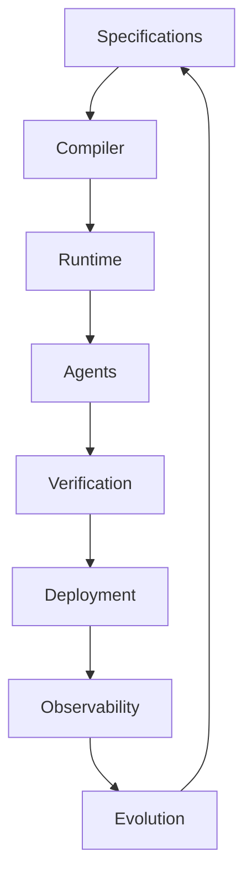
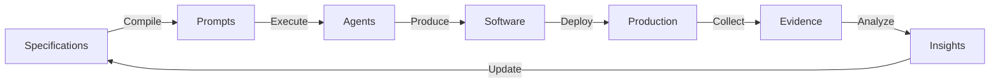

# Vision and Mission

## 🌟 Vision

**To transform software engineering from an artisanal craft into a precise engineering discipline.**

ETASS envisions a world where software systems are built with the same precision, reliability, and predictability as physical engineering disciplines like civil, mechanical, and electrical engineering.

## 🎯 Mission

**To create a Specification-Driven Development platform that enables autonomous engineering agents to build, verify, deploy, and evolve software systems from declarative specifications.**

## 🚀 Goals

### Primary Goals

1. **Eliminate Ambiguity**: Replace ambiguous requirements with precise specifications
2. **Automate Engineering**: Enable autonomous agents to perform engineering tasks
3. **Close the Loop**: Create continuous feedback from operations to specifications
4. **Ensure Determinism**: Guarantee reproducible results from specifications
5. **Enable Evolution**: Support continuous improvement of systems

### Secondary Goals

1. **Improve Quality**: Reduce defects through formal verification
2. **Increase Velocity**: Accelerate development through automation
3. **Enhance Reliability**: Build systems that meet strict SLA requirements
4. **Reduce Cost**: Lower total cost of ownership through automation
5. **Improve Maintainability**: Create self-documenting, evolvable systems

## 🔧 Core Beliefs

### 1. Software is Engineering
Software development should follow the same rigorous principles as other engineering disciplines, with formal specifications, validation, and verification.

### 2. Specifications are Primary
Source code is a derived artifact. The specification is the canonical source of truth that defines what the system should do.

### 3. Automation is Essential
Routine engineering tasks should be automated to allow engineers to focus on creative problem-solving and innovation.

### 4. Feedback is Critical
Operational evidence must flow back into specifications to enable continuous improvement and learning.

### 5. Systems Evolve
Software systems are never "done". They must be designed to evolve gracefully over time.

## 📐 Design Principles

### 1. Declaration Over Imperative
Prefer declarative specifications that describe "what" over imperative code that describes "how".

### 2. Separation of Concerns
Maintain clear boundaries between specification, compilation, execution, verification, and evolution.

### 3. Single Source of Truth
The specification is the authoritative source. All other artifacts are derived from it.

### 4. Deterministic Execution
Given the same specification and inputs, the system should produce the same outputs.

### 5. Observability First
All components must be observable. Operational evidence is a first-class concern.

### 6. Continuous Validation
Verification is not a phase—it's a continuous process integrated into every stage.

### 7. Governed Evolution
Change must be controlled and governed to maintain system integrity.

### 8. Human-in-the-Loop
While automation handles routine tasks, humans provide oversight, creativity, and judgment.

## 🏗️ System Architecture

ETASS follows a layered architecture with clear separation of concerns:

### 1. Specification Layer
- SOMA Charts (declarative specifications)
- Chart Registry
- Version Management
- Governance Rules

### 2. Compilation Layer
- Prompt Compiler
- Template Engine
- Dependency Resolution
- Validation

### 3. Runtime Layer
- Execution Engine
- Scheduler
- Orchestrator
- State Management

### 4. Agent Layer
- Autonomous Engineering Agents
- Agent Contracts
- Execution Workflows
- Handoff Protocols

### 5. Verification Layer
- Testing Framework
- Validation Agents
- Quality Gates
- Evidence Collection

### 6. Deployment Layer
- Deployment Strategies
- Rollout Management
- Rollback Procedures
- Environment Management

### 7. Observability Layer
- Telemetry Collection
- Monitoring Integration
- Logging Framework
- Tracing System

### 8. Evolution Layer
- Feedback Processing
- Specification Updates
- Continuous Learning
- Architecture Review

## 🤖 Autonomous Engineering

ETASS introduces the concept of **Autonomous Engineering Agents**—specialized software entities that perform engineering tasks:

- **Deterministic**: Agents produce consistent results given the same inputs
- **Specialized**: Each agent has a specific, well-defined responsibility
- **Collaborative**: Agents work together through well-defined contracts
- **Observable**: All agent actions are logged and traceable
- **Governed**: Agents operate within strict rules and constraints

### Agent Types

| Category | Agents | Responsibility |
|----------|--------|----------------|
| **Specification** | Chart Loader, Registry Manager | Manage specifications and dependencies |
| **Engineering** | Cerebellum, Motor Cortex, Broca | Plan, code, and document systems |
| **Verification** | Unit Tester, Integration Tester | Validate system quality |
| **Runtime** | Monkey Brain, Introspection | Monitor and observe systems |
| **Evolution** | Architecture Review, Spec Evolution | Improve specifications over time |

## 🔄 Closed-Loop Engineering

ETASS implements a **closed-loop engineering system** where operational evidence feeds back into specifications:

### Feedback Loop Components

1. **Evidence Collection**: Gather operational data from production systems
2. **Analysis**: Identify patterns, anomalies, and improvement opportunities
3. **Insight Generation**: Produce actionable recommendations
4. **Specification Update**: Modify specifications based on insights
5. **Validation**: Verify updated specifications meet requirements
6. **Deployment**: Roll out improved systems

## 📋 Methodology

### Specification-Driven Development (SDD)

1. **Specify**: Create declarative SOMA charts
2. **Compile**: Generate executable prompts
3. **Execute**: Agents produce software artifacts
4. **Verify**: Validate against requirements
5. **Deploy**: Release to production
6. **Observe**: Collect operational evidence
7. **Evolve**: Update specifications based on evidence

### Governance Model

ETASS implements a **governed evolution** model:

- **Change Control**: All specification changes go through review
- **Validation Gates**: Quality checks at each stage
- **Audit Trails**: Complete history of all changes
- **Rollback Capability**: Ability to revert to previous versions
- **Approval Workflows**: Human oversight for critical changes

## 🎓 Engineering Philosophy

### Precision Engineering
Software should be engineered with the same precision as physical systems, with formal specifications, validation, and verification.

### Continuous Improvement
Systems are never "done". They evolve continuously based on operational evidence and changing requirements.

### Automation with Oversight
Automate routine tasks but maintain human oversight for creativity, judgment, and governance.

### Evidence-Based Decision Making
Decisions should be based on operational data and measurable outcomes, not opinions or assumptions.

### System Thinking
Consider the entire system lifecycle—from specification to retirement—and how components interact.

## 🚀 The Future of Engineering

ETASS represents a fundamental shift in how software is built:

- **From Code-First to Specification-First**: Specifications become the primary artifact
- **From Manual to Autonomous**: Engineering agents handle routine tasks
- **From Open-Loop to Closed-Loop**: Continuous feedback drives improvement
- **From Artisanal to Industrial**: Software engineering becomes a precise discipline

This transformation enables:
- **Higher Quality**: Fewer defects through formal methods
- **Faster Delivery**: Automation accelerates development
- **Lower Cost**: Reduced manual effort and rework
- **Greater Reliability**: Systems that meet strict requirements
- **Continuous Evolution**: Systems that improve over time

ETASS is not just a tool—it's a new paradigm for software engineering.