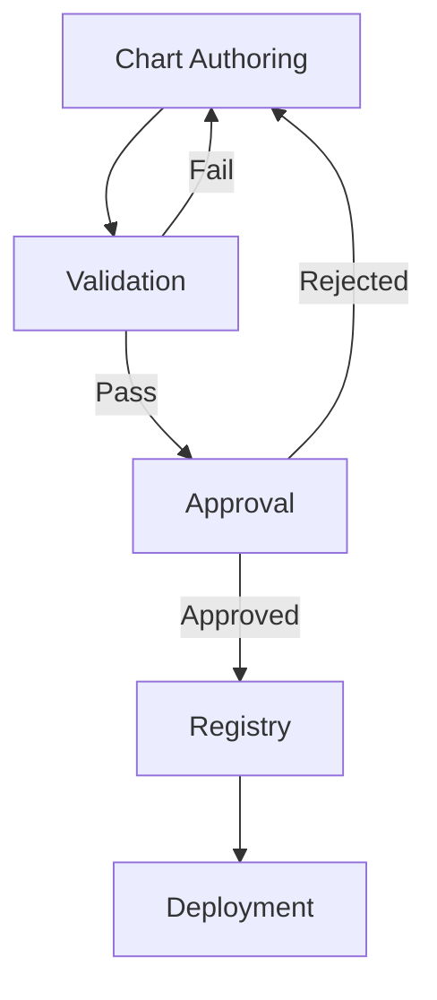

# SOMA Chart Specification

## 📄 Overview

SOMA (Specification-Oriented Modular Architecture) Charts are the declarative specification format used by ETASS to define software systems. SOMA Charts follow a structured, hierarchical format that enables precise definition of system requirements, dependencies, and behaviors.

## 📁 Chart Structure

A SOMA Chart consists of the following files and directories:

```text
my-chart/
├── Chart.yaml                  # Chart metadata and configuration
├── values.yaml                 # Default configuration values
├── templates/                  # Template files
│   ├── deployment.yaml         # Deployment templates
│   ├── service.yaml            # Service templates
│   └── ...
├── profiles/                  # Environment-specific profiles
│   ├── development.yaml        # Development profile
│   ├── production.yaml         # Production profile
│   └── ...
├── constitutions/              # Governance and compliance rules
│   ├── security.yaml           # Security constitution
│   ├── reliability.yaml        # Reliability constitution
│   └── ...
├── policies/                   # Operational policies
│   ├── scaling.yaml            # Auto-scaling policies
│   ├── backup.yaml             # Backup policies
│   └── ...
└── README.md                   # Chart documentation
```

## 📋 Chart.yaml Specification

The `Chart.yaml` file contains metadata and configuration for the chart:

```yaml
# Chart.yaml
apiVersion: etass.io/v1
kind: Chart

metadata:
  name: my-application
  version: 1.0.0
  description: A sample ETASS application
  keywords:
    - web
    - api
    - microservice
  maintainers:
    - name: Engineering Team
      email: engineering@example.com
  dependencies:
    - name: database
      version: 2.1.0
      repository: https://charts.example.com
      condition: database.enabled

spec:
  type: application
  domain: ecommerce
  compliance:
    - soc2
    - gdpr
  slas:
    availability: 99.95%
    latency: p99 < 500ms
  lifecycle: production

configuration:
  schema: values-schema.json
  validation: strict
  profiles:
    - development
    - staging
    - production
```

### Required Fields

| Field | Type | Description |
|-------|------|-------------|
| `apiVersion` | string | SOMA API version (must be `etass.io/v1`) |
| `kind` | string | Resource kind (must be `Chart`) |
| `metadata.name` | string | Chart name (kebab-case) |
| `metadata.version` | string | Semantic version |
| `spec.type` | string | Chart type (`application`, `library`, `infrastructure`) |

### Optional Fields

| Field | Type | Description |
|-------|------|-------------|
| `metadata.description` | string | Human-readable description |
| `metadata.keywords` | list | Search keywords |
| `metadata.maintainers` | list | Maintainer information |
| `metadata.dependencies` | list | Chart dependencies |
| `spec.domain` | string | Business domain |
| `spec.compliance` | list | Compliance standards |
| `spec.slas` | object | Service level agreements |
| `spec.lifecycle` | string | Lifecycle stage |
| `configuration.schema` | string | JSON Schema for validation |
| `configuration.validation` | string | Validation mode (`strict`, `warn`, `none`) |
| `configuration.profiles` | list | Supported environment profiles |

## 📝 values.yaml Specification

The `values.yaml` file contains default configuration values for the chart:

```yaml
# values.yaml

# Global configuration
global:
  environment: development
  region: us-west-2
  tags:
    team: engineering
    project: my-application

# Application configuration
application:
  replicaCount: 2
  image:
    repository: my-registry/my-app
    tag: latest
    pullPolicy: IfNotPresent
  resources:
    requests:
      cpu: 100m
      memory: 256Mi
    limits:
      cpu: 500m
      memory: 512Mi
  ports:
    - containerPort: 8080
      protocol: TCP
  env:
    LOG_LEVEL: INFO
    FEATURE_FLAG_NEW_UI: false

# Database configuration
database:
  enabled: true
  type: postgres
  host: db.example.com
  port: 5432
  credentials:
    username: ${DB_USERNAME}
    password: ${DB_PASSWORD}
  pool:
    minConnections: 5
    maxConnections: 20

# Monitoring configuration
monitoring:
  enabled: true
  metrics:
    enabled: true
    path: /metrics
    port: 9090
  tracing:
    enabled: true
    endpoint: http://jaeger-collector:14268

# Feature flags
features:
  experimentalUI: false
  newCheckoutFlow: true
  analytics: true
```

### Value Types

SOMA supports the following value types:

- **Primitives**: `string`, `number`, `boolean`, `null`
- **Collections**: `list`, `map`
- **References**: `${VARIABLE}` (environment variable reference)
- **Functions**: `{{ function(arg1, arg2) }}` (template functions)
- **Conditions**: `{{ if condition }}...{{ else }}...{{ end }}`

### Environment Variables

Environment variables are referenced using `${VARIABLE_NAME}` syntax:

```yaml
database:
  password: ${DB_PASSWORD}  # Resolved at runtime
  host: ${DB_HOST:localhost}  # With default value
```

### Template Functions

SOMA provides built-in template functions:

```yaml
# String functions
message: {{ upper("hello world") }}  # "HELLO WORLD"
name: {{ lower("MyApp") }}        # "myapp"

# Math functions
replicas: {{ mul 2 3 }}           # 6
timeout: {{ add 30 15 }}         # 45

# Collection functions
services: {{ list "api" "web" "db" }}
dbConfig: {{ dict "host" "localhost" "port" 5432 }}

# Conditional logic
featureEnabled: {{ if eq ENV "prod" }}true{{ else }}false{{ end }}
```

## 📄 Templates Specification

Templates define the structure of generated artifacts. Templates use the SOMA templating language with the following features:

### Template Syntax

```yaml
# templates/deployment.yaml
apiVersion: apps/v1
kind: Deployment
metadata:
  name: {{ .Values.application.name }}-deployment
  labels:
    app: {{ .Values.application.name }}
    environment: {{ .Values.global.environment }}
spec:
  replicas: {{ .Values.application.replicaCount }}
  selector:
    matchLabels:
      app: {{ .Values.application.name }}
  template:
    metadata:
      labels:
        app: {{ .Values.application.name }}
    spec:
      containers:
      - name: {{ .Values.application.name }}
        image: {{ .Values.application.image.repository }}:{{ .Values.application.image.tag }}
        ports:
        - containerPort: {{ .Values.application.ports[0].containerPort }}
        resources:
          {{- toYaml .Values.application.resources | nindent 10 }}
        env:
        {{- range $key, $value := .Values.application.env }}
        - name: {{ $key }}
          value: {{ $value | quote }}
        {{- end }}
```

### Template Functions

| Function | Description | Example |
|----------|-------------|---------|
| `upper` | Convert to uppercase | `{{ upper "hello" }}` → `"HELLO"` |
| `lower` | Convert to lowercase | `{{ lower "HELLO" }}` → `"hello"` |
| `title` | Convert to title case | `{{ title "hello world" }}` → `"Hello World"` |
| `trim` | Remove whitespace | `{{ trim "  hello  " }}` → `"hello"` |
| `replace` | String replacement | `{{ replace "hello" "l" "p" }}` → `"heppo"` |
| `contains` | Check substring | `{{ contains "hello" "ell" }}` → `true` |
| `add` | Numeric addition | `{{ add 1 2 }}` → `3` |
| `sub` | Numeric subtraction | `{{ sub 5 3 }}` → `2` |
| `mul` | Numeric multiplication | `{{ mul 4 5 }}` → `20` |
| `div` | Numeric division | `{{ div 10 2 }}` → `5` |
| `list` | Create list | `{{ list 1 2 3 }}` → `[1, 2, 3]` |
| `dict` | Create dictionary | `{{ dict "key" "value" }}` → `{"key": "value"}` |
| `get` | Get map value | `{{ get $dict "key" }}` → `"value"` |
| `has` | Check map key | `{{ has $dict "key" }}` → `true` |
| `len` | Get length | `{{ len $list }}` → `3` |
| `toYaml` | Convert to YAML | `{{ toYaml $object }}` → YAML string |
| `toJson` | Convert to JSON | `{{ toJson $object }}` → JSON string |

### Control Structures

#### Conditionals

```yaml
{{ if condition }}
  # true branch
{{ else if otherCondition }}
  # alternative branch
{{ else }}
  # false branch
{{ end }}
```

#### Loops

```yaml
{{ range $index, $item := $list }}
  # Loop body
  Item {{ $index }}: {{ $item }}
{{ end }}

{{ range $key, $value := $map }}
  # Loop body
  {{ $key }}: {{ $value }}
{{ end }}
```

#### With Context

```yaml
{{ with $context }}
  # Operations using . as $context
{{ end }}
```

## 📁 Profiles Specification

Profiles define environment-specific configurations that override default values:

```yaml
# profiles/production.yaml

global:
  environment: production
  region: us-east-1

application:
  replicaCount: 4
  image:
    tag: 1.0.0-stable
  resources:
    requests:
      cpu: 500m
      memory: 1Gi
    limits:
      cpu: 2000m
      memory: 2Gi

database:
  pool:
    minConnections: 10
    maxConnections: 50

features:
  experimentalUI: false
  newCheckoutFlow: true
```

### Profile Selection

Profiles are selected using the `--profile` flag:

```bash
etass compile my-chart --profile production
```

### Profile Inheritance

Profiles can inherit from other profiles:

```yaml
# profiles/staging.yaml
inherits: production

global:
  environment: staging

application:
  replicaCount: 2
```

## 📜 Constitutions Specification

Constitutions define governance rules, compliance requirements, and quality standards:

```yaml
# constitutions/security.yaml
apiVersion: etass.io/v1
kind: Constitution
metadata:
  name: security
  version: 1.0.0
spec:
  rules:
    - id: no-hardcoded-secrets
      description: "No hardcoded secrets in configuration"
      severity: critical
      pattern: "password|secret|apiKey|token"
      validation: 
        type: regex
        negate: true
    
    - id: tls-required
      description: "All external endpoints must use TLS"
      severity: critical
      validation:
        type: schema
        schema:
          properties:
            ingress:
              properties:
                tls:
                  type: array
                  minItems: 1
    
    - id: secure-images
      description: "Only use images from approved registries"
      severity: high
      validation:
        type: enum
        field: "$.application.image.repository"
        values:
          - "my-registry.example.com"
          - "docker.io/library"

  compliance:
    - soc2:cc6.1
    - iso27001:a.9.2.1
    - gdpr:article32
```

### Constitution Types

| Type | Description | Example |
|------|-------------|---------|
| `security` | Security requirements | No hardcoded secrets |
| `reliability` | Reliability standards | SLA compliance |
| `performance` | Performance targets | Response time limits |
| `compliance` | Regulatory compliance | GDPR, SOC2 |
| `governance` | Development governance | Code review requirements |

### Validation Modes

```yaml
validation:
  mode: strict  # strict, warn, audit
  onFailure: fail  # fail, warn, continue
```

## 📋 Policies Specification

Policies define operational rules and constraints:

```yaml
# policies/scaling.yaml
apiVersion: etass.io/v1
kind: Policy
metadata:
  name: autoscaling
  version: 1.0.0
spec:
  target: deployment
  rules:
    - name: cpu-scaling
      type: HorizontalPodAutoscaler
      minReplicas: 2
      maxReplicas: 10
      metrics:
        - type: Resource
          resource:
            name: cpu
            target:
              type: Utilization
              averageUtilization: 70
    
    - name: memory-scaling
      type: HorizontalPodAutoscaler
      minReplicas: 2
      maxReplicas: 15
      metrics:
        - type: Resource
          resource:
            name: memory
            target:
              type: Utilization
              averageUtilization: 80

  cooldown:
    scaleUp: 60s
    scaleDown: 300s
```

### Policy Types

| Type | Description | Target |
|------|-------------|--------|
| `HorizontalPodAutoscaler` | Auto-scaling | Deployment |
| `PodDisruptionBudget` | Disruption budget | Deployment |
| `NetworkPolicy` | Network rules | Namespace |
| `ResourceQuota` | Resource limits | Namespace |
| `BackupPolicy` | Backup rules | PersistentVolume |
| `RetentionPolicy` | Data retention | Storage |

## 🔗 Dependency Management

SOMA Charts support dependency management for reusable components:

```yaml
# Chart.yaml
dependencies:
  - name: database
    version: 2.1.0
    repository: https://charts.example.com
    condition: database.enabled
    alias: app-db
    import-values:
      - child: credentials
        parent: database

  - name: monitoring
    version: 1.5.2
    repository: https://monitoring.example.com
    tags:
      - prometheus
      - grafana
```

### Dependency Resolution

1. **Version Resolution**: Uses semantic versioning with constraints
2. **Transitive Dependencies**: Automatically resolves nested dependencies
3. **Conflict Resolution**: Uses highest version that satisfies all constraints
4. **Condition Evaluation**: Only includes dependencies when conditions are met

### Dependency Locking

```yaml
# Chart.lock
dependencies:
  - name: database
    version: 2.1.0
    resolved: https://charts.example.com/database-2.1.0.tgz
    checksum: sha256:abc123...
    dependencies:
      - name: postgres
        version: 1.2.3
        resolved: https://charts.example.com/postgres-1.2.3.tgz
        checksum: sha256:def456...
```

## 🔄 Lifecycle Management

SOMA Charts support lifecycle hooks for pre and post processing:

```yaml
# Chart.yaml
lifecycle:
  preCompile:
    - script: validate-values.sh
    - command: ["security-scan", "--severity=high"]
  
  postCompile:
    - script: generate-docs.sh
    - command: ["notify", "--channel=#deployments"]
  
  preDeploy:
    - script: backup-database.sh
    - command: ["health-check", "--timeout=30s"]
  
  postDeploy:
    - script: smoke-test.sh
    - command: ["monitor", "--duration=5m"]
```

### Lifecycle Hooks

| Hook | Description | Phase |
|------|-------------|-------|
| `preCompile` | Runs before compilation | Compilation |
| `postCompile` | Runs after compilation | Compilation |
| `preDeploy` | Runs before deployment | Deployment |
| `postDeploy` | Runs after deployment | Deployment |
| `preUpgrade` | Runs before upgrade | Upgrade |
| `postUpgrade` | Runs after upgrade | Upgrade |
| `preRollback` | Runs before rollback | Rollback |
| `postRollback` | Runs after rollback | Rollback |

## 📊 Versioning and Releases

SOMA Charts follow semantic versioning:

```yaml
# Chart.yaml
version: MAJOR.MINOR.PATCH

# Release types
release:
  type: stable  # stable, beta, alpha, dev
  channel: production  # production, staging, development
  supported: true
  deprecated: false
  eol: 2024-12-31
```

### Version Constraints

```yaml
dependencies:
  - name: database
    version: ">=2.0.0 <3.0.0"  # Range constraint
    
  - name: monitoring
    version: "~1.5.0"  # Patch updates only
    
  - name: logging
    version: "^2.1.0"  # Minor updates only
```

### Release Process

1. **Version Bump**: Update version in Chart.yaml
2. **Changelog**: Document changes in CHANGELOG.md
3. **Validation**: Run full validation suite
4. **Packaging**: Create chart package
5. **Signing**: Cryptographically sign package
6. **Publishing**: Upload to chart repository
7. **Notification**: Announce release

## ✅ Validation and Governance

SOMA Charts include comprehensive validation:

```yaml
# Chart.yaml
validation:
  schema: values-schema.json
  rules:
    - required: ["application.name", "database.host"]
    - type:
        application.replicaCount: integer
        database.port: integer
    - range:
        application.replicaCount: { min: 1, max: 10 }
        database.pool.maxConnections: { min: 5, max: 100 }
    - pattern:
        application.image.repository: "^[a-z0-9-]+\.[a-z0-9-]+\.[a-z0-9-]+$"
    - enum:
        global.environment: ["development", "staging", "production"]
```

### Validation Levels

| Level | Description |
|-------|-------------|
| `strict` | Fail on any validation error |
| `warn` | Warn but continue on errors |
| `audit` | Log errors but don't fail |
| `none` | No validation |

### Governance Workflow



## 🔧 Tooling Integration

SOMA Charts integrate with development tooling:

### IDE Support
- Syntax highlighting
- Autocompletion
- Schema validation
- Linting
- Debugging

### CI/CD Integration
```yaml
# .github/workflows/validate.yaml
name: SOMA Validation

on: [push, pull_request]

jobs:
  validate:
    runs-on: ubuntu-latest
    steps:
      - uses: actions/checkout@v3
      - uses: etass/setup@v1
      - run: etass lint charts/
      - run: etass validate charts/
      - run: etass test charts/
```

### Editor Support
- VS Code extension
- IntelliJ plugin
- Vim/Neovim integration
- Emacs mode

## 📚 Best Practices

### Chart Organization
1. **Single Responsibility**: Each chart should have a single, well-defined purpose
2. **Modular Design**: Break complex systems into smaller, composable charts
3. **Clear Naming**: Use descriptive names that reflect the chart's purpose
4. **Comprehensive Documentation**: Include README.md with usage examples
5. **Version Compatibility**: Clearly document compatible versions

### Configuration Management
1. **Sensible Defaults**: Provide reasonable defaults in values.yaml
2. **Environment Profiles**: Use profiles for environment-specific configurations
3. **Validation**: Include schema validation for all values
4. **Secrets Management**: Never hardcode secrets—use environment variables
5. **Documentation**: Document all configuration options

### Security
1. **Least Privilege**: Follow principle of least privilege
2. **Network Policies**: Define clear network boundaries
3. **Secret Rotation**: Implement secret rotation policies
4. **Compliance**: Document compliance requirements
5. **Audit Trails**: Maintain complete audit logs

## 🎓 Learning Resources

### Tutorials
- [Getting Started with SOMA](tutorials/getting-started.md)
- [Chart Authoring Guide](tutorials/chart-authoring.md)
- [Advanced Templating](tutorials/advanced-templating.md)
- [Dependency Management](tutorials/dependencies.md)

### Examples
- [Simple Web Application](examples/web-app.md)
- [Microservices Architecture](examples/microservices.md)
- [Data Pipeline](examples/data-pipeline.md)
- [Machine Learning Service](examples/ml-service.md)

### Reference
- [Function Reference](reference/functions.md)
- [Template Guide](reference/templates.md)
- [Validation Rules](reference/validation.md)
- [API Reference](reference/api.md)

## 📋 Summary

SOMA Charts provide a powerful, declarative specification format for ETASS that:

- **Precise**: Unambiguous definition of system requirements
- **Composable**: Modular design with dependency management
- **Validated**: Comprehensive validation and governance
- **Versioned**: Clear versioning and release management
- **Documented**: Self-documenting with built-in documentation
- **Automated**: Designed for autonomous agent execution
- **Observable**: Built-in telemetry and monitoring
- **Evolvable**: Supports continuous improvement

The SOMA language enables Specification-Driven Development by treating specifications as the canonical source of truth, from which all other artifacts are derived through deterministic compilation and execution.